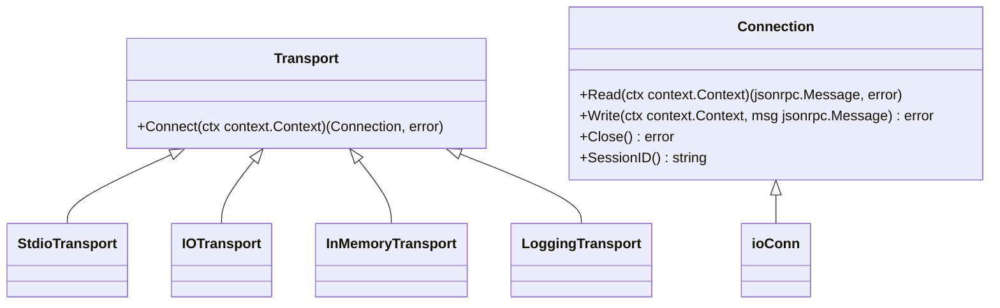
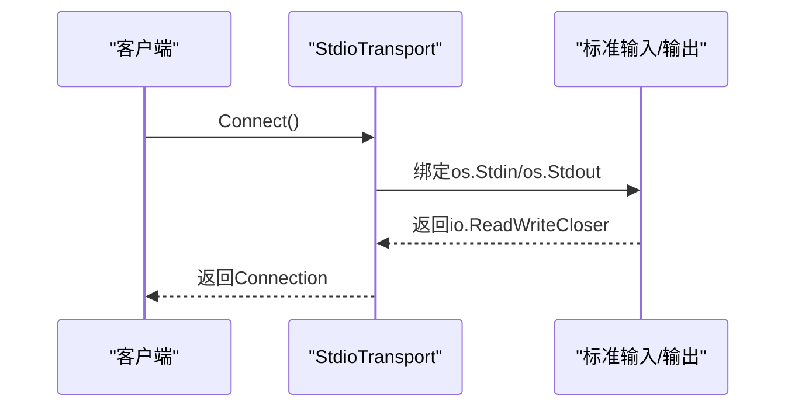
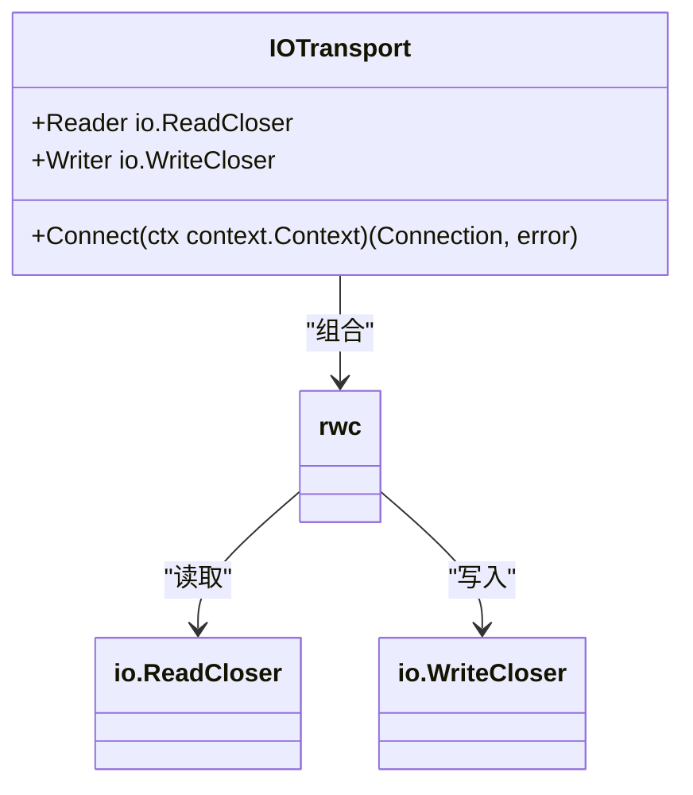
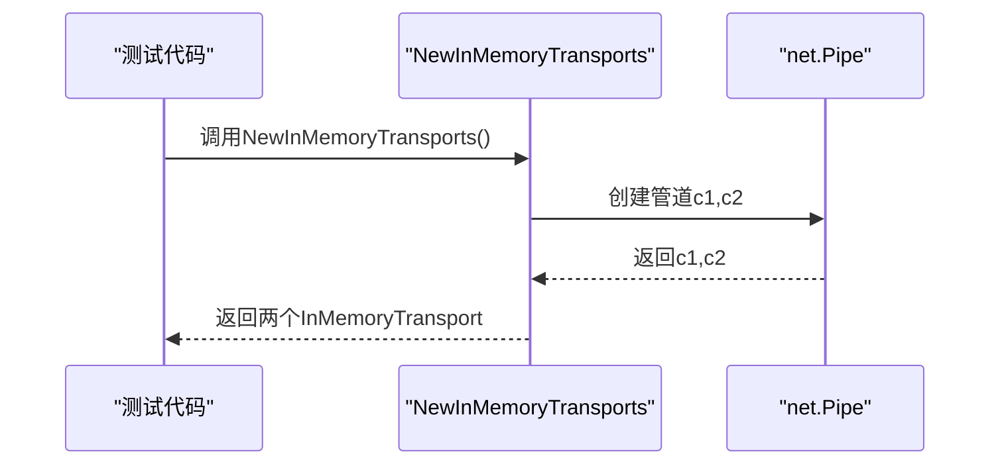
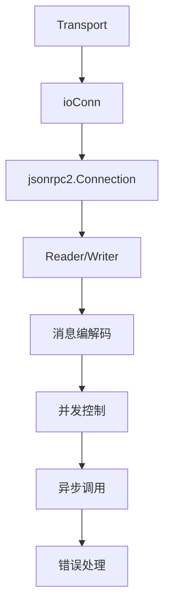
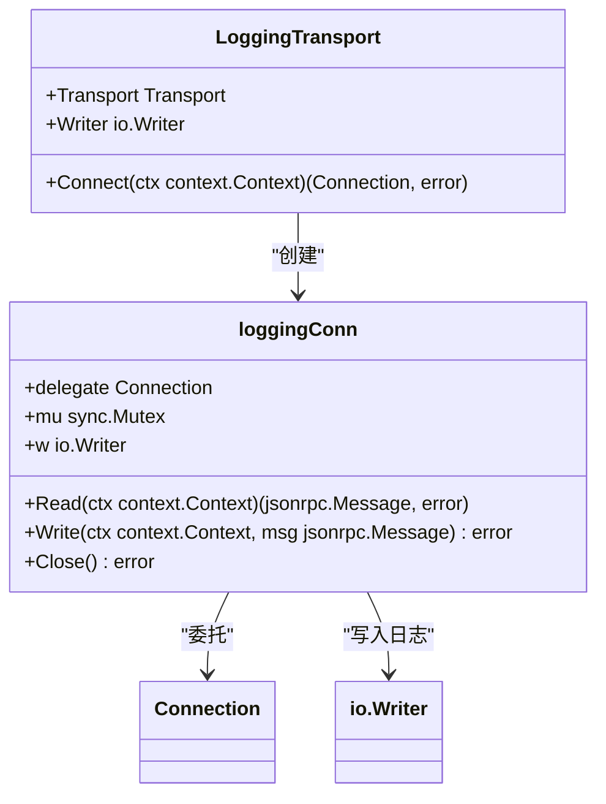
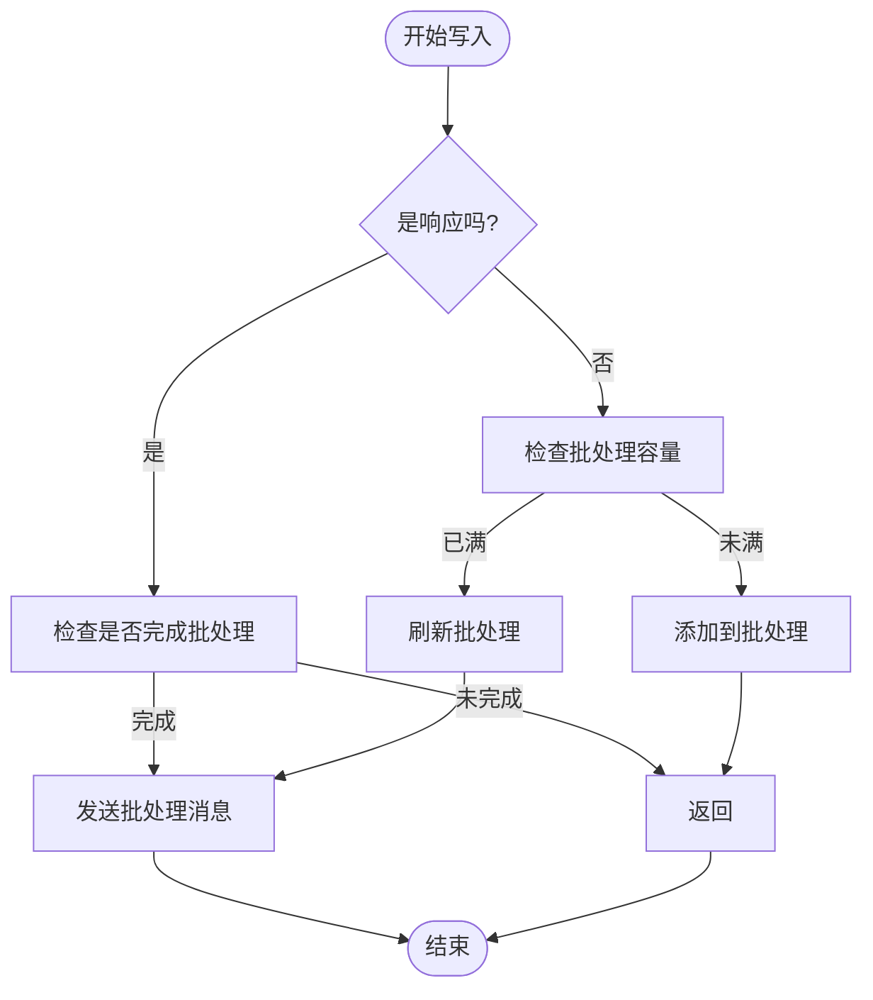
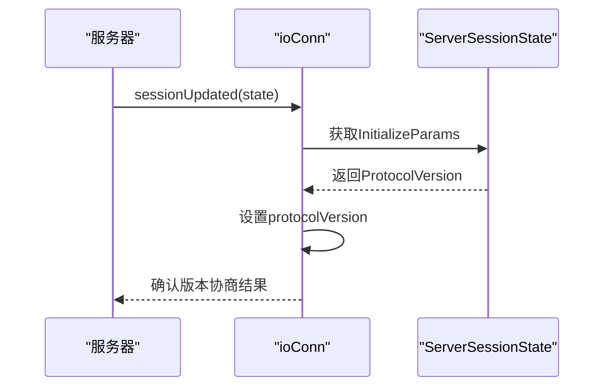

# 传输实现

<cite>
**本文档中引用的文件**   
- [transport.go](file://mcp/transport.go)
- [conn.go](file://internal/jsonrpc2/conn.go)
- [wire.go](file://internal/jsonrpc2/wire.go)
- [frame.go](file://internal/jsonrpc2/frame.go)
- [messages.go](file://internal/jsonrpc2/messages.go)
- [logging.go](file://mcp/logging.go)
</cite>

## 目录
1. [简介](#简介)
2. [传输层核心接口](#传输层核心接口)
3. [具体传输实现](#具体传输实现)
4. [核心连接结构分析](#核心连接结构分析)
5. [JSON-RPC 2.0协议栈](#json-rpc-20协议栈)
6. [装饰器模式实现](#装饰器模式实现)
7. [消息批处理机制](#消息批处理机制)
8. [协议版本协商](#协议版本协商)
9. [总结](#总结)

## 简介
MCP SDK提供了多种传输层实现，支持不同的通信场景和需求。这些传输层实现基于JSON-RPC 2.0协议，通过不同的底层通信机制提供灵活的连接方式。文档将详细介绍StdioTransport、IOTransport、InMemoryTransport等具体实现，以及它们如何与jsonrpc2包协同工作，构建完整的通信协议栈。

## 传输层核心接口

MCP SDK定义了两个核心接口：Transport和Connection，构成了传输层的基础架构。



**Diagram sources**
- [transport.go](file://mcp/transport.go#L31-L60)

**Section sources**
- [transport.go](file://mcp/transport.go#L31-L60)

## 具体传输实现

### StdioTransport
StdioTransport通过标准输入输出进行通信，适用于命令行工具和进程间通信场景。它将os.Stdin作为读取端，os.Stdout作为写入端，构建一个rwc结构体。



**Diagram sources**
- [transport.go](file://mcp/transport.go#L88-L95)

**Section sources**
- [transport.go](file://mcp/transport.go#L88-L95)

### IOTransport
IOTransport适配任意的io.ReadCloser和io.WriteCloser，提供了最大的灵活性。用户可以传入任何满足接口要求的读写器，实现自定义的通信通道。



**Diagram sources**
- [transport.go](file://mcp/transport.go#L104-L112)

**Section sources**
- [transport.go](file://mcp/transport.go#L104-L112)

### InMemoryTransport
InMemoryTransport利用net.Pipe实现内存中的双向通信，特别适用于测试场景。NewInMemoryTransports函数创建一对对称连接，便于构建客户端-服务器测试环境。



**Diagram sources**
- [transport.go](file://mcp/transport.go#L119-L137)

**Section sources**
- [transport.go](file://mcp/transport.go#L119-L137)

## 核心连接结构分析

ioConn结构体是所有传输实现的核心，基于io.ReadWriteCloser处理换行分隔的JSON消息流。

```mermaid
classDiagram
class ioConn {
+protocolVersion string
+writeMu sync.Mutex
+rwc io.ReadWriteCloser
+incoming <-chan msgOrErr
+outgoingBatch []jsonrpc.Message
+queue []jsonrpc.Message
+batchMu sync.Mutex
+batches map[jsonrpc2.ID]*msgBatch
+closeOnce sync.Once
+closed chan struct{}
+closeErr error
}
class msgOrErr {
+msg json.RawMessage
+err error
}
class msgBatch {
+unresolved map[jsonrpc2.ID]int
+responses []*jsonrpc.Response
}
ioConn --> msgOrErr : "包含"
ioConn --> msgBatch : "包含"
ioConn --> rwc : "使用"
```

**Diagram sources**
- [transport.go](file://mcp/transport.go#L329-L354)

**Section sources**
- [transport.go](file://mcp/transport.go#L329-L354)

## JSON-RPC 2.0协议栈

internal/jsonrpc2包在传输层之上构建了完整的JSON-RPC 2.0协议栈，处理消息的编码、解码、异步调用和并发控制。



**Diagram sources**
- [conn.go](file://internal/jsonrpc2/conn.go#L60-L72)
- [frame.go](file://internal/jsonrpc2/frame.go#L24-L39)

**Section sources**
- [conn.go](file://internal/jsonrpc2/conn.go#L60-L72)
- [frame.go](file://internal/jsonrpc2/frame.go#L24-L39)

## 装饰器模式实现

LoggingTransport展示了装饰器模式的应用，通过组合扩展功能而不修改原有逻辑。它包装了底层Transport，添加日志记录功能。



**Diagram sources**
- [transport.go](file://mcp/transport.go#L228-L231)
- [logging.go](file://mcp/logging.go#L144-L188)

**Section sources**
- [transport.go](file://mcp/transport.go#L228-L231)
- [logging.go](file://mcp/logging.go#L144-L188)

## 消息批处理机制

ioConn支持消息批处理（batching），通过outgoingBatch字段收集多个消息，在达到容量时一次性发送。



**Diagram sources**
- [transport.go](file://mcp/transport.go#L500-L550)

**Section sources**
- [transport.go](file://mcp/transport.go#L500-L550)

## 协议版本协商

ioConn支持协议版本协商，通过sessionUpdated方法接收服务器会话状态，确定使用的协议版本。



**Diagram sources**
- [transport.go](file://mcp/transport.go#L365-L375)

**Section sources**
- [transport.go](file://mcp/transport.go#L365-L375)

## 总结
MCP SDK的传输层实现提供了灵活多样的通信方式，从标准输入输出到内存管道，满足不同场景的需求。通过ioConn核心结构体，实现了消息的序列化、批处理和并发控制。结合internal/jsonrpc2包，构建了完整的JSON-RPC 2.0协议栈。装饰器模式的应用使得功能扩展更加灵活，如LoggingTransport所示。这些设计共同构成了一个健壮、可扩展的传输层架构。