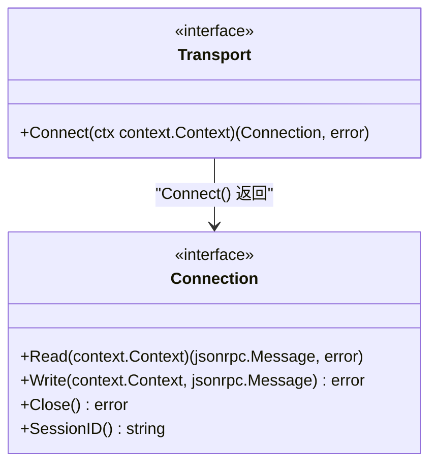
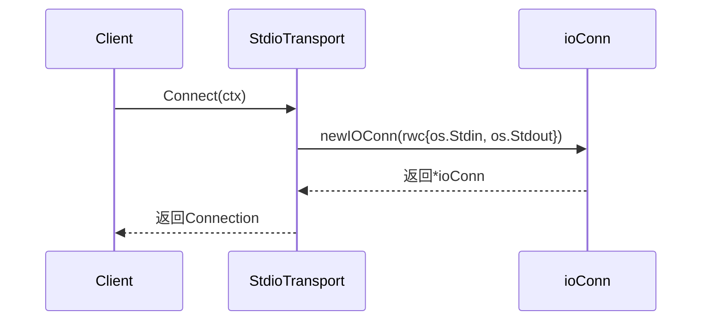
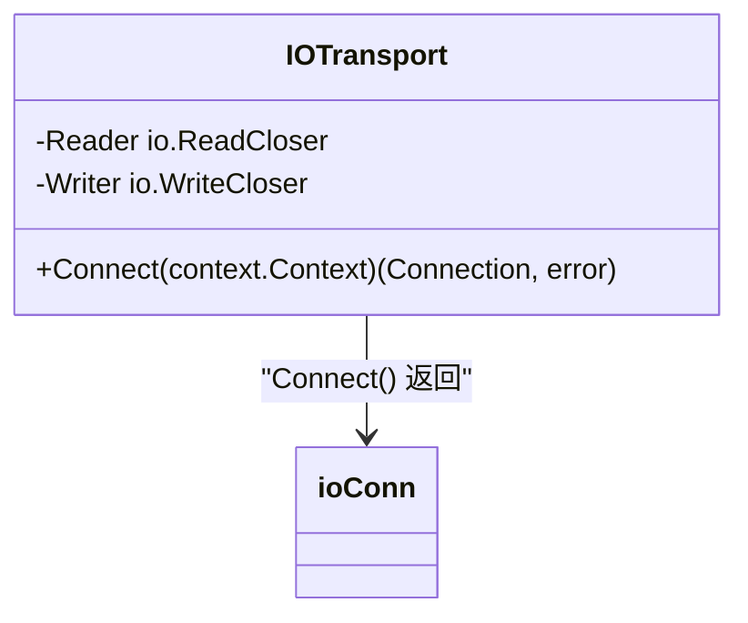
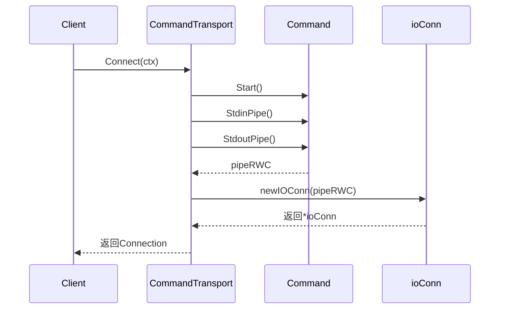
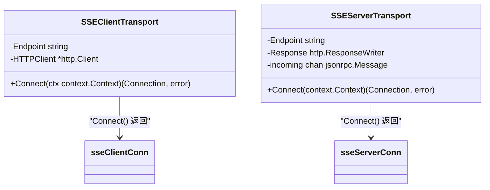
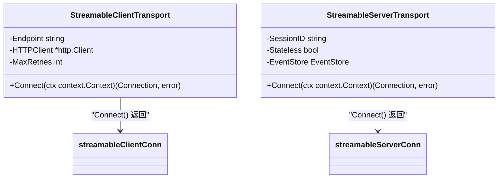
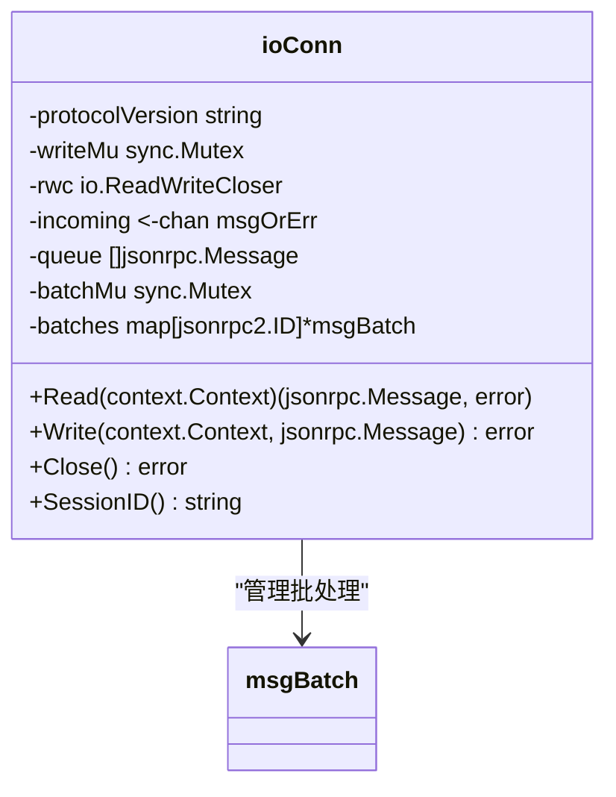
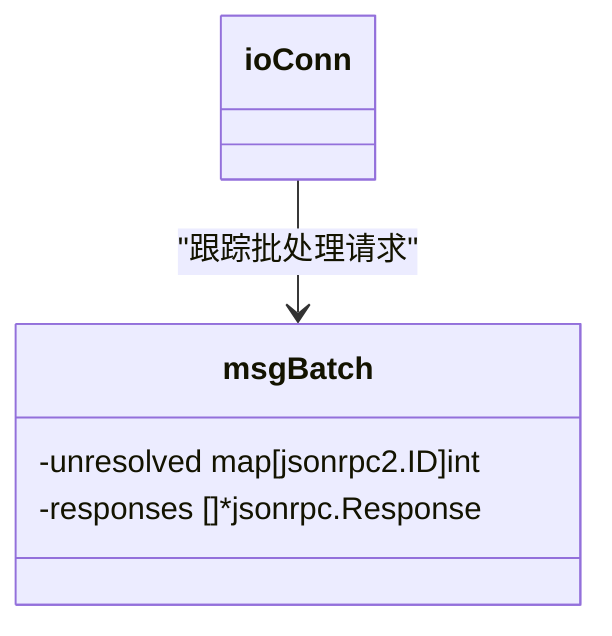
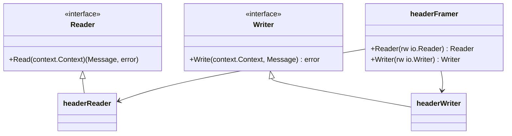
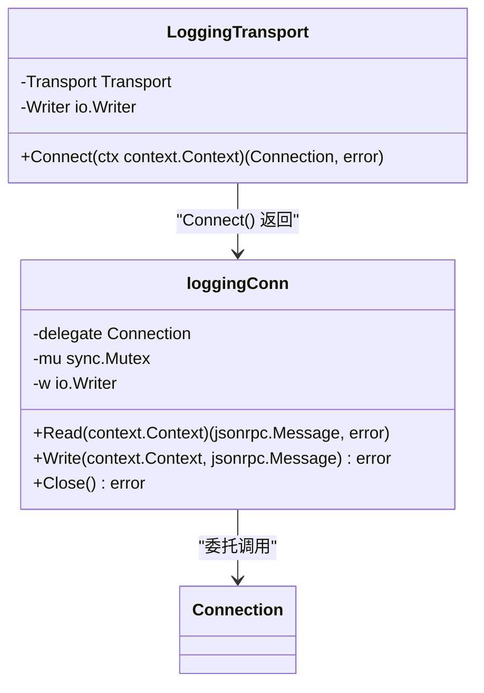

# 传输抽象

<cite>
**本文档引用的文件**
- [transport.go](file://mcp/transport.go)
- [server.go](file://mcp/server.go)
- [client.go](file://mcp/client.go)
- [conn.go](file://internal/jsonrpc2/conn.go)
- [jsonrpc2.go](file://internal/jsonrpc2/jsonrpc2.go)
- [frame.go](file://internal/jsonrpc2/frame.go)
- [sse.go](file://mcp/sse.go)
- [streamable.go](file://mcp/streamable.go)
- [cmd.go](file://mcp/cmd.go)
</cite>

## 目录
1. [引言](#引言)
2. [Transport与Connection接口契约](#transport与connection接口契约)
3. [Transport接口实现](#transport接口实现)
4. [Connection接口实现](#connection接口实现)
5. [JSON-RPC 2.0协议栈](#json-rpc-20协议栈)
6. [中间件式传输](#中间件式传输)
7. [自定义传输实现指导](#自定义传输实现指导)
8. [结论](#结论)

## 引言
MCP SDK的传输（Transport）抽象层是整个通信架构的核心，它定义了客户端与服务器之间建立连接和交换数据的统一方式。该抽象层通过Transport和Connection两个核心接口，实现了通信细节与业务逻辑的解耦，使得开发者可以灵活地适配不同的通信场景，如标准输入输出、内存管道、HTTP流式传输等。本文档将深入解析这一抽象层的设计原理与实现细节。

## Transport与Connection接口契约

### Transport接口
Transport接口是连接建立的统一入口，其核心方法`Connect`负责创建一个逻辑上的JSON-RPC连接。该接口的设计遵循单一职责原则，仅关注于连接的建立，而不涉及具体的数据传输细节。



**接口来源**
- [transport.go](file://mcp/transport.go#L31-L36)

### Connection接口
Connection接口封装了底层数据流的读写与连接管理。它提供了四个核心方法：
- `Read`：从连接中读取下一条消息。
- `Write`：向连接写入一条新消息。
- `Close`：关闭连接。
- `SessionID`：获取会话ID。

该接口的设计考虑了并发安全性和资源管理，确保在高并发场景下的稳定运行。

**接口来源**
- [transport.go](file://mcp/transport.go#L39-L60)

## Transport接口实现

### StdioTransport
StdioTransport是最基础的实现，用于在标准输入输出上进行通信。它通过`os.Stdin`和`os.Stdout`创建一个`io.ReadWriteCloser`，并将其包装成`ioConn`。



**实现来源**
- [transport.go](file://mcp/transport.go#L88-L93)

### IOTransport
IOTransport允许用户指定任意的`io.ReadCloser`和`io.WriteCloser`，提供了更高的灵活性。它同样使用`newIOConn`函数来创建连接。



**实现来源**
- [transport.go](file://mcp/transport.go#L104-L112)

### InMemoryTransport
InMemoryTransport用于在内存中创建双向通信管道，常用于单元测试或进程内通信。它利用`net.Pipe()`创建一对连接的`io.ReadWriteCloser`。

```mermaid
flowchart TD
A[NewInMemoryTransports] --> B[net.Pipe()]
B --> C[InMemoryTransport{c1}]
B --> D[InMemoryTransport{c2}]
C --> E[newIOConn(c1)]
D --> F[newIOConn(c2)]
```

**实现来源**
- [transport.go](file://mcp/transport.go#L119-L126)
- [transport.go](file://mcp/transport.go#L134-L137)

### CommandTransport
CommandTransport用于与外部命令行程序通信。它通过`exec.Cmd`启动一个子进程，并获取其标准输入和输出管道。



**实现来源**
- [cmd.go](file://mcp/cmd.go#L19-L46)

### SSEClientTransport与SSEServerTransport
SSEClientTransport和SSEServerTransport分别用于客户端和服务器端的SSE（Server-Sent Events）通信。它们通过HTTP长连接实现双向通信。



**实现来源**
- [sse.go](file://mcp/sse.go#L324-L331)
- [sse.go](file://mcp/sse.go#L104-L124)

### StreamableClientTransport与StreamableServerTransport
StreamableClientTransport和StreamableServerTransport用于流式HTTP通信，支持连接恢复和事件持久化。



**实现来源**
- [streamable.go](file://mcp/streamable.go#L1115-L1129)
- [streamable.go](file://mcp/streamable.go#L353-L397)

## Connection接口实现

### ioConn
ioConn是基于`io.ReadWriteCloser`的流式传输实现，它处理消息的编码、解码、批处理和并发控制。



**实现来源**
- [transport.go](file://mcp/transport.go#L329-L354)
- [transport.go](file://mcp/transport.go#L485-L548)
- [transport.go](file://mcp/transport.go#L573-L622)

### msgBatch
msgBatch用于管理JSON-RPC批处理请求，确保响应的正确顺序。



**实现来源**
- [transport.go](file://mcp/transport.go#L424-L439)
- [transport.go](file://mcp/transport.go#L447-L465)

## JSON-RPC 2.0协议栈

### jsonrpc2.Connection
jsonrpc2.Connection在Transport之上构建了完整的JSON-RPC 2.0协议栈，处理消息的编码、解码、批处理和并发控制。

```mermaid
classDiagram
class Connection {
-seq int64
-stateMu sync.Mutex
-state inFlightState
-done chan struct{}
-writer Writer
-handler Handler
+Call(ctx context.Context, method string, params any) *AsyncCall
+Notify(ctx context.Context, method string, params any) error
+Close() error
+Wait() error
}
Connection --> inFlightState : "管理进行中的请求"
Connection --> Writer : "发送消息"
Connection --> Handler : "处理消息"
```

**实现来源**
- [conn.go](file://internal/jsonrpc2/conn.go#L60-L72)
- [conn.go](file://internal/jsonrpc2/conn.go#L327-L374)
- [conn.go](file://internal/jsonrpc2/conn.go#L285-L320)

### Reader与Writer接口
Reader和Writer接口定义了消息的读取和写入契约，支持不同的帧格式。



**实现来源**
- [frame.go](file://internal/jsonrpc2/frame.go#L24-L27)
- [frame.go](file://internal/jsonrpc2/frame.go#L36-L39)
- [frame.go](file://internal/jsonrpc2/frame.go#L124-L126)
- [frame.go](file://internal/jsonrpc2/frame.go#L76-L78)

## 中间件式传输

### LoggingTransport
LoggingTransport是一个典型的装饰器模式实现，它包装另一个Transport，记录所有进出的消息。



**实现来源**
- [transport.go](file://mcp/transport.go#L228-L231)
- [transport.go](file://mcp/transport.go#L235-L241)
- [transport.go](file://mcp/transport.go#L243-L248)
- [transport.go](file://mcp/transport.go#L253-L271)
- [transport.go](file://mcp/transport.go#L274-L290)

## 自定义传输实现指导

### 线程安全
在实现自定义传输时，必须确保`Write`方法的并发安全，通常使用`sync.Mutex`来保护写操作。

```go
type myTransport struct {
    writeMu sync.Mutex
    writer  io.Writer
}

func (t *myTransport) Write(ctx context.Context, msg jsonrpc.Message) error {
    t.writeMu.Lock()
    defer t.writeMu.Unlock()
    // 写入逻辑
}
```

### 错误处理
当`Read`或`Write`失败时，应隐式调用`Close`方法，并确保`Close`可以被多次调用。

```go
func (t *myTransport) Close() error {
    t.closeOnce.Do(func() {
        t.closeErr = t.rwc.Close()
        close(t.closed)
    })
    return t.closeErr
}
```

### 资源释放
确保在`Close`方法中正确释放所有资源，包括关闭底层的`io.ReadWriteCloser`和关闭相关的通道。

**实现来源**
- [transport.go](file://mcp/transport.go#L624-L630)

## 结论
MCP SDK的传输抽象层通过精心设计的接口和灵活的实现，为开发者提供了强大的通信能力。无论是简单的标准输入输出，还是复杂的流式HTTP通信，都可以通过统一的API进行操作。理解这一抽象层的设计原理，有助于开发者更好地利用MCP SDK构建高效、可靠的MCP应用。