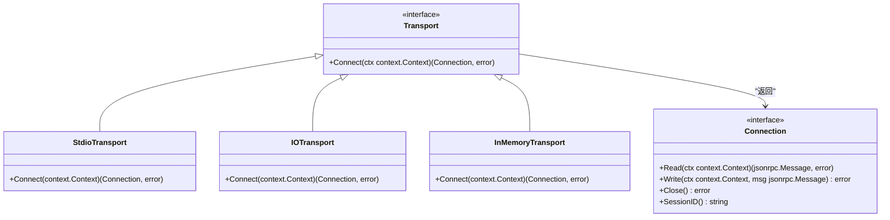
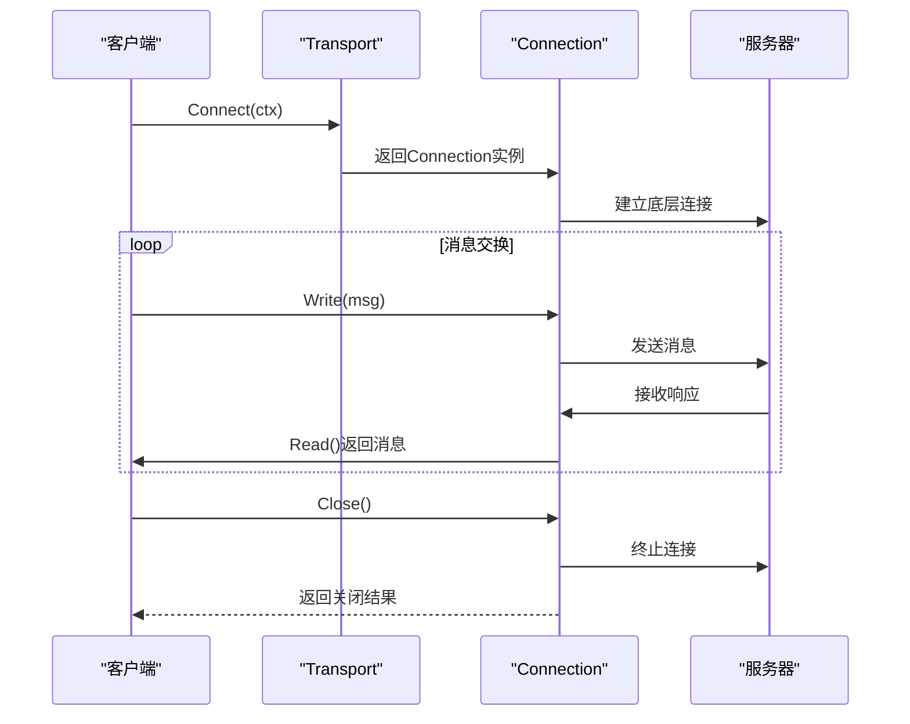
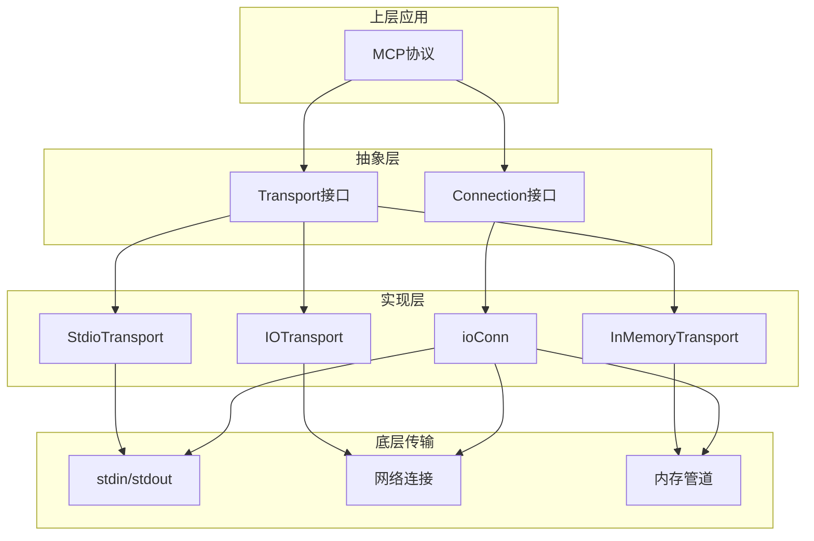
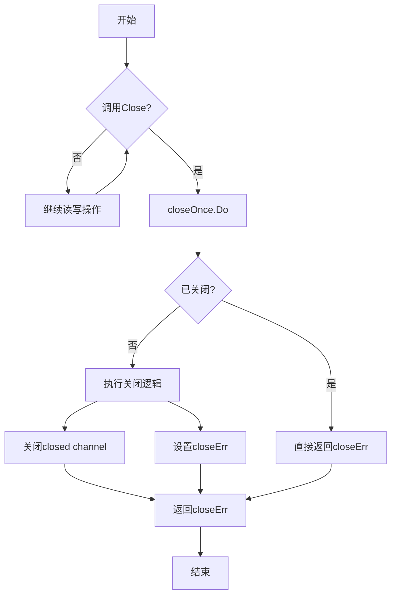
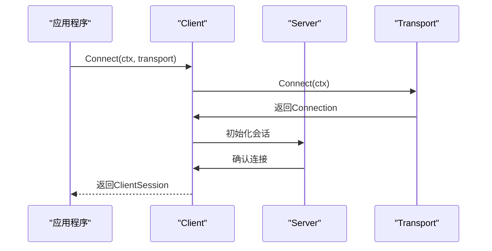

# 传输接口

<cite>
**本文档中引用的文件**  
- [mcp/transport.go](file://mcp/transport.go)
- [mcp/client.go](file://mcp/client.go)
- [mcp/server.go](file://mcp/server.go)
</cite>

## 目录
1. [引言](#引言)
2. [Transport接口设计原理](#transport接口设计原理)
3. [Connection接口契约规范](#connection接口契约规范)
4. [接口实现与抽象机制](#接口实现与抽象机制)
5. [线程安全与并发控制](#线程安全与并发控制)
6. [错误处理与生命周期管理](#错误处理与生命周期管理)
7. [使用模式与最佳实践](#使用模式与最佳实践)
8. [总结](#总结)

## 引言
MCP SDK中的Transport和Connection接口构成了客户端与服务器之间通信的核心抽象层。这两个接口共同定义了双向消息通道的建立与操作契约，为上层MCP协议提供了统一的通信基础。本文档深入解析这两个接口的设计原理、契约定义及其在实际应用中的行为规范。

**Section sources**
- [mcp/transport.go](file://mcp/transport.go#L22-L60)

## Transport接口设计原理
Transport接口作为连接建立的统一入口，其核心方法Connect被设计为仅能调用一次。该接口通过Connect方法返回一个逻辑上的JSON-RPC连接，此方法被Server.Connect和Client.Connect方法分别调用且仅调用一次。

这种设计确保了连接建立过程的原子性和唯一性，防止了重复连接导致的状态混乱。Transport的实现类（如StdioTransport、IOTransport、InMemoryTransport）都遵循这一契约，通过Connect方法初始化底层通信流并返回Connection实例。

**Diagram sources**
- [mcp/transport.go](file://mcp/transport.go#L31-L36)
- [mcp/transport.go](file://mcp/transport.go#L39-L60)

**Section sources**
- [mcp/transport.go](file://mcp/transport.go#L31-L36)

## Connection接口契约规范
Connection接口定义了双向消息通道的核心操作，包含Read、Write、Close和SessionID四个方法，每个方法都有严格的契约要求。

### Read方法
Read方法负责从连接中读取下一条待处理的消息。该方法必须支持与Close方法的并发调用，特别要求调用Close时能够解除Read的阻塞状态。这是通过在ioConn实现中使用goroutine和channel机制实现的，确保关闭操作可以及时中断等待中的读取操作。

### Write方法
Write方法用于向连接写入新消息，必须支持并发写入。该方法通过writeMu互斥锁保证写操作的并发安全，允许多个goroutine同时调用Write方法发送消息。

### Close方法
Close方法用于关闭连接，具有以下关键特性：
- 可被多次调用，包括并发调用
- 隐式地在Read或Write失败时被调用
- 使用closeOnce sync.Once确保底层资源仅被释放一次

### SessionID方法
SessionID方法返回会话标识符，目前标记为待移除（TODO），但在当前实现中仍提供会话跟踪功能。

**Diagram sources**
- [mcp/transport.go](file://mcp/transport.go#L39-L60)

**Section sources**
- [mcp/transport.go](file://mcp/transport.go#L39-L60)

## 接口实现与抽象机制
Transport和Connection接口通过分层设计抽象了底层通信细节，为上层协议提供统一的双向消息通道。核心实现机制包括：

### ioConn实现
ioConn是Connection接口的核心实现，它：
- 使用io.ReadWriteCloser作为底层流
- 通过goroutine处理读取操作，确保Close能解除Read阻塞
- 支持JSON-RPC消息批处理
- 使用newline-delimited JSON进行消息分隔

### 装饰器模式
通过LoggingTransport等装饰器实现扩展功能，如日志记录。LoggingTransport包装了基础Transport，返回包装后的Connection，在读写操作前后添加日志记录。

### 协议版本协商
在连接建立过程中，通过sessionUpdated方法协商协议版本，确保客户端和服务器使用兼容的协议版本进行通信。

**Diagram sources**
- [mcp/transport.go](file://mcp/transport.go#L229-L229)
- [mcp/transport.go](file://mcp/transport.go#L329-L354)

**Section sources**
- [mcp/transport.go](file://mcp/transport.go#L149-L179)

## 线程安全与并发控制
接口设计充分考虑了并发环境下的线程安全问题，采用多种机制确保在多goroutine环境下的正确性。

### 读写并发控制
- Read方法通过channel和goroutine实现，避免与Close的竞态条件
- Write方法使用writeMu互斥锁保护写操作
- 批处理状态通过batchMu互斥锁同步访问

### 关闭机制的并发安全
Close方法使用sync.Once确保：
- 多次调用的安全性
- 并发调用的正确处理
- 底层资源的单次释放

### 连接状态管理
通过closed channel和closeErr错误变量，确保关闭状态的可见性和错误的正确传播。

**Diagram sources**
- [mcp/transport.go](file://mcp/transport.go#L329-L354)

**Section sources**
- [mcp/transport.go](file://mcp/transport.go#L329-L354)

## 错误处理与生命周期管理
接口设计包含完善的错误处理机制和连接生命周期管理策略。

### ErrConnectionClosed传播
当向已关闭或正在关闭的连接发送消息时，返回ErrConnectionClosed错误。该错误在调用栈中被正确包装和传播，确保上层应用能够识别连接状态。

### 隐式关闭机制
在Read或Write操作失败时，自动隐式调用Close方法，确保连接资源的及时释放和状态的一致性。

### 上下文控制
通过context.Context参数控制连接生命周期，支持超时、取消等操作，与Go语言的标准并发模式保持一致。

**Section sources**
- [mcp/transport.go](file://mcp/transport.go#L22-L23)

## 使用模式与最佳实践
### 连接建立模式

### 资源管理
- 总是由客户端负责关闭连接
- 使用defer语句确保连接的正确关闭
- 监听Wait方法以检测服务器端的连接终止

### 并发使用
- 多个goroutine可安全地并发调用Write
- Read操作通常在单个goroutine中循环执行
- Close可从任意goroutine调用以中断阻塞操作

**Section sources**
- [mcp/client.go](file://mcp/client.go#L135-L170)
- [mcp/server.go](file://mcp/server.go#L838-L853)

## 总结
Transport和Connection接口通过精心设计的契约定义，为MCP SDK提供了可靠、高效的通信基础。其设计特点包括：
- Connect方法的单次调用保证连接建立的确定性
- Read与Close的并发支持确保连接关闭的及时性
- Write的并发写入能力满足高吞吐需求
- Close的幂等性保证资源释放的安全性
- 基于context的生命周期管理与Go语言生态无缝集成

这些设计原则共同构建了一个健壮、灵活且易于使用的通信抽象层，为MCP协议的稳定运行提供了坚实基础。

**Section sources**
- [mcp/transport.go](file://mcp/transport.go#L22-L60)
- [mcp/client.go](file://mcp/client.go#L22-L30)
- [mcp/server.go](file://mcp/server.go#L37-L51)