# 协议与消息

<cite>
**Referenced Files in This Document**   
- [protocol.go](file://mcp/protocol.go)
- [jsonrpc.go](file://jsonrpc/jsonrpc.go)
- [wire.go](file://internal/jsonrpc2/wire.go)
</cite>

## 目录
1. [引言](#引言)
2. [MCP方法命名与RPC调用结构](#mcp方法命名与rpc调用结构)
3. [核心请求与响应结构](#核心请求与响应结构)
4. [初始化流程](#初始化流程)
5. [请求-响应与通知模式](#请求-响应与通知模式)
6. [进度追踪机制](#进度追踪机制)
7. [JSON-RPC 2.0映射关系](#json-rpc-20映射关系)
8. [消息序列化注意事项](#消息序列化注意事项)

## 引言
本文档系统性地解析MCP（Model Context Protocol）协议的消息格式与通信语义。基于`protocol.go`中定义的请求参数和响应结果，详细说明MCP的方法命名规范、RPC调用结构、消息模式以及与JSON-RPC 2.0的映射关系，为开发者提供全面的协议理解与实现指导。

## MCP方法命名与RPC调用结构
MCP协议采用分层的、语义化的命名规范来定义其方法。方法名称遵循`{category}/{action}`的格式，清晰地表达了操作的类别和具体动作。

**MCP方法命名规范示例：**
- `mcp.tools.list`: 工具类别的列表操作
- `mcp.tools.call`: 工具类别的调用操作
- `mcp.prompts.get`: 提示词类别的获取操作
- `mcp.resources.read`: 资源类别的读取操作

这些方法名称在代码中通过常量定义，确保了统一性和避免拼写错误。

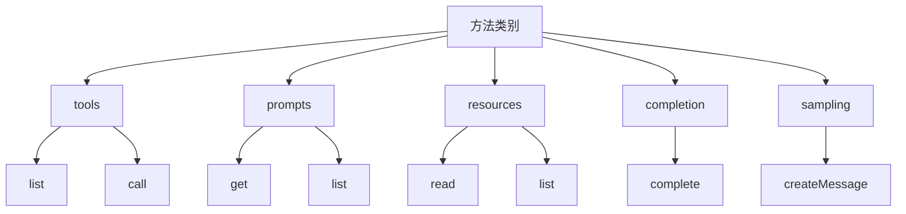

**Diagram sources**
- [protocol.go](file://mcp/protocol.go#L660-L680)

**Section sources**
- [protocol.go](file://mcp/protocol.go#L660-L680)

## 核心请求与响应结构
MCP协议的核心通信单元是请求（Request）和响应（Response）。每个请求都包含一个方法名和参数对象，而响应则包含结果或错误信息。

### 工具调用结构
`CallToolParams`和`CallToolResult`是MCP中最核心的交互结构，用于客户端调用服务器端的工具。

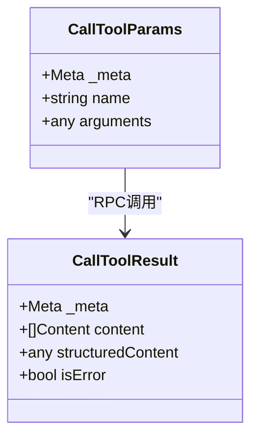

**Diagram sources**
- [protocol.go](file://mcp/protocol.go#L41-L50)
- [protocol.go](file://mcp/protocol.go#L72-L116)

### 工具列表结构
`ListToolsParams`和`ListToolsResult`用于分页获取可用工具的列表。

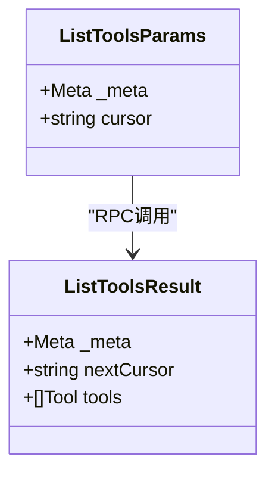

**Diagram sources**
- [protocol.go](file://mcp/protocol.go#L528-L535)
- [protocol.go](file://mcp/protocol.go#L543-L551)

**Section sources**
- [protocol.go](file://mcp/protocol.go#L41-L116)
- [protocol.go](file://mcp/protocol.go#L528-L551)

## 初始化流程
MCP会话的建立始于一个标准化的初始化流程，该流程通过`initialize`方法完成，确保客户端和服务器能够协商协议版本和能力。

### 初始化请求与响应
初始化流程由客户端发起`InitializeParams`请求，服务器响应`InitializeResult`。

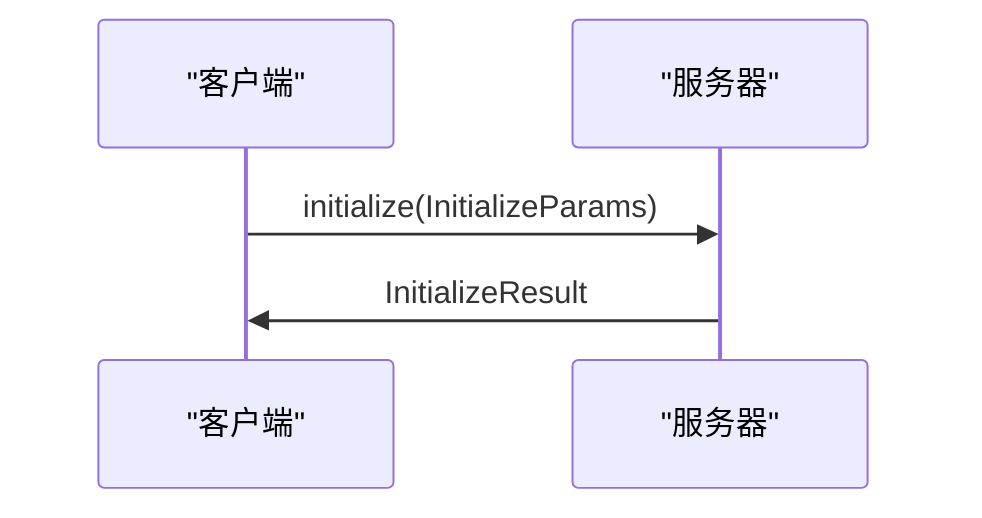

**Diagram sources**
- [protocol.go](file://mcp/protocol.go#L375-L384)
- [protocol.go](file://mcp/protocol.go#L392-L408)

### 初始化参数结构
`InitializeParams`包含了客户端的能力和信息。

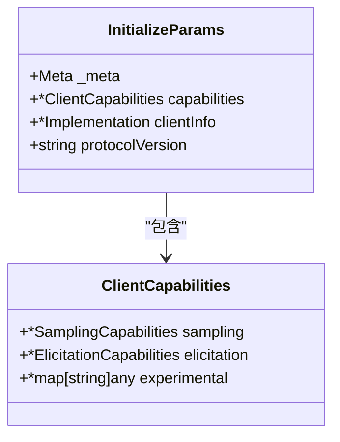

**Diagram sources**
- [protocol.go](file://mcp/protocol.go#L375-L384)

### 初始化结果结构
`InitializeResult`包含了服务器的能力、信息和使用说明。

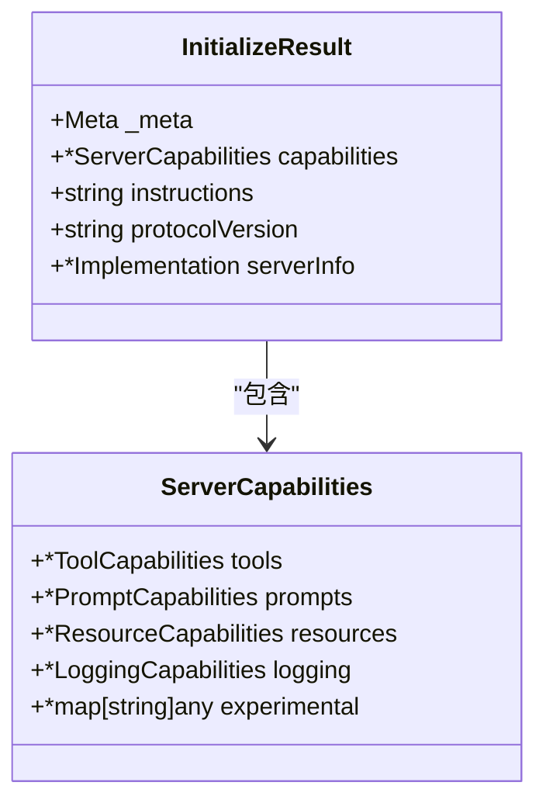

**Diagram sources**
- [protocol.go](file://mcp/protocol.go#L392-L408)

**Section sources**
- [protocol.go](file://mcp/protocol.go#L375-L408)

## 请求-响应与通知模式
MCP协议支持两种主要的通信模式：请求-响应模式和通知模式，以适应不同的交互场景。

### 请求-响应模式
这是最常用的模式，客户端发送一个请求并等待服务器的响应。每个请求都有一个唯一的ID，用于匹配响应。

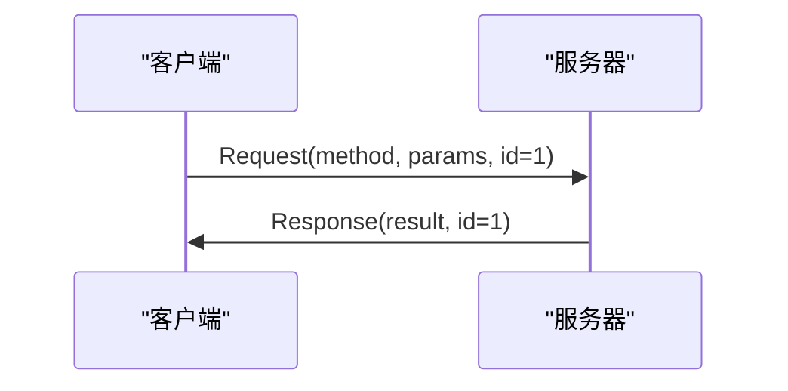

**Diagram sources**
- [wire.go](file://internal/jsonrpc2/wire.go#L45-L55)

### 通知模式
通知模式用于服务器向客户端发送信息，而不需要客户端的响应。这种模式常用于状态更新或进度报告。

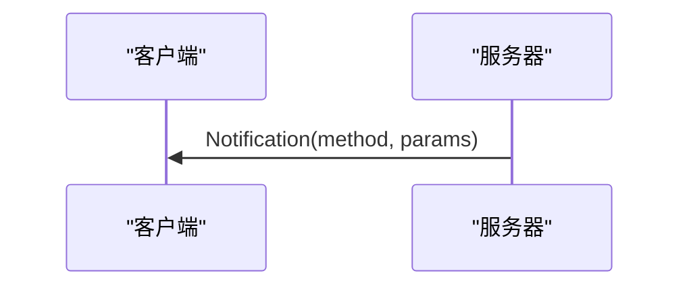

**Diagram sources**
- [wire.go](file://internal/jsonrpc2/wire.go#L45-L55)

### 两种模式的区别
| 特性 | 请求-响应模式 | 通知模式 |
| :--- | :--- | :--- |
| **ID字段** | 必须存在 | 不存在 |
| **响应** | 必须返回 | 不返回 |
| **用途** | 获取数据、执行操作 | 状态更新、事件通知 |
| **可靠性** | 需要确认 | 尽力而为 |

**Section sources**
- [wire.go](file://internal/jsonrpc2/wire.go#L45-L55)

## 进度追踪机制
对于长时间运行的操作，MCP协议提供了进度追踪机制，允许服务器向客户端发送进度更新。

### Meta字段的保留用途
`_meta`字段是协议保留的元数据字段，用于在请求、响应和通知中传递额外的上下文信息。它是一个`map[string]any`类型的字段，可以携带任意的元数据。

```go
type Meta map[string]any
```

在进度追踪中，`_meta`字段用于携带`_progressToken`，以关联进度通知与原始请求。

### ProgressNotificationParams结构
`ProgressNotificationParams`是用于发送进度更新的通知参数。

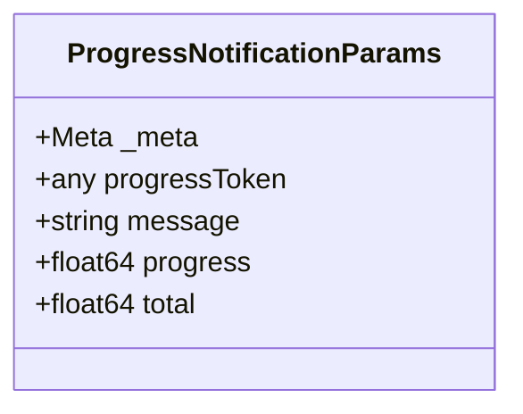

- `progressToken`: 与初始请求关联的进度令牌
- `message`: 可选的进度描述信息
- `progress`: 当前进度值
- `total`: 总进度值（如果已知）

**Diagram sources**
- [protocol.go](file://mcp/protocol.go#L641-L656)

### 进度追踪工作流程
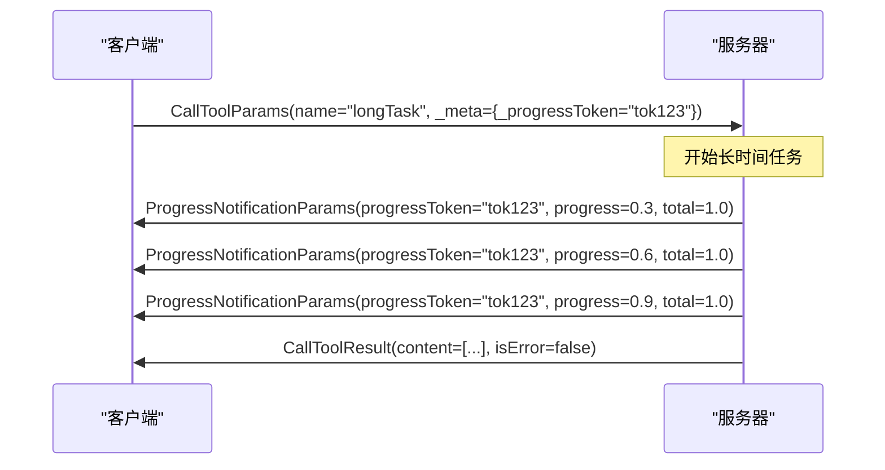

**Diagram sources**
- [protocol.go](file://mcp/protocol.go#L641-L656)

**Section sources**
- [protocol.go](file://mcp/protocol.go#L641-L656)

## JSON-RPC 2.0映射关系
MCP协议基于JSON-RPC 2.0规范构建，其消息结构直接映射到JSON-RPC的核心字段。

### 核心字段映射
MCP的请求和响应对象直接对应JSON-RPC 2.0的消息结构。

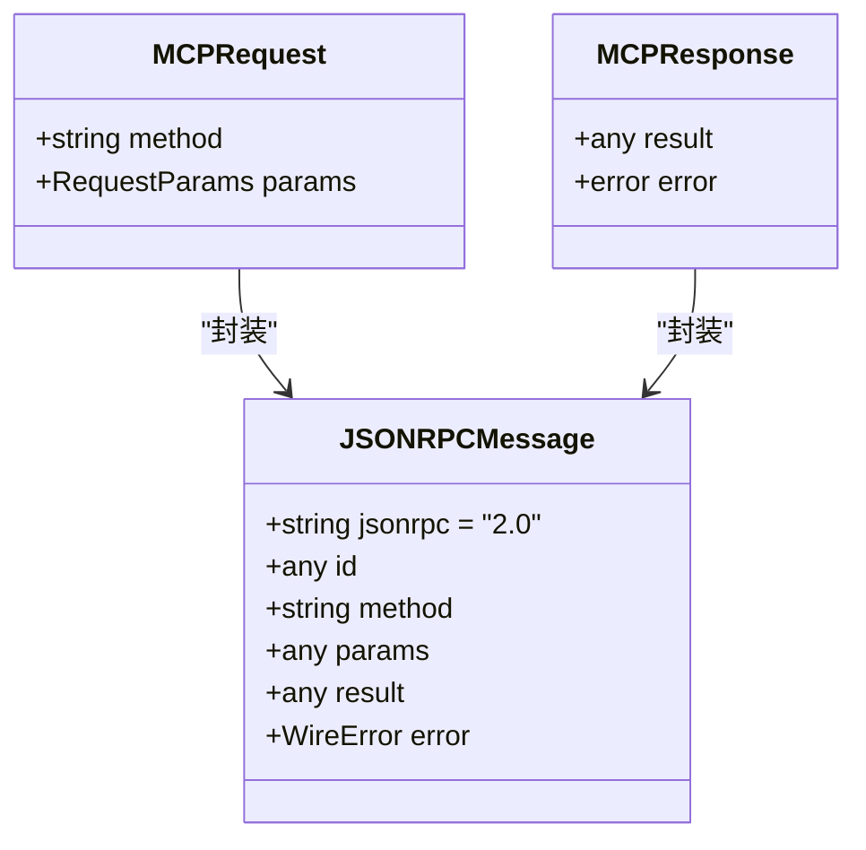

**Diagram sources**
- [wire.go](file://internal/jsonrpc2/wire.go#L45-L55)

### 字段详细映射
| JSON-RPC 2.0字段 | MCP协议中的对应 | 说明 |
| :--- | :--- | :--- |
| `method` | `method`常量 | 标识要调用的操作，如`tools/list` |
| `params` | `RequestParams`实现 | 请求参数对象，如`ListToolsParams` |
| `id` | 请求ID | 用于匹配请求和响应的唯一标识符 |
| `result` | `isResult`接口实现 | 成功响应的结果对象，如`ListToolsResult` |
| `error` | Go的`error`类型 | 错误响应，包含错误码和消息 |

### 错误处理
MCP遵循JSON-RPC 2.0的错误处理规范，使用标准的错误码。

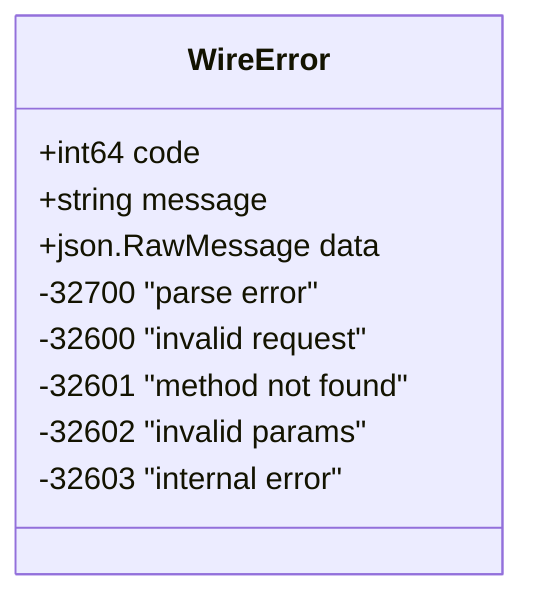

**Diagram sources**
- [wire.go](file://internal/jsonrpc2/wire.go#L15-L30)

**Section sources**
- [wire.go](file://internal/jsonrpc2/wire.go#L15-L97)
- [jsonrpc.go](file://jsonrpc/jsonrpc.go#L0-L39)

## 消息序列化注意事项
在实现MCP协议时，消息的序列化和反序列化是关键环节，需要注意以下几点。

### 序列化库选择
建议使用标准的`encoding/json`包进行序列化，确保与JSON-RPC 2.0规范的兼容性。

### 调试建议
1. **启用日志记录**：在开发和调试阶段，启用详细的日志记录，捕获所有进出的消息。
2. **使用中间件**：利用MCP SDK提供的中间件机制，在消息发送和接收时进行拦截和记录。
3. **验证JSON结构**：使用在线JSON验证工具或IDE插件验证生成的JSON结构是否正确。
4. **处理边缘情况**：特别注意处理`null`值、空数组和特殊浮点数（如NaN、Infinity）的情况。

**Section sources**
- [jsonrpc.go](file://jsonrpc/jsonrpc.go#L30-L39)
- [wire.go](file://internal/jsonrpc2/wire.go#L80-L97)