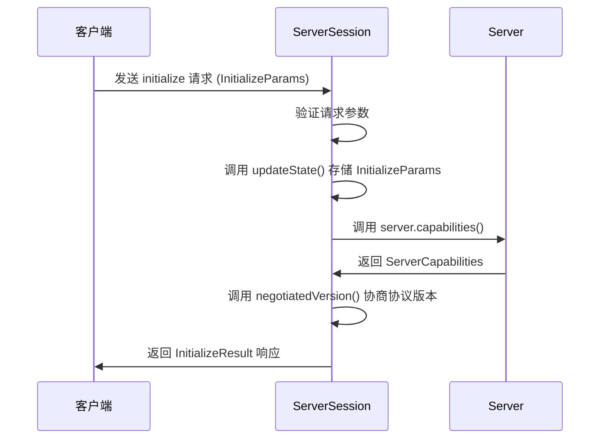

# 初始化方法

<cite>
**本文档中引用的文件**   
- [protocol.go](file://mcp/protocol.go)
- [server.go](file://mcp/server.go)
- [session.go](file://mcp/session.go)
- [client.go](file://mcp/client.go)
</cite>

## 目录
1. [介绍](#介绍)
2. [初始化参数体系](#初始化参数体系)
3. [初始化结果体系](#初始化结果体系)
4. [服务器会话处理流程](#服务器会话处理流程)
5. [版本协商与错误处理](#版本协商与错误处理)
6. [最佳实践示例](#最佳实践示例)

## 介绍
MCP（Model Context Protocol）协议中的初始化方法是客户端与服务器建立通信会话的核心环节。该过程通过 `initialize` 请求和 `InitializeResult` 响应完成握手，确立双方的通信能力、版本兼容性和上下文信息。本文档将深入解析 `InitializeParams` 和 `InitializeResult` 结构体的设计与语义，结合 `ServerSession` 的实现，阐明初始化流程的完整机制。

**Section sources**
- [protocol.go](file://mcp/protocol.go#L375-L408)
- [server.go](file://mcp/server.go#L1142-L1142)

## 初始化参数体系
客户端通过 `InitializeParams` 结构体发起初始化请求，向服务器传递其能力、信息和协议版本。该结构体是握手过程的起点，其字段定义了客户端的上下文。

### ProtocolVersion 字段
`ProtocolVersion` 字段表示客户端支持的最新MCP协议版本。客户端可以支持多个旧版本，但此字段声明其最高能力。服务器根据此信息决定是否接受连接，并协商最终使用的协议版本。

### ClientInfo 字段
`ClientInfo` 是一个 `Implementation` 类型的指针，包含客户端的名称（`Name`）、可选标题（`Title`）和版本号（`Version`）。这些信息帮助服务器识别客户端，可用于日志记录、功能适配或用户界面展示。

### Capabilities 字段
`Capabilities` 字段是一个 `ClientCapabilities` 类型的指针，用于声明客户端支持的可选功能。其核心子字段包括：
- `Roots`: 表明客户端支持列出根目录的能力。
- `Sampling`: 表明客户端支持从LLM进行采样的能力。
- `Elicitation`: 表明客户端支持从服务器获取用户输入的能力。
- `Experimental`: 一个映射，用于定义客户端支持的实验性、非标准能力。

这些能力字段使服务器能够动态调整其行为，仅提供客户端能够处理的功能。

**Section sources**
- [protocol.go](file://mcp/protocol.go#L375-L384)

## 初始化结果体系
服务器在收到 `initialize` 请求后，返回 `InitializeResult` 结构体作为响应。该响应确立了会话的最终配置。

### Instructions 字段
`Instructions` 字段是服务器提供给客户端的指令字符串。这些指令可以被客户端用作“提示”（hint），以优化LLM对服务器可用工具、资源等功能的理解。例如，客户端可以将这些指令添加到系统提示（system prompt）中，从而提升LLM与服务器交互的准确性和效率。

### ServerCapabilities 字段
`ServerCapabilities` 字段是 `ServerCapabilities` 类型的指针，描述了服务器支持的功能。这是一个可扩展的机制，其核心子字段包括：
- `Tools`: 表明服务器提供工具调用的能力。
- `Prompts`: 表明服务器提供提示模板的能力。
- `Resources`: 表明服务器提供资源读取的能力。
- `Logging`: 表明服务器支持向客户端发送日志消息的能力。
- `Completions`: 表明服务器支持参数自动补全建议的能力。
- `Experimental`: 一个映射，用于定义服务器支持的实验性、非标准能力。

该字段的结构允许协议在未来轻松扩展，而不会破坏现有实现。

### ProtocolVersion 字段
此字段表示服务器希望使用的MCP协议版本。它可能与客户端请求的版本不同。如果客户端无法支持此版本，它必须断开连接。这实现了版本协商的最终决策。

### ServerInfo 字段
`ServerInfo` 字段是另一个 `Implementation` 类型的指针，用于向客户端提供服务器的名称、标题和版本信息，完成双向的身份识别。

**Section sources**
- [protocol.go](file://mcp/protocol.go#L392-L408)

## 服务器会话处理流程
服务器通过 `ServerSession` 结构体管理与客户端的会话。初始化流程在 `server.go` 文件中实现。

### ServerSession 结构
`ServerSession` 结构体封装了会话状态，包括指向 `Server` 实例的指针、JSON-RPC连接、会话状态（`state`）等。其 `state` 字段是 `ServerSessionState` 类型，其中包含 `InitializeParams` 字段，用于存储客户端的初始化参数。

### 处理 initialize 请求
当服务器收到 `initialize` 请求时，会调用 `ServerSession` 的 `initialize` 方法。该方法执行以下关键步骤：
1.  **验证参数**：确保 `params` 不为 `nil`。
2.  **更新状态**：将客户端的 `InitializeParams` 存储在会话的 `state` 中，通过 `updateState` 方法保证线程安全。
3.  **生成响应**：创建并返回一个 `InitializeResult` 实例。该实例的字段通过以下方式填充：
    -   `ProtocolVersion`: 调用 `negotiatedVersion` 函数，基于客户端请求的版本协商出一个双方都支持的版本。
    -   `Capabilities`: 调用 `Server` 实例的 `capabilities()` 方法，根据服务器的配置和已注册的功能（如工具、提示等）动态生成能力集。
    -   `Instructions`: 直接使用 `ServerOptions` 中配置的 `Instructions` 字符串。
    -   `ServerInfo`: 使用创建 `Server` 时传入的 `Implementation` 对象。



**Diagram sources**
- [server.go](file://mcp/server.go#L1142-L1142)
- [protocol.go](file://mcp/protocol.go#L375-L408)

**Section sources**
- [server.go](file://mcp/server.go#L1142-L1166)
- [session.go](file://mcp/session.go#L19-L19)

## 版本协商与错误处理
版本不兼容是初始化过程中最常见的错误场景。

### 协商失败处理
当客户端请求的协议版本与服务器支持的版本完全不匹配时，服务器会返回一个 `InitializeResult`，其 `ProtocolVersion` 字段为一个服务器支持的版本。如果客户端无法支持此版本，它必须主动断开连接。服务器端不会为此情况抛出错误，而是将决策权交给客户端。

### 客户端错误处理
在客户端的 `Connect` 方法中，会显式检查服务器返回的 `ProtocolVersion` 是否在客户端支持的版本列表中。如果不在，`Connect` 方法会返回一个 `unsupportedProtocolVersionError` 类型的错误，阻止会话的建立。

```go
// 伪代码示例：客户端版本检查
if !slices.Contains(supportedProtocolVersions, res.ProtocolVersion) {
    return nil, unsupportedProtocolVersionError{res.ProtocolVersion}
}
```

这种设计确保了连接的健壮性，避免了因版本不匹配导致的后续通信错误。

**Section sources**
- [client.go](file://mcp/client.go#L195-L195)
- [protocol.go](file://mcp/protocol.go#L392-L408)

## 最佳实践示例
以下是初始化流程的最佳实践代码示例：

```go
// 服务器端：创建并配置服务器
server := mcp.NewServer(&mcp.Implementation{
    Name:    "my-server",
    Version: "v1.0.0",
}, &mcp.ServerOptions{
    Instructions: "你可以使用我的工具来查询数据。",
    // ... 其他配置
})

// 客户端：连接服务器
client := mcp.NewClient(&mcp.Implementation{
    Name:    "my-client",
    Version: "v1.0.0",
}, nil)

// 使用传输层连接
session, err := client.Connect(ctx, transport, nil)
if err != nil {
    log.Fatal(err)
}
defer session.Close()

// 此时，session.InitializeResult() 可以访问服务器的响应
result := session.InitializeResult()
fmt.Printf("服务器信息: %s %s\n", result.ServerInfo.Name, result.ServerInfo.Version)
fmt.Printf("服务器指令: %s\n", result.Instructions)
```

此示例展示了如何正确配置客户端和服务器，并在连接成功后安全地访问初始化结果。

**Section sources**
- [client.go](file://mcp/client.go#L195-L195)
- [server.go](file://mcp/server.go#L1142-L1142)