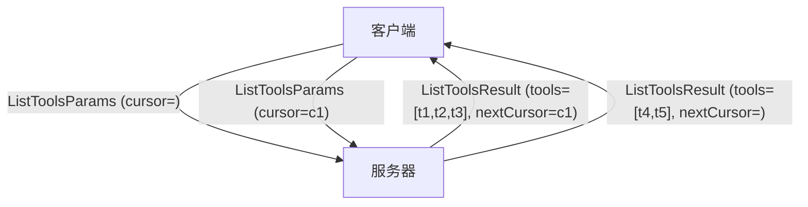
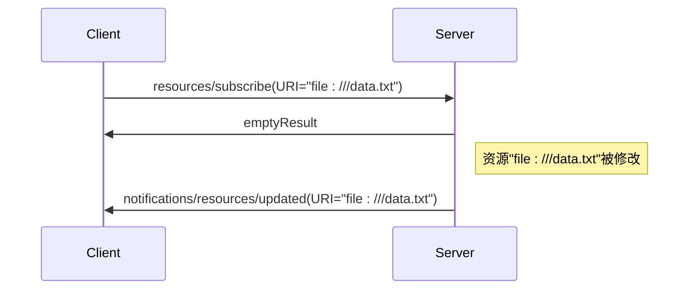
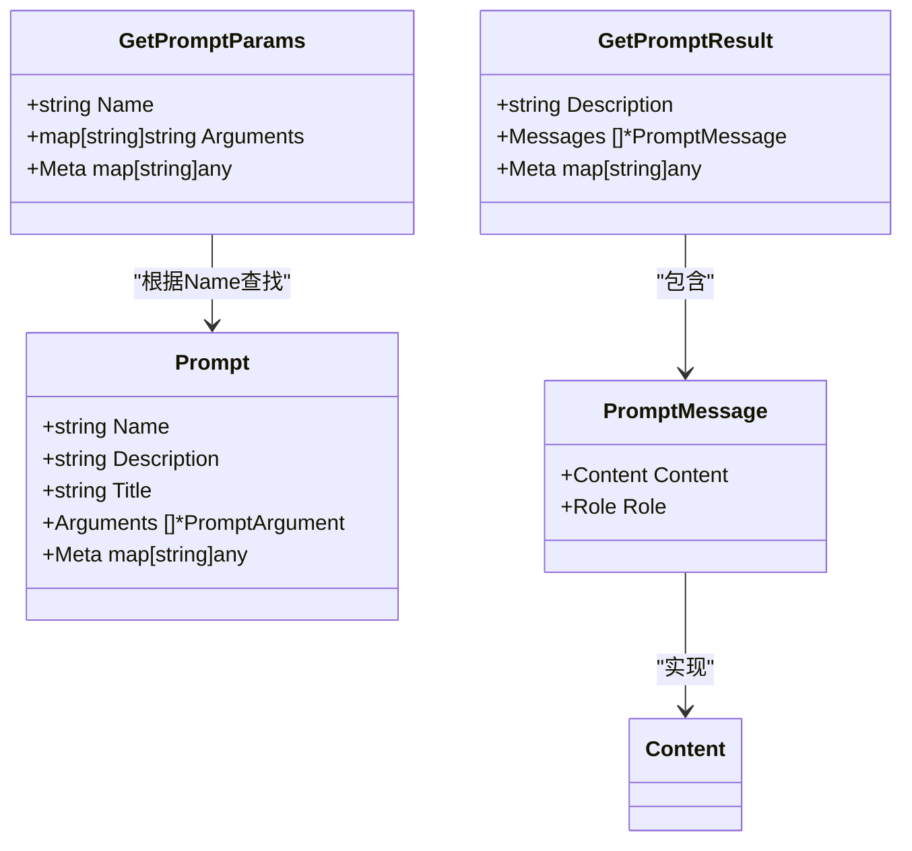

# 协议方法

<cite>
**本文档引用的文件**   
- [protocol.go](file://mcp/protocol.go)
- [server.go](file://mcp/server.go)
- [client.go](file://mcp/client.go)
- [tool.go](file://mcp/tool.go)
- [requests.go](file://mcp/requests.go)
- [shared.go](file://mcp/shared.go)
- [content.go](file://mcp/content.go)
</cite>

## 目录
1. [初始化方法](#初始化方法)
2. [工具调用方法](#工具调用方法)
3. [资源管理方法](#资源管理方法)
4. [提示词操作方法](#提示词操作方法)
5. [通用功能与元数据](#通用功能与元数据)
6. [错误处理与最佳实践](#错误处理与最佳实践)

## 初始化方法

MCP协议的初始化过程由`initialize`和`notifications/initialized`两个方法组成，它们共同建立客户端与服务器之间的会话。

`initialize`方法由客户端发起，其请求参数为`InitializeParams`。该结构体包含客户端支持的最新协议版本（`ProtocolVersion`）、客户端信息（`ClientInfo`）以及客户端支持的功能（`Capabilities`）。服务器收到此请求后，会返回一个`InitializeResult`响应。该响应包含服务器支持的功能（`Capabilities`）、使用说明（`Instructions`）、服务器信息（`ServerInfo`）以及双方协商确定的协议版本（`ProtocolVersion`）。如果客户端无法支持服务器指定的协议版本，则必须断开连接。

在客户端成功接收`InitializeResult`后，它会立即发送一个`notifications/initialized`通知，其参数为`InitializedParams`。这标志着初始化流程的完成，之后双方可以进行正常的RPC通信。

**Section sources**
- [protocol.go](file://mcp/protocol.go#L375-L384)
- [protocol.go](file://mcp/protocol.go#L392-L408)
- [protocol.go](file://mcp/protocol.go#L412-L416)
- [client.go](file://mcp/client.go#L135-L170)
- [server.go](file://mcp/server.go#L1144-L1161)

## 工具调用方法

工具调用是MCP协议的核心功能，允许客户端调用服务器提供的各种工具。主要涉及`tools/list`和`tools/call`两个方法。

### 列出工具 (tools/list)

`ListToolsParams`是`tools/list`方法的请求参数。它包含一个可选的`Cursor`字段，用于分页。服务器在处理请求时，会返回一个`ListToolsResult`。该结果包含一个`Tools`列表和一个`NextCursor`字段。如果`NextCursor`不为空，则表示还有更多结果，客户端可以使用该游标发起下一次请求以获取后续数据。

**Diagram sources **
- [protocol.go](file://mcp/protocol.go#L528-L535)
- [protocol.go](file://mcp/protocol.go#L543-L551)

### 调用工具 (tools/call)

`CallToolParams`是`tools/call`方法的请求参数，包含要调用的工具名称（`Name`）和调用参数（`Arguments`）。服务器处理后返回`CallToolResult`。

`CallToolResult`的`Content`字段是一个`Content`接口数组，用于承载非结构化结果。`StructuredContent`字段用于承载结构化结果，必须能被序列化为JSON对象。`IsError`字段用于指示工具调用是否出错。根据协议，工具内部的错误应通过设置`IsError=true`并填充`Content`来报告，而不是作为协议级别的错误响应。

服务器端通过`Server.AddTool`或`AddTool`函数注册工具处理函数。`AddTool`是一个泛型函数，能自动处理参数反序列化、验证和结果填充，是推荐的使用方式。

**Section sources**
- [protocol.go](file://mcp/protocol.go#L41-L50)
- [protocol.go](file://mcp/protocol.go#L72-L116)
- [tool.go](file://mcp/tool.go#L1-L103)
- [server.go](file://mcp/server.go#L191-L234)
- [server.go](file://mcp/server.go#L547-L559)
- [server.go](file://mcp/server.go#L561-L578)

## 资源管理方法

MCP协议提供了一套完整的资源管理机制，包括列出、读取和订阅资源。

### 列出资源 (resources/list)

`ListResourcesParams`是`resources/list`方法的请求参数，其结构与`ListToolsParams`类似，包含一个用于分页的`Cursor`字段。服务器返回`ListResourcesResult`，其中包含`Resources`列表和`NextCursor`。

### 读取资源 (resources/read)

`ReadResourceParams`是`resources/read`方法的请求参数，包含要读取的资源的URI。服务器返回`ReadResourceResult`，其中包含一个`Contents`数组，每个元素代表资源的一部分内容。

### 订阅资源 (resources/subscribe)

客户端可以通过`SubscribeParams`发起`resources/subscribe`请求，订阅特定资源的变更。服务器在资源更新后，会通过`ResourceUpdatedNotificationParams`向所有订阅者发送`notifications/resources/updated`通知。

**Diagram sources **
- [protocol.go](file://mcp/protocol.go#L729-L736)
- [protocol.go](file://mcp/protocol.go#L743-L748)
- [protocol.go](file://mcp/protocol.go#L1001-L1007)
- [protocol.go](file://mcp/protocol.go#L1027-L1033)
- [server.go](file://mcp/server.go#L710-L727)
- [server.go](file://mcp/server.go#L729-L636)
- [server.go](file://mcp/server.go#L700-L708)

**Section sources**
- [protocol.go](file://mcp/protocol.go#L478-L485)
- [protocol.go](file://mcp/protocol.go#L493-L501)
- [protocol.go](file://mcp/protocol.go#L729-L736)
- [protocol.go](file://mcp/protocol.go#L743-L748)
- [protocol.go](file://mcp/protocol.go#L1001-L1007)
- [protocol.go](file://mcp/protocol.go#L1014-L1020)
- [protocol.go](file://mcp/protocol.go#L1027-L1033)
- [server.go](file://mcp/server.go#L580-L592)
- [server.go](file://mcp/server.go#L609-L636)
- [server.go](file://mcp/server.go#L710-L727)
- [server.go](file://mcp/server.go#L729-L636)
- [server.go](file://mcp/server.go#L700-L708)

## 提示词操作方法

MCP协议支持提示词模板的管理，允许服务器向客户端提供预定义的提示词。

### 列出提示词 (prompts/list)

`ListPromptsParams`是`prompts/list`方法的请求参数，同样支持`Cursor`分页。服务器返回`ListPromptsResult`，包含`Prompts`列表和`NextCursor`。

### 获取提示词 (prompts/get)

`GetPromptParams`是`prompts/get`方法的请求参数，包含要获取的提示词名称（`Name`）和用于模板填充的参数（`Arguments`）。服务器返回`GetPromptResult`，其中包含提示词的消息列表（`Messages`）。

**Diagram sources **
- [protocol.go](file://mcp/protocol.go#L349-L357)
- [protocol.go](file://mcp/protocol.go#L364-L371)
- [protocol.go](file://mcp/protocol.go#L422-L429)
- [protocol.go](file://mcp/protocol.go#L437-L445)
- [protocol.go](file://mcp/protocol.go#L661-L675)

**Section sources**
- [protocol.go](file://mcp/protocol.go#L349-L357)
- [protocol.go](file://mcp/protocol.go#L364-L371)
- [protocol.go](file://mcp/protocol.go#L422-L429)
- [protocol.go](file://mcp/protocol.go#L437-L445)
- [protocol.go](file://mcp/protocol.go#L661-L675)
- [server.go](file://mcp/server.go#L519-L531)
- [server.go](file://mcp/server.go#L533-L545)

## 通用功能与元数据

### Meta字段

`Meta`字段（定义为`map[string]any`）在协议的几乎所有请求和响应参数中都存在，且是可选的（`omitempty`）。它为客户端和服务器提供了一个通用的扩展机制，允许它们附加额外的元数据。例如，可以用于传递跟踪ID、自定义上下文或实验性功能。

### 分页机制

所有以`list`结尾的方法（如`tools/list`, `resources/list`, `prompts/list`）都实现了分页机制。其核心是`Cursor`和`NextCursor`字段。服务器使用`encodeCursor`和`decodeCursor`函数将内部的唯一标识符（如资源ID）编码为不透明的字符串游标。客户端在首次请求时无需提供`Cursor`，后续请求则使用上一次响应中的`NextCursor`来获取下一页数据，直到`NextCursor`为空。

### 方法命名规范

MCP协议的方法命名遵循清晰的模块化规范：
- `mcp.tools.list` 和 `mcp.tools.call` 属于**工具模块**，用于发现和执行服务器提供的功能。
- `mcp.resources.read` 和 `mcp.resources.subscribe` 属于**资源模块**，用于访问和监控服务器上的数据。
- `mcp.prompts.get` 和 `mcp.prompts.list` 属于**提示词模块**，用于获取预定义的提示模板。
- `mcp.initialize` 和 `mcp.notifications/initialized` 属于**会话管理模块**，负责建立连接。
- `mcp.logging/setLevel` 属于**日志模块**，用于控制日志级别。

**Section sources**
- [shared.go](file://mcp/shared.go#L373-L373)
- [shared.go](file://mcp/shared.go#L376-L376)
- [shared.go](file://mcp/shared.go#L379-L379)
- [server.go](file://mcp/server.go#L838-L853)
- [server.go](file://mcp/server.go#L810-L821)

## 错误处理与最佳实践

### 错误处理策略

MCP协议区分了两种错误：
1.  **协议级错误**：由JSON-RPC 2.0规范定义，例如找不到方法（`MethodNotFound`）或无效参数（`InvalidParams`）。这些错误通过JSON-RPC的错误响应返回。
2.  **工具级错误**：指工具在执行过程中发生的业务逻辑错误。根据协议，这类错误不应作为协议错误返回，而应在`CallToolResult`中设置`IsError=true`，并将错误信息放入`Content`字段。这确保了LLM能够感知到错误并进行自我纠正。

### 参数验证规则

- **必填字段**：如`CallToolParams.Name`和`InitializeParams.ProtocolVersion`是必需的，缺少它们会导致`InvalidParams`错误。
- **模式验证**：对于`Tool`和`Prompt`等对象，其`InputSchema`和`OutputSchema`字段必须是有效的JSON Schema对象，且类型为`"object"`。
- **URI验证**：`Resource.URI`和`Root.URI`必须是有效的绝对URI。

### 最佳实践建议

1.  **使用`AddTool`而非`Server.AddTool`**：`AddTool`泛型函数能自动处理输入验证、反序列化和结果填充，大大简化了开发。
2.  **充分利用`Instructions`**：在`InitializeResult`中提供清晰的`Instructions`，帮助LLM更好地理解服务器的能力。
3.  **合理使用分页**：对于可能返回大量数据的`list`方法，务必实现分页，避免一次性传输过多数据。
4.  **利用`Meta`字段**：在`Meta`中传递上下文信息，如请求ID，便于调试和追踪。
5.  **正确报告工具错误**：始终使用`CallToolResult.IsError`来报告工具内部错误，而不是抛出协议异常。

**Section sources**
- [protocol.go](file://mcp/protocol.go#L72-L116)
- [tool.go](file://mcp/tool.go#L1-L103)
- [server.go](file://mcp/server.go#L191-L234)
- [server.go](file://mcp/server.go#L561-L578)