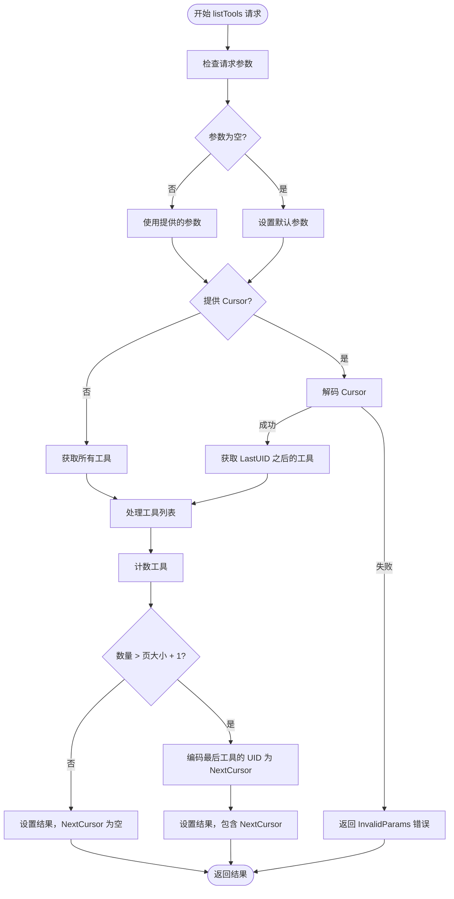
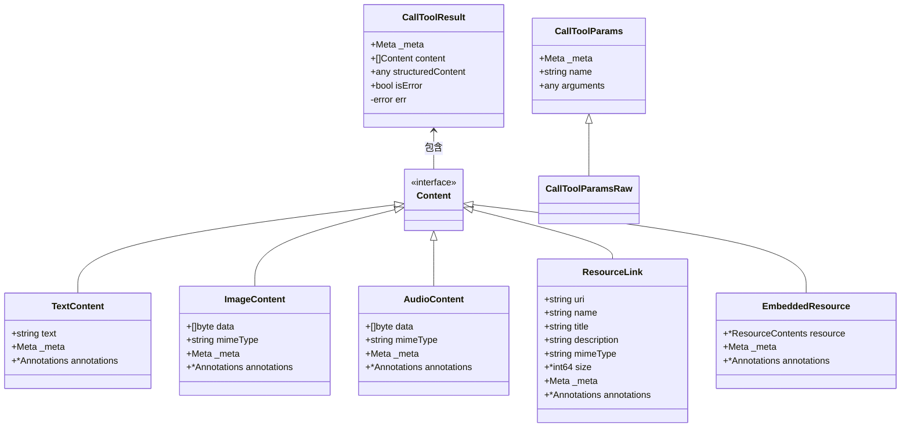
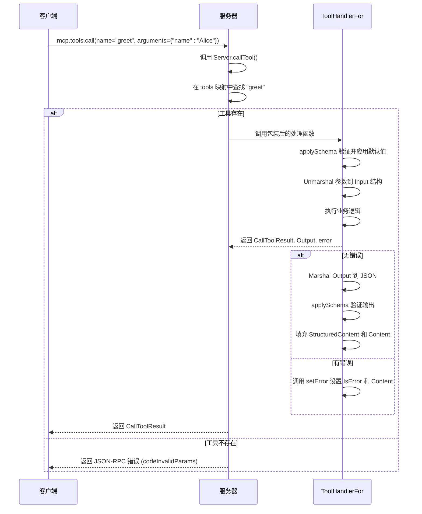

# 工具调用方法

<cite>
**本文档中引用的文件**  
- [tool.go](file://mcp/tool.go)
- [protocol.go](file://mcp/protocol.go)
- [server.go](file://mcp/server.go)
- [requests.go](file://mcp/requests.go)
- [shared.go](file://mcp/shared.go)
- [content.go](file://mcp/content.go)
- [examples/server/toolschemas/main.go](file://examples/server/toolschemas/main.go)
</cite>

## 目录
1. [简介](#简介)
2. [工具列表方法](#工具列表方法)
3. [工具调用方法](#工具调用方法)
4. [服务器端工具处理机制](#服务器端工具处理机制)
5. [客户端调用示例与错误处理](#客户端调用示例与错误处理)
6. [流式响应支持](#流式响应支持)
7. [结论](#结论)

## 简介
MCP（Model Context Protocol）协议定义了一套标准化的工具调用机制，允许客户端通过 `mcp.tools.list` 和 `mcp.tools.call` 方法发现和调用服务器端提供的功能。本文档详细阐述了这些方法的参数结构、分页机制、元数据用途、序列化要求以及服务器端的注册和处理流程。通过分析 `tool.go` 中 `ToolHandler` 的实现，说明了如何在服务器端注册工具并处理调用请求，同时提供了客户端调用时的参数验证、错误捕获和结构化输出解析的完整示例。

## 工具列表方法

`mcp.tools.list` 方法用于获取服务器支持的工具列表。该方法支持分页机制，以处理大量工具的场景。

### 分页机制（Cursor/NextCursor）
分页通过 `ListToolsParams` 和 `ListToolsResult` 结构中的 `Cursor` 和 `NextCursor` 字段实现。`Cursor` 是一个不透明的令牌，表示当前分页的位置。当客户端在请求中提供 `Cursor` 时，服务器应返回该位置之后的结果。`NextCursor` 是结果中返回的下一个分页位置的令牌。如果存在，表明可能还有更多结果。

分页逻辑由 `paginateList` 函数实现，该函数使用 `encodeCursor` 和 `decodeCursor` 来序列化和反序列化分页状态。分页状态包含一个 `LastUID`，用于标识上一页的最后一个项目的唯一ID。



**图示来源**
- [server.go](file://mcp/server.go#L1223-L1289)
- [features.go](file://mcp/features.go#L75-L93)

**本节来源**
- [protocol.go](file://mcp/protocol.go#L528-L535)
- [protocol.go](file://mcp/protocol.go#L543-L551)
- [server.go](file://mcp/server.go#L547-L559)

## 工具调用方法

`mcp.tools.call` 方法用于调用服务器端的特定工具。其核心参数是 `CallToolParams`，包含工具名称和参数。

### 参数序列化要求
`CallToolParams` 结构中的 `Name` 字段是工具的名称，必须与服务器注册的工具名称完全匹配。`Arguments` 字段是工具调用的参数，可以是任何可序列化为JSON的值。服务器端在处理时，会根据工具的输入模式（InputSchema）对 `Arguments` 进行验证和默认值填充。

### 结果字段使用场景
`CallToolResult` 结构定义了工具调用的响应，包含以下关键字段：
- **Content**: 一个内容对象列表，代表工具调用的非结构化结果。当使用 `ToolHandlerFor` 且未设置 `Content` 时，它会自动填充为结构化输出的JSON文本内容。
- **StructuredContent**: 可选值，代表工具调用的结构化结果，必须能序列化为JSON对象。当使用 `ToolHandlerFor` 时，此字段会自动填充为类型化的输出值，不应手动设置。
- **IsError**: 布尔值，指示工具调用是否以错误结束。如果工具内部发生错误，应将此字段设为 `true`，并将错误信息放入 `Content` 字段，而不是作为MCP协议级别的错误响应，以便LLM能够感知错误并自我纠正。



**图示来源**
- [protocol.go](file://mcp/protocol.go#L41-L50)
- [protocol.go](file://mcp/protocol.go#L72-L116)
- [content.go](file://mcp/content.go#L15-L284)

**本节来源**
- [protocol.go](file://mcp/protocol.go#L41-L50)
- [protocol.go](file://mcp/protocol.go#L72-L116)

## 服务器端工具处理机制

服务器端通过 `Server` 结构的 `AddTool` 方法来注册工具。工具的处理由 `ToolHandler` 或 `ToolHandlerFor` 函数实现。

### ToolHandler 与 ToolHandlerFor
`ToolHandler` 是一个低级API，直接处理原始请求，不进行任何预处理或后处理。大多数用户应使用 `ToolHandlerFor`，它提供了开箱即用的功能，如输入验证、默认值填充和输出结构化。

`AddTool` 函数是注册工具的主要入口。它接受一个 `Tool` 定义和一个 `ToolHandlerFor` 处理函数。内部会调用 `toolForErr` 函数来包装处理函数，添加输入验证、模式应用和错误处理逻辑。



**图示来源**
- [tool.go](file://mcp/tool.go#L57-L60)
- [server.go](file://mcp/server.go#L191-L234)
- [server.go](file://mcp/server.go#L236-L347)
- [tool.go](file://mcp/tool.go#L66-L102)

**本节来源**
- [tool.go](file://mcp/tool.go#L15-L102)
- [server.go](file://mcp/server.go#L191-L234)
- [server.go](file://mcp/server.go#L236-L347)
- [examples/server/toolschemas/main.go](file://examples/server/toolschemas/main.go#L1-L185)

## 客户端调用示例与错误处理

客户端调用工具时，需要确保参数符合工具的输入模式。错误处理应区分协议错误和工具执行错误。

### 参数验证与错误捕获
客户端在调用前应验证参数的类型和结构。如果服务器返回 `CallToolResult` 且 `IsError` 为 `true`，则表示工具执行失败，错误信息在 `Content` 字段中。如果收到JSON-RPC错误，则表示协议层面的问题，如未知工具。

### 结构化输出解析
当工具返回结构化输出时，`StructuredContent` 字段包含原始的JSON对象，而 `Content` 字段可能包含其文本表示。客户端应优先解析 `StructuredContent` 以获取结构化数据。

```go
// 伪代码示例
result, err := client.CallTool(ctx, &CallToolParams{
    Name: "greet",
    Arguments: map[string]any{"name": "Alice"},
})
if err != nil {
    // 处理协议错误，如未知工具
    log.Printf("Protocol error: %v", err)
    return
}
if result.IsError {
    // 处理工具执行错误
    errorMsg := result.Content[0].(*TextContent).Text
    log.Printf("Tool error: %s", errorMsg)
    return
}
// 解析结构化输出
var output Output
json.Unmarshal(result.StructuredContent, &output)
fmt.Println(output.Greeting)
```

**本节来源**
- [protocol.go](file://mcp/protocol.go#L72-L116)
- [content.go](file://mcp/content.go#L15-L284)

## 流式响应支持

虽然 `mcp.tools.call` 本身是同步请求-响应模式，但MCP协议通过 `notifications/progress` 通知支持流式响应。服务器可以在长时间运行的工具执行过程中，发送进度更新。

服务器可以通过 `Server` 的 `ProgressNotificationHandler` 选项来处理进度通知。对于发送进度，服务器可以使用 `notifySessions` 函数向客户端发送 `ProgressNotificationParams`。

**本节来源**
- [shared.go](file://mcp/shared.go#L515-L525)

## 结论
MCP协议的工具调用机制通过 `mcp.tools.list` 和 `mcp.tools.call` 方法提供了灵活且强大的功能。分页机制确保了大规模工具列表的高效处理，而 `Meta` 字段为扩展提供了空间。`CallToolParams` 和 `CallToolResult` 的设计强调了结构化与非结构化输出的分离，以及清晰的错误报告。服务器端通过 `ToolHandlerFor` 和 `AddTool` 实现了安全、自动化的工具注册和处理。客户端应正确处理 `IsError` 标志和结构化输出，以充分利用工具的功能。流式响应通过进度通知得到支持，增强了用户体验。