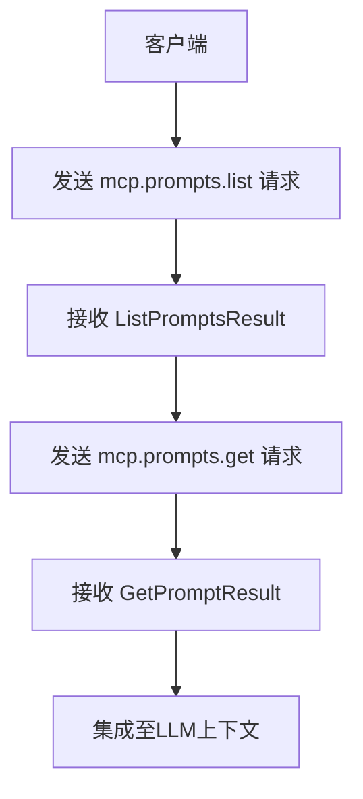
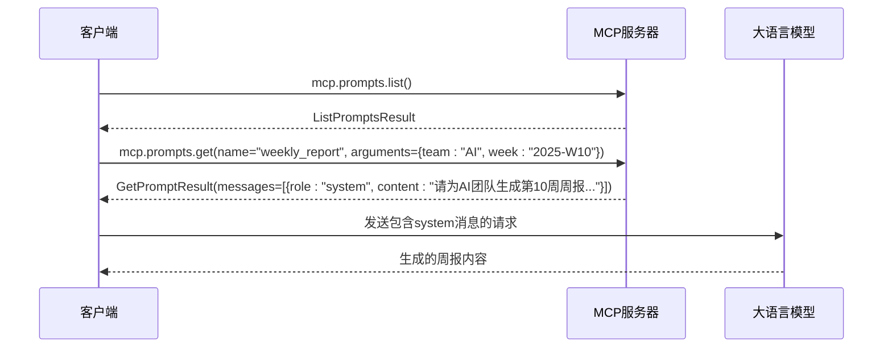

# 提示词操作方法

<cite>
**本文档中引用的文件**  
- [protocol.go](file://mcp/protocol.go)
- [prompt.go](file://mcp/prompt.go)
- [server.go](file://mcp/server.go)
- [requests.go](file://mcp/requests.go)
- [shared.go](file://mcp/shared.go)
</cite>

## 目录
1. [简介](#简介)
2. [核心RPC方法概述](#核心rpc方法概述)
3. [ListPrompts方法详解](#listprompts方法详解)
4. [GetPrompts方法详解](#getprompts方法详解)
5. [服务器端提示词定义机制](#服务器端提示词定义机制)
6. [客户端典型使用场景](#客户端典型使用场景)
7. [集成到LLM上下文中的实践](#集成到llm上下文中的实践)
8. [结论](#结论)

## 简介
MCP（Model Context Protocol）协议通过标准化的RPC接口为客户端提供动态提示词管理能力。本文件深入解析与提示词相关的两个核心RPC方法：`mcp.prompts.list` 和 `mcp.prompts.get`。这些方法使客户端能够发现服务器支持的提示词模板，并根据参数动态获取具体提示内容，从而增强大语言模型（LLM）的理解与响应能力。

**Section sources**
- [protocol.go](file://mcp/protocol.go#L349-L445)

## 核心RPC方法概述
MCP协议中与提示词交互的核心方法包括：
- `mcp.prompts.list`：用于列出服务器提供的所有提示词模板。
- `mcp.prompts.get`：根据名称和参数获取特定提示词模板的实例化结果。

这两个方法共同构成了客户端动态获取结构化提示内容的基础，支持参数化、分页和角色消息嵌入等高级功能。



**Diagram sources**
- [protocol.go](file://mcp/protocol.go#L422-L445)
- [protocol.go](file://mcp/protocol.go#L349-L371)

## ListPrompts方法详解
`mcp.prompts.list` 方法允许客户端查询服务器所支持的所有提示词模板。该方法采用分页机制以支持大规模提示词集合。

### 请求参数：ListPromptsParams
```go
type ListPromptsParams struct {
	Meta   `json:"_meta,omitempty"`
	Cursor string `json:"cursor,omitempty"`
}
```
- **Cursor**：可选的不透明令牌，表示当前分页位置。若提供，则服务器应返回此游标之后的结果，实现增量加载。

### 响应结果：ListPromptsResult
```go
type ListPromptsResult struct {
	Meta       `json:"_meta,omitempty"`
	NextCursor string    `json:"nextCursor,omitempty"`
	Prompts    []*Prompt `json:"prompts"`
}
```
- **NextCursor**：表示最后一个返回结果后的分页位置。若存在，则表明仍有更多结果可用。
- **Prompts**：包含一组 `Prompt` 对象，每个对象描述一个可用的提示词模板。

### Prompt对象结构
```go
type Prompt struct {
	Meta        `json:"_meta,omitempty"`
	Arguments   []*PromptArgument `json:"arguments,omitempty"`
	Description string            `json:"description,omitempty"`
	Name        string            `json:"name"`
	Title       string            `json:"title,omitempty"`
}
```
- **Name**：程序化使用的唯一标识符，用于逻辑引用或API调用。
- **Title**：面向用户界面显示的可读名称，优化为人类易理解的形式。
- **Description**：对该提示词用途的简要说明，帮助用户理解其功能。
- **Arguments**：定义提示词接受的参数列表，每个参数包含名称、标题、描述和是否必需等属性。

**Section sources**
- [protocol.go](file://mcp/protocol.go#L422-L445)
- [protocol.go](file://mcp/protocol.go#L661-L675)

## GetPrompts方法详解
`mcp.prompts.get` 方法用于根据指定名称和参数获取具体的提示词内容。

### 请求参数：GetPromptParams
```go
type GetPromptParams struct {
	Meta      `json:"_meta,omitempty"`
	Arguments map[string]string `json:"arguments,omitempty"`
	Name      string            `json:"name"`
}
```
- **Name**：要获取的提示词模板的名称，必须与 `ListPromptsResult` 中某个 `Prompt` 的 `Name` 字段匹配。
- **Arguments**：用于模板填充的键值对映射。服务器将使用这些值替换提示词中的占位符，实现动态内容生成。

### 响应结果：GetPromptResult
```go
type GetPromptResult struct {
	Meta        `json:"_meta,omitempty"`
	Description string           `json:"description,omitempty"`
	Messages    []*PromptMessage `json:"messages"`
}
```
- **Description**：该提示词的可选描述信息。
- **Messages**：一组 `PromptMessage` 对象，构成完整的提示模板序列，可直接用于LLM上下文。

### PromptMessage结构
```go
type PromptMessage struct {
	Content Content `json:"content"`
	Role    Role    `json:"role"`
}
```
- **Content**：消息内容，可以是文本、图像或其他媒体类型。
- **Role**：消息角色（如 system、user、assistant），用于构建对话上下文。

变量替换机制在服务器端执行，确保所有 `{key}` 形式的占位符被 `Arguments` 中对应的值安全替换。

**Section sources**
- [protocol.go](file://mcp/protocol.go#L349-L371)
- [protocol.go](file://mcp/protocol.go#L705-L708)

## 服务器端提示词定义机制
服务器通过 `AddPrompt` 方法注册提示词模板及其处理逻辑。

### AddPrompt实现分析
```go
func (s *Server) AddPrompt(p *Prompt, h PromptHandler)
```
- **p *Prompt**：定义提示词元数据（如 Name、Title、Arguments）的结构体。
- **h PromptHandler**：处理 `mcp.prompts.get` 请求的回调函数，类型为：
  ```go
  type PromptHandler func(context.Context, *GetPromptRequest) (*GetPromptResult, error)
  ```

当客户端发起 `get` 请求时，服务器调用对应的 `PromptHandler`，传入包含 `GetPromptParams` 的 `GetPromptRequest`，由处理器生成并返回 `GetPromptResult`。

该机制支持动态逻辑，例如基于参数查询数据库、调用外部服务或组合多个资源生成最终提示。

**Section sources**
- [server.go](file://mcp/server.go#L153-L160)
- [prompt.go](file://mcp/prompt.go#L10-L12)

## 客户端典型使用场景
以下是客户端获取参数化提示词的典型流程：

1. 调用 `mcp.prompts.list` 获取所有可用提示词。
2. 根据用户选择确定目标提示词 `Name`。
3. 收集所需参数（如用户输入、上下文数据）。
4. 调用 `mcp.prompts.get` 并传入 `Name` 和 `Arguments`。
5. 接收包含角色消息的完整提示模板。
6. 将 `Messages` 序列注入LLM请求上下文。

例如，一个“生成周报”提示词可能接受 `{team}` 和 `{week}` 参数，客户端填充后获取定制化的系统提示。



**Diagram sources**
- [protocol.go](file://mcp/protocol.go#L349-L371)
- [protocol.go](file://mcp/protocol.go#L422-L445)

## 集成到LLM上下文中的实践
获取的 `GetPromptResult.Messages` 可直接作为LLM请求的上下文消息数组使用。这种集成方式具有以下优势：
- **一致性**：确保所有客户端使用统一的提示格式。
- **动态性**：支持基于运行时参数生成个性化提示。
- **可维护性**：提示逻辑集中于服务器端，便于更新和版本控制。
- **安全性**：敏感逻辑或数据处理保留在服务器内部。

通过将MCP提示词无缝集成到LLM交互流程中，应用能够显著提升模型输出的相关性与准确性。

**Section sources**
- [protocol.go](file://mcp/protocol.go#L364-L371)
- [protocol.go](file://mcp/protocol.go#L705-L708)

## 结论
MCP协议的提示词操作方法为构建智能化、上下文感知的应用提供了强大支持。通过 `mcp.prompts.list` 和 `mcp.prompts.get` 方法，客户端能够灵活发现并获取参数化提示模板，而服务器端则可通过 `AddPrompt` 注册动态逻辑。这种机制不仅增强了LLM的理解能力，还实现了提示工程的集中化管理与动态化执行，是现代AI应用架构中的关键组件。