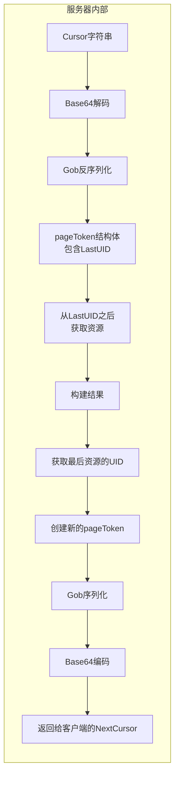
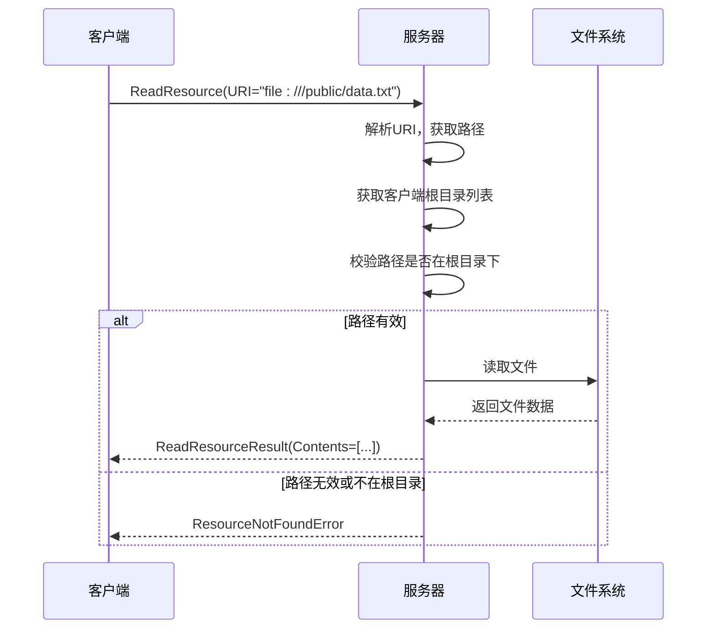
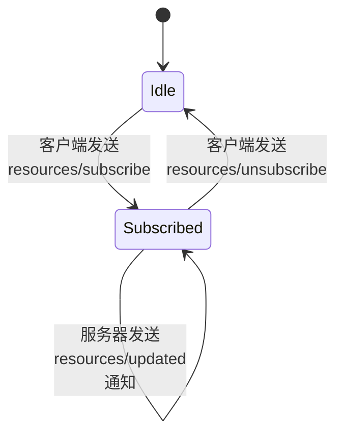
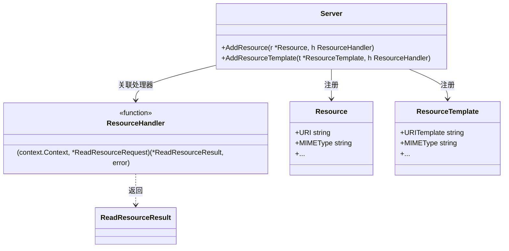

# 资源管理方法

<cite>
**本文档中引用的文件**   
- [resource.go](file://mcp/resource.go)
- [protocol.go](file://mcp/protocol.go)
- [server.go](file://mcp/server.go)
- [content.go](file://mcp/content.go)
</cite>

## 目录
1. [简介](#简介)
2. [资源列表与分页机制](#资源列表与分页机制)
3. [资源元数据结构](#资源元数据结构)
4. [读取资源方法](#读取资源方法)
5. [资源订阅与生命周期管理](#资源订阅与生命周期管理)
6. [服务器资源注册机制](#服务器资源注册机制)
7. [客户端使用示例](#客户端使用示例)
8. [结论](#结论)

## 简介
MCP（Model Context Protocol）协议提供了一套完整的资源管理方法体系，使服务器能够暴露可读资源，客户端能够查询、读取和监听资源变更。本文档系统性地介绍 `mcp.resources.list`、`mcp.resources.read` 和 `mcp.resources.subscribe` 三大核心方法，详细解析其参数、结果结构、分页设计及事件订阅机制。通过分析 `resource.go` 中的资源注册逻辑，阐明服务器如何暴露资源，并提供完整的客户端代码示例。

**Section sources**
- [protocol.go](file://mcp/protocol.go#L478-L501)
- [server.go](file://mcp/server.go#L580-L592)

## 资源列表与分页机制
`mcp.resources.list` 方法允许客户端分页查询服务器上可用的资源列表。该机制通过 `ListResourcesParams` 和 `ListResourcesResult` 结构体实现，支持高效的分页浏览。

### 分页参数与结果
分页的核心是游标（cursor）机制。客户端首次请求时无需提供游标，服务器返回第一页结果和一个不透明的 `nextCursor`。客户端在后续请求中将此 `nextCursor` 作为 `ListResourcesParams.Cursor` 的值，服务器即可返回下一页数据。

```mermaid
flowchart TD
A[客户端: ListResources<br>Cursor = ""] --> B[服务器: 返回第一页<br>Resources[0..99]<br>NextCursor = "abc123"]
B --> C[客户端: ListResources<br>Cursor = "abc123"]
C --> D[服务器: 返回第二页<br>Resources[100..199]<br>NextCursor = "def456"]
D --> E[客户端: ListResources<br>Cursor = "def456"]
E --> F[服务器: 返回第三页<br>Resources[200..299]<br>NextCursor = ""]
F --> G[客户端: 无更多结果]
```

**Diagram sources**
- [protocol.go](file://mcp/protocol.go#L478-L485)
- [protocol.go](file://mcp/protocol.go#L493-L501)

### 分页实现原理
服务器内部使用 `paginateList` 函数实现分页逻辑。游标（cursor）在内部被编码为一个 `pageToken` 结构体，该结构体包含上一页最后一个资源的唯一标识符（UID）。此 `pageToken` 通过 Gob 序列化后，再进行 Base64 编码，形成客户端可见的不透明字符串。



**Diagram sources**
- [server.go](file://mcp/server.go#L1260-L1290)

**Section sources**
- [server.go](file://mcp/server.go#L1260-L1290)

## 资源元数据结构
`Resource` 结构体定义了资源的元数据，为客户端提供关于资源的丰富信息。

### Resource 结构体字段详解
| 字段 | 类型 | 描述 |
| :--- | :--- | :--- |
| **URI** | `string` | 资源的唯一标识符（URI），是读取和订阅资源的关键。 |
| **MIMEType** | `string` | 资源的MIME类型（如 `text/plain`, `image/png`），帮助客户端正确处理内容。 |
| **Name** | `string` | 资源的程序化名称，用于逻辑引用。 |
| **Title** | `string` | 资源的显示名称，优化为人类可读。 |
| **Description** | `string` | 资源的描述，可作为LLM理解资源的“提示”。 |
| **Size** | `int64` | 资源内容的原始大小（字节），用于估算上下文窗口占用。 |
| **Annotations** | `*Annotations` | 可选的客户端注解，包含优先级、最后修改时间等。 |
| **Meta** | `Meta` | 保留字段，用于附加额外的元数据。 |

**Section sources**
- [protocol.go](file://mcp/protocol.go#L753-L784)

### Annotations 结构体
`Annotations` 结构体提供了额外的上下文信息。
- **Audience**: 指定资源的目标受众（如用户、助手）。
- **LastModified**: ISO 8601格式的最后修改时间戳。
- **Priority**: 重要性优先级（0-1），1表示最重要。

## 读取资源方法
`mcp.resources.read` 方法允许客户端根据URI读取资源内容。

### URI解析机制
`ReadResourceParams.URI` 字段可以使用任何协议，其解释权完全在服务器。在文件系统场景下，`fileResourceHandler` 会进行严格的URI解析和安全检查：
1.  **协议检查**: 确保URI的协议为 `file`。
2.  **路径本地化**: 使用 `filepath.Localize` 处理路径，防止 `..` 等路径遍历攻击。
3.  **根目录校验**: 将请求的文件路径与客户端提供的根目录（Roots）进行比对，确保请求的文件位于允许的根目录之下。



**Diagram sources**
- [resource.go](file://mcp/resource.go#L110-L150)
- [server.go](file://mcp/server.go#L640-L654)

### 多部分响应格式
`ReadResourceResult` 的 `Contents` 字段是一个 `[]*ResourceContents` 数组，支持返回资源的多个部分或不同表示形式。
- **Text**: 用于文本内容，以字符串形式存储。
- **Blob**: 用于二进制内容（如图片、音频），以字节数组形式存储。
- **URI/MIMEType**: 每个部分都包含自己的URI和MIMEType，允许服务器返回资源的子部分或不同格式的版本。

**Section sources**
- [protocol.go](file://mcp/protocol.go#L743-L748)
- [content.go](file://mcp/content.go#L231-L245)

## 资源订阅与生命周期管理
`mcp.resources.subscribe` 和 `mcp.resources.unsubscribe` 方法实现了资源变更的事件通知机制。

### 订阅生命周期
1.  **订阅 (Subscribe)**: 客户端发送 `SubscribeParams` 指定要监听的资源URI。服务器将该客户端会话（Session）加入到该URI的订阅者列表中。
2.  **变更通知 (ResourceUpdated)**: 当服务器检测到资源变更时，调用 `Server.ResourceUpdated()` 方法。服务器会遍历该资源的所有订阅者会话，并向它们发送 `notifications/resources/updated` 通知。
3.  **取消订阅 (Unsubscribe)**: 客户端发送 `UnsubscribeParams` 以停止接收通知。服务器会从订阅者列表中移除该会话。



**Diagram sources**
- [server.go](file://mcp/server.go#L710-L749)
- [server.go](file://mcp/server.go#L700-L708)

### 服务器端实现
服务器使用一个 `map[string]map[*ServerSession]bool` 类型的 `resourceSubscriptions` 字段来维护订阅关系，其中外层map的key是资源URI，内层map的key是订阅的会话。`SubscribeHandler` 和 `UnsubscribeHandler` 是可选的回调函数，允许服务器在订阅/取消订阅时执行自定义逻辑。

**Section sources**
- [server.go](file://mcp/server.go#L50-L50)
- [server.go](file://mcp/server.go#L710-L749)

## 服务器资源注册机制
服务器通过 `Server` 结构体的方法来暴露可读资源。

### 注册方法
- **AddResource**: 直接注册一个具体的 `Resource` 对象和一个 `ResourceHandler`。当客户端请求该资源的精确URI时，会调用此处理器。
- **AddResourceTemplate**: 注册一个 `ResourceTemplate`，它使用RFC 6570 URI模板（如 `file:///data/{year}/{month}/{day}.log`）。这允许服务器暴露一类资源，处理器可以处理匹配该模板的任何URI。



**Diagram sources**
- [server.go](file://mcp/server.go#L422-L453)
- [resource.go](file://mcp/resource.go#L25-L30)

### 查找处理器
当收到 `readResource` 请求时，服务器首先在精确注册的资源列表中查找，如果未找到，则遍历所有资源模板，检查请求的URI是否与某个模板匹配。这种设计提供了极大的灵活性。

**Section sources**
- [server.go](file://mcp/server.go#L640-L654)

## 客户端使用示例
以下代码片段展示了客户端如何使用这些方法（路径引用）。

### 分页查询资源列表
```go
// 代码示例路径: examples/client/listfeatures/main.go
params := &mcp.ListResourcesParams{}
for {
    result, err := clientSession.ListResources(ctx, params)
    if err != nil { /* 处理错误 */ }
    for _, resource := range result.Resources {
        fmt.Printf("资源: %s (%s)\n", resource.Name, resource.URI)
    }
    if result.NextCursor == "" {
        break // 无更多结果
    }
    params.Cursor = result.NextCursor // 设置游标以获取下一页
}
```

### 读取二进制内容
```go
// 代码示例路径: examples/server/memory/main.go
params := &mcp.ReadResourceParams{URI: "file:///data/image.png"}
result, err := clientSession.ReadResource(ctx, params)
if err != nil { /* 处理错误 */ }
// result.Contents[0].Blob 包含PNG图像的字节数据
```

### 处理资源变更通知
```go
// 代码示例路径: examples/server/distributed/main.go
// (客户端需要实现一个能接收通知的会话)
subscribeParams := &mcp.SubscribeParams{URI: "file:///config/app.json"}
_, err := clientSession.Subscribe(ctx, subscribeParams)
// ... 之后，当服务器发送 notifications/resources/updated 时，
// 客户端的会话会收到通知，可以触发重新读取配置的操作。
```

**Section sources**
- [examples/client/listfeatures/main.go](file://examples/client/listfeatures/main.go)
- [examples/server/memory/main.go](file://examples/server/memory/main.go)
- [examples/server/distributed/main.go](file://examples/server/distributed/main.go)

## 结论
MCP协议的资源管理方法体系设计精巧，通过 `list`、`read` 和 `subscribe` 三大方法，结合分页游标、丰富的元数据和事件通知机制，为构建动态、响应式的AI应用提供了坚实的基础。服务器通过灵活的资源注册机制暴露数据，客户端则能高效地发现、读取和监听资源变更，实现了模型与外部上下文的无缝集成。