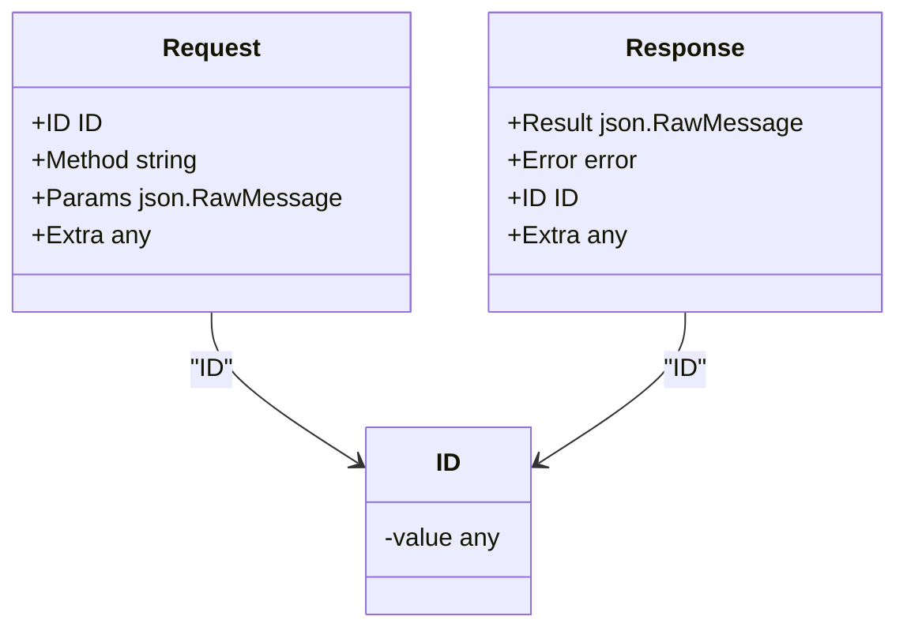
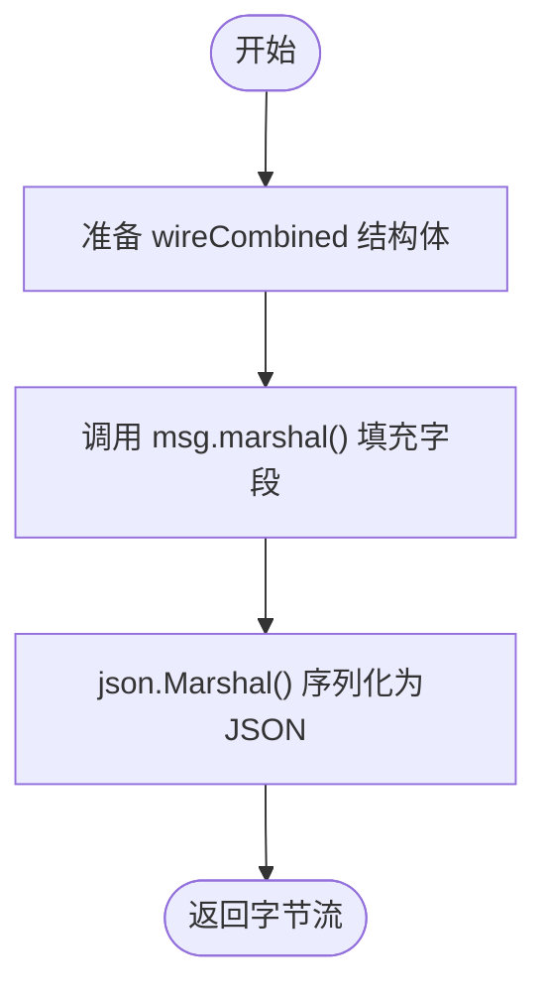
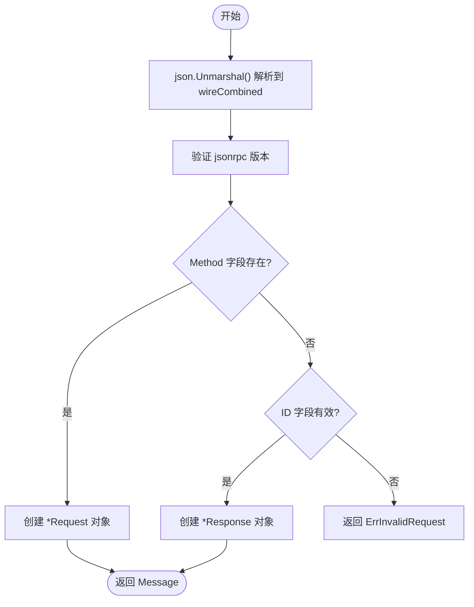
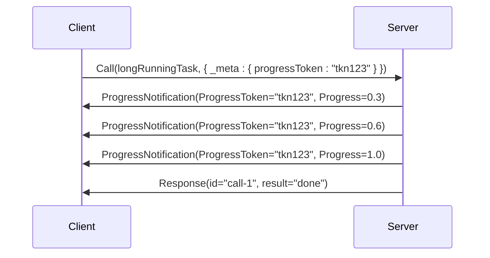

# 消息交互模式

<cite>
**Referenced Files in This Document**   
- [internal/jsonrpc2/messages.go](file://internal/jsonrpc2/messages.go)
- [internal/jsonrpc2/wire.go](file://internal/jsonrpc2/wire.go)
- [mcp/protocol.go](file://mcp/protocol.go)
- [mcp/shared.go](file://mcp/shared.go)
- [mcp/client.go](file://mcp/client.go)
- [mcp/server.go](file://mcp/server.go)
- [jsonrpc/jsonrpc.go](file://jsonrpc/jsonrpc.go)
</cite>

## 目录
1. [引言](#引言)
2. [JSON-RPC 2.0消息结构](#json-rpc-20消息结构)
3. [请求-响应与通知模式](#请求-响应与通知模式)
4. [消息编解码机制](#消息编解码机制)
5. [进度反馈机制](#进度反馈机制)
6. [调试与优化](#调试与优化)

## 引言

本文档深入解析MCP协议基于JSON-RPC 2.0的消息交互机制。MCP（Model Context Protocol）作为一种模型上下文协议，其核心通信依赖于JSON-RPC 2.0规范，通过定义清晰的请求-响应和通知模式来实现客户端与服务器之间的高效、可靠交互。本文档将详细阐述消息的序列化规则、核心字段的语义、进度反馈机制的实现细节，并结合Go SDK的代码实现，为开发者提供全面的技术指导。

## JSON-RPC 2.0消息结构

JSON-RPC 2.0定义了一种轻量级的远程过程调用协议，其消息以JSON格式进行序列化。一个完整的JSON-RPC消息包含以下几个核心字段：

*   **`jsonrpc`**: 一个固定的字符串 `"2.0"`，用于标识协议版本。
*   **`method`**: 一个字符串，表示要调用的方法名称。
*   **`params`**: 包含方法调用参数的结构体或数组。在MCP协议中，这通常是一个包含特定业务逻辑参数的对象。
*   **`id`**: 请求的唯一标识符。它可以是字符串、整数或`null`。`id`的存在与否是区分请求-响应模式和通知模式的关键。
*   **`result`**: 当消息是响应时，此字段包含调用成功的结果。
*   **`error`**: 当消息是响应且调用失败时，此字段包含错误信息，通常包括`code`和`message`。

在Go SDK的实现中，这些概念被封装在`internal/jsonrpc2`包中。`Request`和`Response`结构体分别代表了请求和响应消息，而`ID`类型则用于安全地处理各种类型的请求标识符。



**Diagram sources**
- [internal/jsonrpc2/messages.go](file://internal/jsonrpc2/messages.go#L50-L61)
- [internal/jsonrpc2/messages.go](file://internal/jsonrpc2/messages.go#L65-L75)
- [internal/jsonrpc2/messages.go](file://internal/jsonrpc2/messages.go#L14-L16)

**Section sources**
- [internal/jsonrpc2/messages.go](file://internal/jsonrpc2/messages.go#L14-L75)

## 请求-响应与通知模式

JSON-RPC 2.0定义了两种主要的交互模式：请求-响应（Request-Response）和通知（Notification）。这两种模式在技术实现和应用场景上有着本质的区别。

### 技术差异

*   **请求-响应模式**:
    *   **`id`字段**: 必须存在且不为`null`。
    *   **响应**: 服务器必须返回一个包含相同`id`的响应消息。响应消息中包含`result`（成功）或`error`（失败）字段。
    *   **实现**: 在SDK中，通过`NewCall`函数创建一个带有`id`的`Request`对象。服务器处理后，调用`NewResponse`生成响应。
*   **通知模式**:
    *   **`id`字段**: 必须为`null`或完全省略。
    *   **响应**: 服务器**不会**发送任何响应。客户端发送通知后即认为消息已送达。
    *   **实现**: 在SDK中，通过`NewNotification`函数创建一个`Request`对象，该函数内部不会设置`id`字段。

这种设计使得通知模式具有更低的通信开销，适用于那些不需要确认或结果的场景。

### 应用场景

*   **请求-响应**: 适用于需要获取结果或确认操作成功的场景。例如，`tools/list`请求需要服务器返回可用工具的列表；`resources/read`请求需要服务器返回资源内容。
*   **通知**: 适用于单向的状态更新或事件广播。例如，`notifications/tool_list_changed`用于通知客户端工具列表已更新；`notifications/progress`用于在长时间操作中发送进度更新。

## 消息编解码机制

消息的编解码是通信的基础，负责将Go语言中的结构体序列化为JSON字节流，以及将接收到的JSON字节流反序列化为结构体。

### 编码 (EncodeMessage)

编码过程将`Message`接口（`*Request`或`*Response`）转换为JSON字节流。其核心步骤如下：
1.  创建一个`wireCombined`结构体，该结构体包含了JSON-RPC 2.0规范中所有可能的字段。
2.  调用消息的`marshal`方法，将`Request`或`Response`的字段填充到`wireCombined`中。
3.  使用`json.Marshal`将`wireCombined`序列化为JSON字节流。



**Diagram sources**
- [internal/jsonrpc2/messages.go](file://internal/jsonrpc2/messages.go#L144-L152)
- [internal/jsonrpc2/messages.go](file://internal/jsonrpc2/messages.go#L135-L142)

**Section sources**
- [internal/jsonrpc2/messages.go](file://internal/jsonrpc2/messages.go#L144-L152)

### 解码 (DecodeMessage)

解码过程将接收到的JSON字节流反序列化为`Message`。其核心步骤如下：
1.  使用`json.Unmarshal`将字节流解析到`wireCombined`结构体中。
2.  验证`jsonrpc`字段的值是否为`"2.0"`。
3.  根据`wireCombined`中的字段判断消息类型：
    *   如果`Method`字段存在，则为`Request`。
    *   如果`Method`字段不存在，则为`Response`。
4.  根据判断结果，创建相应的`*Request`或`*Response`对象，并将`wireCombined`中的字段赋值给它。



**Diagram sources**
- [internal/jsonrpc2/messages.go](file://internal/jsonrpc2/messages.go#L167-L200)

**Section sources**
- [internal/jsonrpc2/messages.go](file://internal/jsonrpc2/messages.go#L167-L200)

## 进度反馈机制

对于长时间运行的操作（如大文件处理、复杂计算），`ProgressNotificationParams`提供了一种优雅的进度反馈机制，允许服务器或客户端在操作过程中向对方发送进度更新。

### ProgressNotificationParams 结构

该结构体定义了进度通知的详细信息：
*   **`ProgressToken`**: 进度令牌，用于将此通知与发起的原始请求关联起来。
*   **`Message`**: 可选的描述性消息。
*   **`Progress`**: 当前的进度值（通常为0到1的浮点数）。
*   **`Total`**: 总进度值（如果已知）。

### _progressToken 的生成、传递与关联逻辑

`_progressToken`是实现进度反馈的核心。它并非直接作为`ProgressNotificationParams`的字段，而是通过`Params`接口的`Meta`元数据字段进行传递。

1.  **生成与设置**: 当发起一个长时间操作的请求时，可以在请求的`Params`对象中通过`SetProgressToken`方法设置一个唯一的令牌（通常是字符串或整数）。
    ```go
    params.SetProgressToken("unique-token-123")
    ```
    此方法会将令牌存储在`Params`的`Meta`映射中，键为`"progressToken"`。

2.  **传递**: 当请求被序列化并发送时，`Meta`字段会作为`_meta`出现在JSON中。例如：
    ```json
    {
      "jsonrpc": "2.0",
      "id": "call-1",
      "method": "longRunningTask",
      "params": {
        "_meta": { "progressToken": "unique-token-123" },
        "otherParam": "value"
      }
    }
    ```

3.  **关联与获取**: 在处理请求的服务器端，可以通过`GetProgressToken`方法从`Params`中提取令牌。当需要发送进度通知时，将此令牌赋值给`ProgressNotificationParams.ProgressToken`字段。接收方通过匹配`ProgressToken`，即可将进度通知与原始请求关联起来。



**Diagram sources**
- [mcp/protocol.go](file://mcp/protocol.go#L641-L656)
- [mcp/shared.go](file://mcp/shared.go#L383-L399)

**Section sources**
- [mcp/protocol.go](file://mcp/protocol.go#L641-L656)
- [mcp/shared.go](file://mcp/shared.go#L383-L399)

## 调试与优化

### 消息调试技巧

*   **日志记录**: 在`Transport`层或`Middleware`中添加日志，打印出`EncodeMessage`和`DecodeMessage`前后的完整JSON字符串，便于排查序列化问题。
*   **使用`jsonrpc`包**: `jsonrpc`包提供了`EncodeMessage`和`DecodeMessage`的导出函数，方便在自定义传输层进行调试。

### 常见序列化错误排查

*   **`ErrInvalidRequest`**: 通常由`DecodeMessage`返回，表示接收到的消息格式不正确。检查`jsonrpc`版本、`id`字段的有效性以及`params`的JSON格式。
*   **`ErrParse`**: 表示JSON解析失败。检查消息的JSON格式是否有效。
*   **`ErrMethodNotFound`**: 服务器收到一个无法处理的方法调用。确保客户端请求的方法名与服务器注册的方法名完全一致。

### 性能优化建议

*   **复用连接**: 尽可能复用`jsonrpc2.Connection`，避免频繁建立和断开连接的开销。
*   **批量处理**: 对于可以合并的请求，考虑实现批量处理逻辑以减少网络往返次数。
*   **精简消息**: 避免在`params`或`result`中传递不必要的大对象，以减少序列化和网络传输的开销。