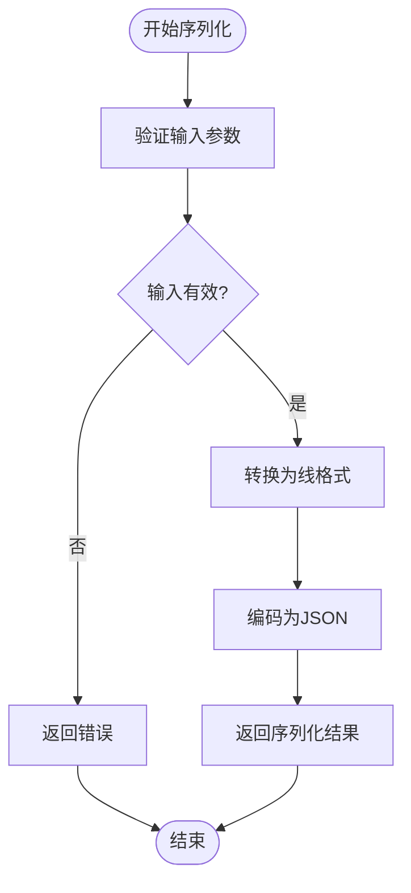
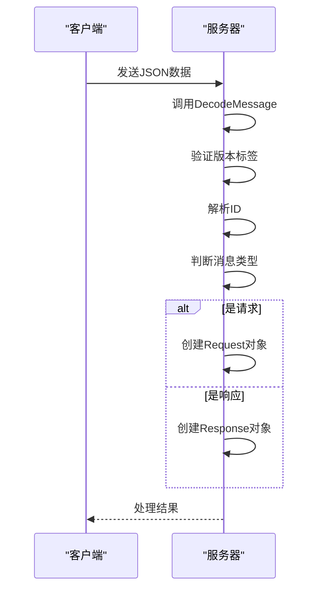
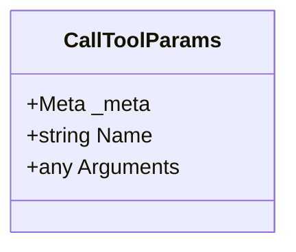
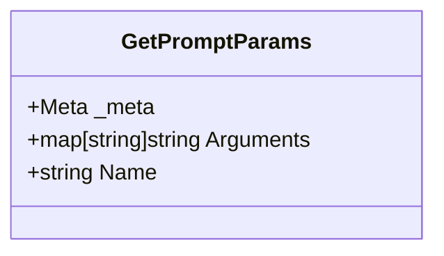
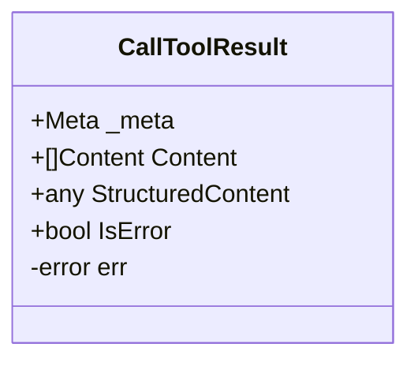
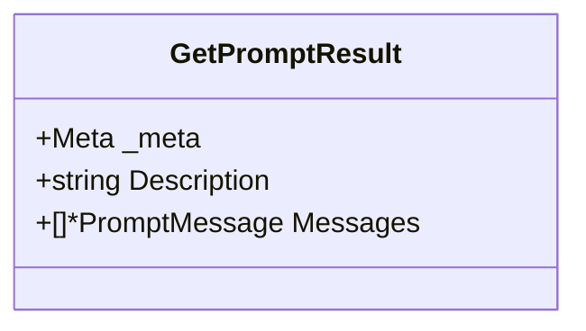
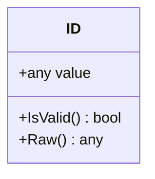
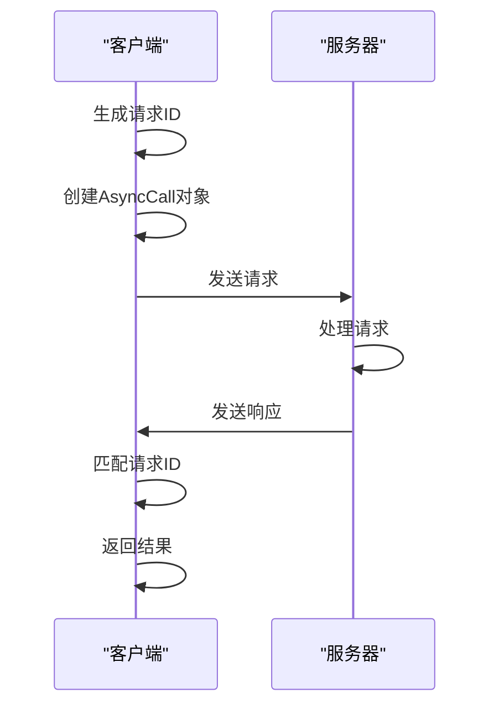
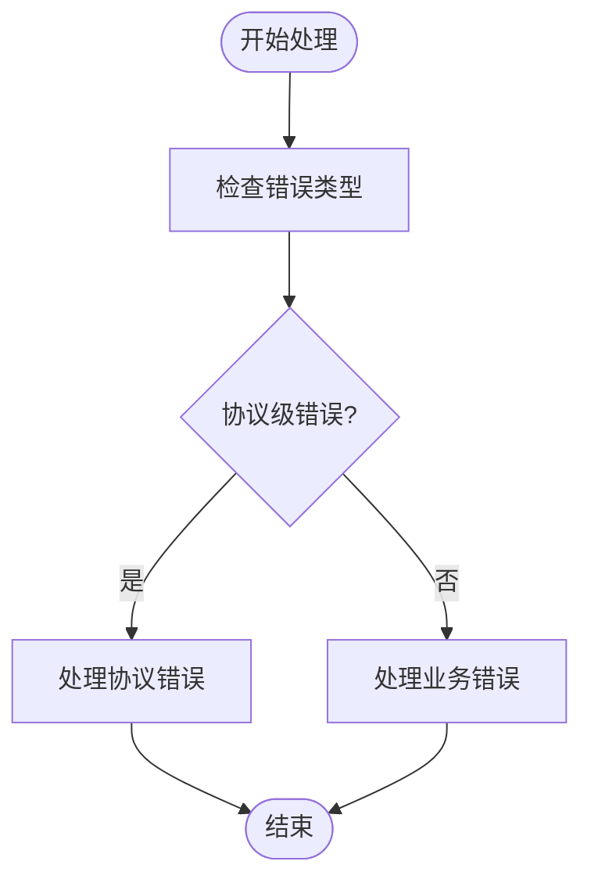
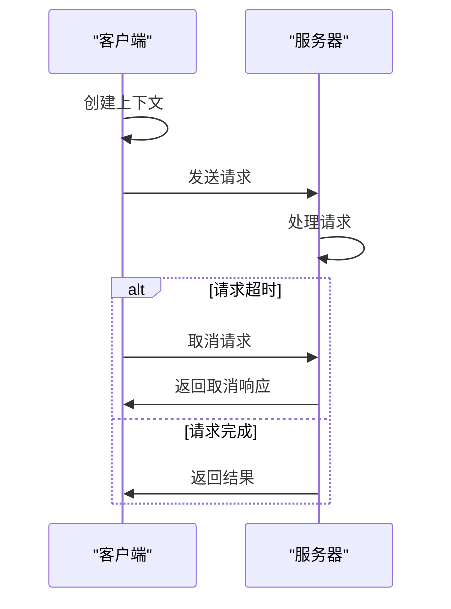

# 请求与响应

<cite>
**本文档引用的文件**   
- [CallToolParams.go](file://mcp/protocol.go#L41-L50)
- [GetPromptParams.go](file://mcp/protocol.go#L349-L357)
- [CallToolResult.go](file://mcp/protocol.go#L72-L116)
- [GetPromptResult.go](file://mcp/protocol.go#L364-L371)
- [NewCall.go](file://internal/jsonrpc2/messages.go#L99-L102)
- [NewResponse.go](file://internal/jsonrpc2/messages.go#L114-L117)
- [EncodeMessage.go](file://internal/jsonrpc2/messages.go#L144-L152)
- [DecodeMessage.go](file://internal/jsonrpc2/messages.go#L167-L200)
- [conn.go](file://internal/jsonrpc2/conn.go)
- [wire.go](file://internal/jsonrpc2/wire.go)
- [jsonrpc.go](file://jsonrpc/jsonrpc.go)
- [transport.go](file://mcp/transport.go)
- [sse.go](file://mcp/sse.go)
- [streamable.go](file://mcp/streamable.go)
</cite>

## 目录
1. [引言](#引言)
2. [请求-响应交互模式](#请求-响应交互模式)
3. [消息序列化与反序列化](#消息序列化与反序列化)
4. [核心参数与结果结构](#核心参数与结果结构)
5. [ID类型与请求匹配](#id类型与请求匹配)
6. [同步调用流程与错误处理](#同步调用流程与错误处理)
7. [上下文与请求生命周期](#上下文与请求生命周期)
8. [调试技巧与性能优化](#调试技巧与性能优化)

## 引言
本文档深入解析MCP协议中基于JSON-RPC 2.0的请求-响应交互模式。详细说明请求消息（Request）的method、params、id字段的序列化规则，以及响应消息（Response）中result与error的语义处理机制。结合mcp.CallToolParams、GetPromptParams等具体参数结构体，阐述客户端如何构造调用请求，并解析服务器返回的CallToolResult、GetPromptResult等结果类型。重点分析internal/jsonrpc2包中NewCall、NewResponse、EncodeMessage、DecodeMessage的实现逻辑，解释ID类型在请求匹配中的作用。提供实际代码示例展示同步调用流程、错误处理策略（如协议级错误与业务级错误区分），并说明如何通过上下文（context）管理请求生命周期。包含调试技巧，如日志记录、序列化异常排查及性能优化建议。

## 请求-响应交互模式
MCP协议基于JSON-RPC 2.0规范，采用请求-响应模式进行客户端与服务器之间的通信。客户端发送一个包含方法名、参数和唯一标识符的请求，服务器处理请求后返回一个包含结果或错误信息的响应。

**Section sources**
- [conn.go](file://internal/jsonrpc2/conn.go#L327-L374)
- [conn.go](file://internal/jsonrpc2/conn.go#L703-L757)

## 消息序列化与反序列化
### 序列化规则
请求和响应消息的序列化由`internal/jsonrpc2`包中的`EncodeMessage`函数处理。该函数将消息对象转换为符合JSON-RPC 2.0规范的JSON格式。

**Diagram sources**
- [messages.go](file://internal/jsonrpc2/messages.go#L144-L152)

### 反序列化机制
反序列化由`DecodeMessage`函数完成，该函数将接收到的JSON数据解析为相应的消息对象。

**Diagram sources**
- [messages.go](file://internal/jsonrpc2/messages.go#L167-L200)

## 核心参数与结果结构
### 请求参数结构
#### CallToolParams
`CallToolParams`结构体用于客户端调用工具时传递参数。

**Diagram sources**
- [protocol.go](file://mcp/protocol.go#L41-L50)

#### GetPromptParams
`GetPromptParams`结构体用于获取提示信息时的参数。

**Diagram sources**
- [protocol.go](file://mcp/protocol.go#L349-L357)

### 响应结果结构
#### CallToolResult
`CallToolResult`结构体表示工具调用的结果。

**Diagram sources**
- [protocol.go](file://mcp/protocol.go#L72-L116)

#### GetPromptResult
`GetPromptResult`结构体表示获取提示信息的结果。

**Diagram sources**
- [protocol.go](file://mcp/protocol.go#L364-L371)

## ID类型与请求匹配
ID类型在请求-响应匹配中起着关键作用。`internal/jsonrpc2`包中的`ID`结构体用于表示请求的唯一标识符。

**Diagram sources**
- [messages.go](file://internal/jsonrpc2/messages.go#L26-L36)

## 同步调用流程与错误处理
### 同步调用流程
同步调用流程通过`Connection.Call`方法实现，该方法发送请求并等待响应。

**Diagram sources**
- [conn.go](file://internal/jsonrpc2/conn.go#L327-L374)

### 错误处理策略
错误处理分为协议级错误和业务级错误。协议级错误如`ErrMethodNotFound`，业务级错误通过`CallToolResult.IsError`字段表示。

**Diagram sources**
- [messages.go](file://internal/jsonrpc2/messages.go#L114-L117)

## 上下文与请求生命周期
上下文（context）用于管理请求的生命周期，包括超时、取消等操作。

**Diagram sources**
- [conn.go](file://internal/jsonrpc2/conn.go#L327-L374)

## 调试技巧与性能优化
### 调试技巧
- 使用`LoggingTransport`记录请求和响应日志
- 检查序列化和反序列化过程中的异常
- 监控请求ID的匹配情况

### 性能优化
- 使用批量消息处理减少网络开销
- 优化JSON序列化和反序列化性能
- 合理设置请求超时时间

**Section sources**
- [transport.go](file://mcp/transport.go#L253-L290)
- [messages.go](file://internal/jsonrpc2/messages.go#L144-L152)