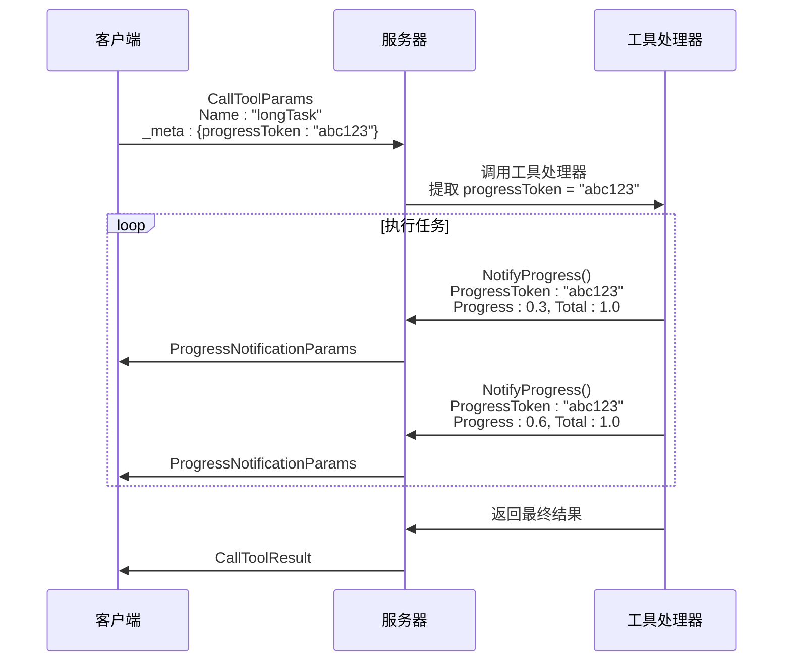

# 进度追踪

<cite>
**本文档引用的文件**
- [protocol.go](file://mcp/protocol.go)
- [server.go](file://mcp/server.go)
- [client.go](file://mcp/client.go)
- [shared.go](file://mcp/shared.go)
- [mcp_example_test.go](file://mcp/mcp_example_test.go)
</cite>

## 目录
1. [引言](#引言)
2. [核心结构体：ProgressNotificationParams](#核心结构体progressnotificationparams)
3. [进度令牌（ProgressToken）的关联机制](#进度令牌progresstoken的关联机制)
4. [进度通知字段的语义与规范](#进度通知字段的语义与规范)
5. [实际应用场景与代码示例](#实际应用场景与代码示例)
6. [设计优势与实现注意事项](#设计优势与实现注意事项)
7. [结论](#结论)

## 引言
在模型上下文协议（MCP）中，长时间操作的进度反馈机制是提升用户体验和实现操作透明性的关键功能。该机制允许服务器在执行耗时任务（如大文件处理、复杂计算）时，向客户端发送实时的进度更新。本文档将深入解析这一机制，核心围绕`ProgressNotificationParams`结构体展开。我们将详细说明`_meta`字段中的`progressToken`如何在初始请求（如`CallToolParams`）与后续的进度通知之间建立关联，确保客户端能正确匹配和处理进度更新。同时，本文将阐述该机制的设计优势，并讨论实现时的关键注意事项。

## 核心结构体：ProgressNotificationParams
`ProgressNotificationParams`是MCP协议中用于传递进度信息的核心数据结构。它定义了服务器向客户端发送进度更新时所携带的所有必要信息。

**Section sources**
- [protocol.go](file://mcp/protocol.go#L641-L656)

## 进度令牌（ProgressToken）的关联机制
进度令牌（`progressToken`）是整个进度反馈机制的基石，它确保了客户端能够将多个进度通知与一个特定的、长时间运行的请求关联起来。

### 令牌的生成与传递
1.  **客户端发起请求**：当客户端需要调用一个可能耗时较长的工具时，它会在请求参数（如`CallToolParams`）的`_meta`字段中嵌入一个唯一的`progressToken`。这个令牌可以是字符串或整数。
2.  **服务器接收请求**：服务器在处理`CallToolRequest`时，通过`GetProgressToken()`方法从请求的`Meta`字段中提取出`progressToken`。
3.  **服务器发送进度通知**：在执行长时间任务的过程中，服务器会创建`ProgressNotificationParams`实例，并将之前提取的`progressToken`赋值给其`ProgressToken`字段。然后，通过`ServerSession.NotifyProgress()`方法将此通知发送给客户端。

### 关联的实现
客户端通过`ProgressNotificationClientRequest`中的`ProgressToken`字段来识别该通知属于哪个原始请求。这使得客户端能够为不同的操作维护独立的进度条或状态显示，即使这些操作是并发执行的。



**Diagram sources**
- [protocol.go](file://mcp/protocol.go#L641-L656)
- [server.go](file://mcp/server.go#L907-L909)
- [client.go](file://mcp/client.go#L677-L679)

**Section sources**
- [protocol.go](file://mcp/protocol.go#L41-L50)
- [shared.go](file://mcp/shared.go#L463-L473)

## 进度通知字段的语义与规范
`ProgressNotificationParams`结构体中的各个字段具有明确的语义和使用规范。

### Progress 字段
- **语义**：表示当前已完成的进度量。这是一个浮点数，其值应随着任务的推进而单调递增。
- **规范**：即使`Total`未知，`Progress`也应在每次取得进展时增加。例如，在处理一个未知大小的文件流时，`Progress`可以代表已处理的字节数或已处理的文件数量。

### Total 字段
- **语义**：表示完成整个任务所需的总工作量。如果任务的总量是已知的（如处理一个100MB的文件），则`Total`应设置为该值。
- **规范**：如果总量未知，则`Total`必须为0。客户端应据此判断是否可以计算百分比进度。

### Message 字段
- **语义**：一个可选的字符串，用于描述当前的进度状态，为用户提供更直观的信息。
- **规范**：该字段是可选的，但强烈建议使用，例如设置为"正在压缩文件..."或"已处理 50/100 条记录"。

**Section sources**
- [protocol.go](file://mcp/protocol.go#L641-L656)

## 实际应用场景与代码示例
以下代码示例展示了如何在服务器端生成进度通知，以及客户端如何接收并处理这些通知。

### 服务器端示例
```go
// 服务器端：在工具处理器中发送进度通知
func Example_progress() {
	server := mcp.NewServer(&mcp.Implementation{Name: "server", Version: "v0.0.1"}, nil)
	mcp.AddTool(server, &mcp.Tool{Name: "makeProgress"}, func(ctx context.Context, req *mcp.CallToolRequest, _ any) (*mcp.CallToolResult, any, error) {
		// 从初始请求中获取进度令牌
		if token := req.Params.GetProgressToken(); token != nil {
			for i := range 3 {
				params := &mcp.ProgressNotificationParams{
					Message:       "frobbing widgets",
					ProgressToken: token,
					Progress:      float64(i),
					Total:         2,
				}
				// 发送进度通知
				req.Session.NotifyProgress(ctx, params) // ignore error
			}
		}
		return &mcp.CallToolResult{}, nil, nil
	})
	// ... 连接服务器
}
```

### 客户端示例
```go
// 客户端：注册进度通知处理器
client := mcp.NewClient(&mcp.Implementation{Name: "client", Version: "v0.0.1"}, &mcp.ClientOptions{
	ProgressNotificationHandler: func(_ context.Context, req *mcp.ProgressNotificationClientRequest) {
		// 处理收到的进度通知
		fmt.Printf("%s %.0f/%.0f\n", req.Params.Message, req.Params.Progress, req.Params.Total)
	},
})
// ... 连接客户端并发起请求
session.CallTool(ctx, &mcp.CallToolParams{
	Name: "makeProgress",
	Meta: mcp.Meta{"progressToken": "abc123"}, // 在_meta中设置令牌
})
```

**Section sources**
- [mcp_example_test.go](file://mcp/mcp_example_test.go#L59-L101)

## 设计优势与实现注意事项
### 设计优势
1.  **提升用户体验**：用户可以实时了解长时间操作的执行状态，避免了“无响应”的错觉，增强了应用的可预测性和可用性。
2.  **支持操作中断**：客户端可以根据进度信息决定是否取消一个长时间运行的操作。
3.  **解耦与灵活性**：该机制通过`progressToken`实现了请求与通知的松耦合，使得服务器可以灵活地在任何阶段发送进度更新。

### 实现注意事项
1.  **频率控制**：避免过于频繁地发送进度通知，以免造成网络和处理开销。可以采用节流（throttling）策略，例如每100毫秒或每处理一定量数据后发送一次。
2.  **令牌管理**：确保`progressToken`的唯一性和安全性。在高并发场景下，应使用安全的随机数生成器来创建令牌。
3.  **错误处理**：在发送进度通知时，应妥善处理可能的网络错误或连接中断。`NotifyProgress`方法的返回错误应被检查和记录，但通常不应中断主任务的执行。

**Section sources**
- [server.go](file://mcp/server.go#L907-L909)
- [client.go](file://mcp/client.go#L677-L679)

## 结论
MCP协议中的进度反馈机制通过`ProgressNotificationParams`结构体和`progressToken`令牌，为长时间操作提供了强大而灵活的进度追踪能力。该机制不仅定义了清晰的语义和规范，还通过示例代码展示了其在实际应用中的易用性。正确实现此机制能显著提升应用程序的用户体验和健壮性。开发者在实现时，应重点关注频率控制、令牌管理和错误处理等关键方面，以确保系统的稳定和高效。