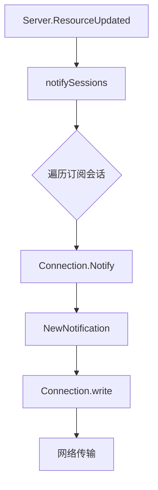

# 通知机制

<cite>
**Referenced Files in This Document**   
- [internal/jsonrpc2/messages.go](file://internal/jsonrpc2/messages.go)
- [mcp/protocol.go](file://mcp/protocol.go)
- [mcp/event.go](file://mcp/event.go)
- [mcp/server.go](file://mcp/server.go)
- [internal/jsonrpc2/conn.go](file://internal/jsonrpc2/conn.go)
- [mcp/transport.go](file://mcp/transport.go)
</cite>

## 目录
1. [引言](#引言)
2. [通知机制核心概念](#通知机制核心概念)
3. [MCP协议中的通知参数类型](#mcp协议中的通知参数类型)
4. [JSON-RPC 2.0规范与通知实现](#json-rpc-20规范与通知实现)
5. [通知的发送流程与可靠性](#通知的发送流程与可靠性)
6. [使用场景与示例](#使用场景与示例)
7. [潜在问题与调试建议](#潜在问题与调试建议)
8. [结论](#结论)

## 引言

在MCP（Model Context Protocol）协议中，通知机制是一种关键的通信模式，它允许服务器或客户端主动向对等方推送状态变更信息，而无需等待请求或期望响应。这种无响应的单向消息传递模式与传统的请求-响应模式有着本质的区别。本文档将全面阐述MCP协议中的通知机制，深入分析其技术实现、使用场景以及潜在的可靠性问题。

## 通知机制核心概念

通知机制的核心在于其**单向性**和**无响应性**。当一个实体（如服务器）发送一个通知时，它不会期望收到一个对应的响应。这与请求-响应模式形成了鲜明对比，在后者中，每个请求都必须有一个匹配的响应。

在JSON-RPC 2.0规范中，这种区别通过**ID字段**来体现。一个带有ID字段的JSON-RPC消息被视为一个“调用”（Call），发送方会等待一个带有相同ID的“响应”（Response）。而一个**没有ID字段**的JSON-RPC消息则被视为一个“通知”（Notification）。由于没有ID，接收方无法将响应与原始消息关联起来，因此发送方不会期待任何回复。

这种设计对通信语义产生了深远影响：
- **轻量级通信**：通知消除了等待响应的开销，使得状态更新可以快速、高效地广播。
- **解耦**：发送方和接收方之间的耦合度降低。发送方可以自由地发送状态变更，而无需关心接收方是否在线或是否成功处理了通知。
- **可靠性**：通知的发送是“即发即忘”（fire-and-forget）的。如果通知在传输过程中丢失，协议本身不会提供重传机制。

**Section sources**
- [internal/jsonrpc2/messages.go](file://internal/jsonrpc2/messages.go#L50-L61)

## MCP协议中的通知参数类型

MCP协议定义了一系列特定的通知，用于在服务器和客户端之间同步状态。这些通知通过其参数类型来传递具体的变更信息。

### `ListRootsParams` 与 `PromptListChangedParams`

`ListRootsParams` 和 `PromptListChangedParams` 是MCP协议中两种典型的通知参数类型。它们本身不包含复杂的变更数据，而是作为**变更事件的信号**。

- **`ListRootsParams`**：当服务器的根目录列表（roots list）发生变化时，服务器会向客户端发送一个 `notifications/roots/list_changed` 通知。该通知的参数类型为 `ListRootsParams`。客户端在收到此通知后，通常会立即调用 `roots/list` 方法来获取最新的根目录列表。
- **`PromptListChangedParams`**：当服务器上可用的提示词（prompts）列表发生变化时，服务器会发送一个 `notifications/prompts/list_changed` 通知。同样，该通知的参数类型为 `PromptListChangedParams`，客户端收到后会调用 `prompts/list` 来刷新其本地缓存。

这些通知参数类型的设计体现了MCP协议的**拉取模型**。通知本身不携带完整的数据集，而是告知对方“有东西变了，请来拉取最新数据”。这避免了在每次小变更时都传输大量冗余数据。

**Section sources**
- [mcp/protocol.go](file://mcp/protocol.go#L506-L510)
- [mcp/protocol.go](file://mcp/protocol.go#L691-L695)

## JSON-RPC 2.0规范与通知实现

MCP协议建立在JSON-RPC 2.0规范之上，其通知机制的底层实现由 `internal/jsonrpc2` 包提供。

### `NewNotification` 函数分析

`internal/jsonrpc2` 包中的 `NewNotification` 函数是创建通知消息的核心。其源码如下：

```go
func NewNotification(method string, params any) (*Request, error) {
	p, merr := marshalToRaw(params)
	return &Request{Method: method, Params: p}, merr
}
```

该函数的关键点在于：
1.  **方法（Method）和参数（Params）**：函数接收一个方法名和一个参数对象。方法名定义了通知的类型（如 `notifications/roots/list_changed`），参数则包含了通知的负载。
2.  **ID字段的缺失**：与创建请求的 `NewCall` 函数不同，`NewNotification` 在构造 `Request` 结构体时，**没有设置 `ID` 字段**。这正是JSON-RPC 2.0规范中定义通知的方式。
3.  **序列化**：`marshalToRaw` 函数负责将参数对象序列化为 `json.RawMessage`，以便直接写入JSON-RPC消息体。

### JSON-RPC 2.0规范要求

根据JSON-RPC 2.0规范，一个通知消息的JSON结构如下：
```json
{
  "jsonrpc": "2.0",
  "method": "notifications/roots/list_changed",
  "params": {}
}
```
- **必须**包含 `jsonrpc` 和 `method` 字段。
- **必须**不包含 `id` 字段。
- `params` 字段是可选的，用于传递参数。

`NewNotification` 函数的实现严格遵循了这一规范。

**Section sources**
- [internal/jsonrpc2/messages.go](file://internal/jsonrpc2/messages.go#L92-L95)

## 通知的发送流程与可靠性

通知的发送是一个涉及多个组件的流程，从高层API调用到底层网络传输。

### 发送流程

1.  **高层调用**：在MCP服务器端，当一个资源发生变化时，开发者会调用 `Server.ResourceUpdated` 方法。
2.  **内部处理**：`Server.ResourceUpdated` 方法会调用 `notifySessions` 函数，该函数会遍历所有已订阅该资源的会话。
3.  **连接层调用**：对于每个会话，`notifySessions` 会调用 `Connection.Notify` 方法。
4.  **底层实现**：`Connection.Notify` 方法位于 `internal/jsonrpc2/conn.go` 中。它首先调用 `NewNotification` 创建一个通知消息，然后通过 `c.write(ctx, notify)` 将其写入底层的网络流。



**Diagram sources**
- [mcp/server.go](file://mcp/server.go#L1000-L1010)
- [mcp/shared.go](file://mcp/shared.go#L342-L359)
- [internal/jsonrpc2/conn.go](file://internal/jsonrpc2/conn.go#L285-L320)

### 可靠性设计建议

由于通知是“即发即忘”的，其可靠性需要应用层来保障。以下是一些设计建议：
- **幂等性**：确保通知的处理是幂等的。即使同一个通知被重复接收，其效果也应与接收一次相同。
- **状态轮询**：对于关键的、不可丢失的状态变更，可以结合使用通知和定期轮询。通知用于提示变更，轮询用于确保最终一致性。
- **确认机制**：在某些场景下，可以设计一个应用层的确认机制。例如，客户端在成功处理一个通知后，可以发送一个确认消息给服务器。

## 使用场景与示例

### 资源列表变更通知

这是通知机制最典型的使用场景。例如，一个文件服务器在添加或删除文件后，可以调用 `Server.ResourceUpdated` 来通知所有客户端。客户端收到 `notifications/resources/list_changed` 通知后，会自动刷新其文件浏览器视图。

### 提示词列表更新

当服务器端的提示词库被更新时，服务器会发送 `notifications/prompts/list_changed` 通知。这使得客户端能够及时向用户展示最新的可用提示词，而无需用户手动刷新。

### 进度通知

`ProgressNotificationParams` 类型允许服务器在长时间运行的操作（如大文件上传或模型推理）中，向客户端发送进度更新。这为用户提供了良好的反馈体验。

## 潜在问题与调试方法

### 潜在问题

- **通知丢失**：由于网络问题或接收方处理速度慢，通知可能会丢失。这是通知机制固有的弱点。
- **顺序保证**：JSON-RPC 2.0规范不保证消息的顺序。虽然在同一个TCP连接上，消息通常按发送顺序到达，但这不能作为强保证。如果应用逻辑依赖于严格的顺序，需要在应用层实现排序或版本控制。
- **资源消耗**：频繁的通知可能会消耗大量网络带宽和CPU资源，尤其是在有大量订阅者的情况下。

### 调试方法

- **日志记录**：使用 `LoggingTransport` 可以记录所有进出的RPC消息，这对于调试通知是否被正确发送和接收非常有帮助。
- **状态检查**：在调试时，可以检查 `Server` 实例的 `sessions` 列表和 `resourceSubscriptions` 映射，以确认会话和订阅关系是否正确建立。
- **单元测试**：利用 `NewInMemoryTransports` 可以创建内存中的连接对，用于编写单元测试，模拟通知的发送和接收。

**Section sources**
- [mcp/transport.go](file://mcp/transport.go#L200-L215)
- [mcp/server.go](file://mcp/server.go#L37-L51)

## 结论

MCP协议中的通知机制是一种高效、灵活的单向通信模式，它通过利用JSON-RPC 2.0规范中无ID字段的特性，实现了轻量级的状态同步。开发者应深刻理解其“即发即忘”的语义，并在应用层设计相应的可靠性策略，以构建健壮的分布式系统。