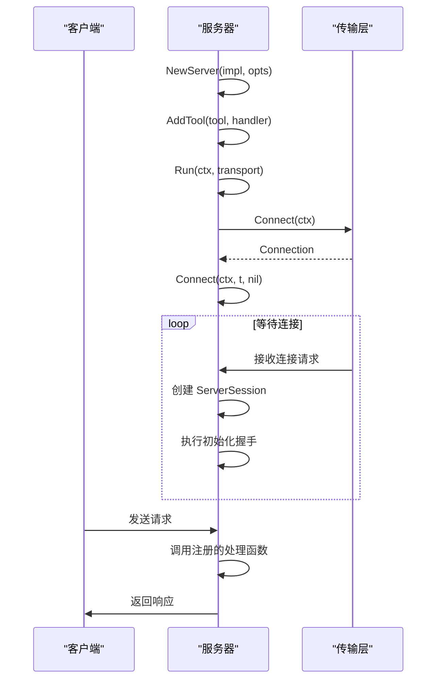
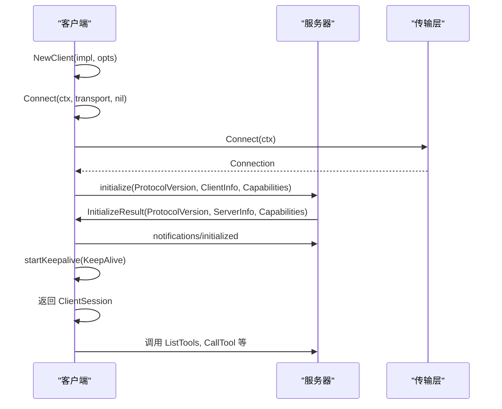
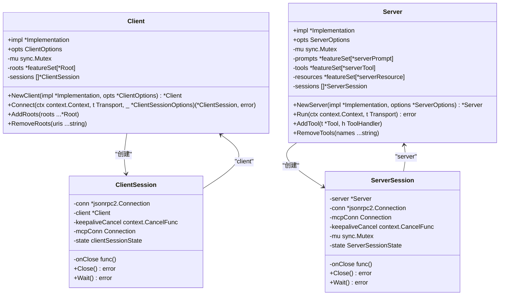

# 客户端与服务器

<cite>
**本文档引用的文件**   
- [client.go](file://mcp/client.go)
- [server.go](file://mcp/server.go)
- [mcp.go](file://mcp/mcp.go)
- [protocol.go](file://mcp/protocol.go)
- [shared.go](file://mcp/shared.go)
- [transport.go](file://mcp/transport.go)
- [session.go](file://mcp/session.go)
</cite>

## 目录
1. [引言](#引言)
2. [对等架构模型](#对等架构模型)
3. [身份标识与配置](#身份标识与配置)
4. [典型调用流程](#典型调用流程)
5. [并发会话管理](#并发会话管理)
6. [设计哲学与类比](#设计哲学与类比)

## 引言
MCP SDK 实现了一个对等的客户端-服务器架构模型，其中客户端（Client）和服务器（Server）在协议层面具有对称性，同时又在职责上存在差异。该模型基于 JSON-RPC 2.0 协议，允许双方在初始化后动态地注册和发现功能。本文档将深入解析该架构，阐述 `Client` 与 `Server` 的创建、配置、连接流程以及内部状态管理机制。

## 对等架构模型

MCP SDK 的核心设计理念是**对等性**（Peer-to-Peer Symmetry）。尽管在传统语义上存在“客户端”和“服务器”的区分，但在 MCP 协议中，两者在通信能力上是平等的，都可以作为请求的发起方和响应方。

### 架构对称性与差异

**对称性**体现在：
- **通信协议**：双方都通过 `Transport` 接口建立连接，并使用 `Connection` 接口进行消息的读写，底层均基于 `jsonrpc2.Connection`。
- **会话模型**：连接成功后，双方都创建一个会话对象（`ClientSession` 或 `ServerSession`），该会话是与对等方交互的主要接口。
- **消息处理**：双方都实现了 `Session` 接口，拥有 `sendingMethodHandler` 和 `receivingMethodHandler`，用于处理发送和接收的消息。
- **功能注册**：双方都可以注册处理函数来响应对方的请求。例如，`Client` 可以通过 `ClientOptions` 注册 `CreateMessageHandler` 来响应服务器的采样请求，而 `Server` 则通过 `AddTool` 等方法注册工具来响应客户端的调用。

**差异性**体现在：
- **初始化角色**：`Server` 通过 `NewServer` 创建并等待连接，而 `Client` 通过 `NewClient` 创建后主动调用 `Connect` 方法去连接远程 `Server`。
- **功能注册方式**：`Server` 通过 `AddXXX` 系列方法（如 `AddTool`, `AddPrompt`）主动向客户端宣告其功能。`Client` 则通过在 `ClientOptions` 中设置处理函数（如 `CreateMessageHandler`）来宣告其支持的能力。
- **生命周期管理**：`Server.Run` 方法用于阻塞运行一个会话，而 `Client.Connect` 则是一个非阻塞的连接方法。

```mermaid
graph TB
subgraph "客户端 (Client)"
C[NewClient]
CO[ClientOptions]
CS[ClientSession]
end
subgraph "服务器 (Server)"
S[NewServer]
SO[ServerOptions]
SS[ServerSession]
end
C --> |Connect| S
S --> |Run| SS
C --> |Connect| CS
CS < --> |JSON-RPC 2.0| SS
CO --> |注册处理函数| C
SO --> |配置选项| S
S --> |AddTool/AddPrompt| SS
C --> |AddRoots| CS
style C fill:#f9f,stroke:#333
style S fill:#f9f,stroke:#333
```

**Diagram sources**
- [client.go](file://mcp/client.go#L39-L53)
- [server.go](file://mcp/server.go#L109-L150)

**Section sources**
- [client.go](file://mcp/client.go#L23-L29)
- [server.go](file://mcp/server.go#L39-L50)

## 身份标识与配置

### Implementation 结构体

`Implementation` 结构体是 `Client` 和 `Server` 的核心身份标识，它在协议的初始化阶段（`initialize` 请求）被交换，用于向对等方宣告自身。

```go
type Implementation struct {
    Name    string `json:"name"`
    Title   string `json:"title,omitempty"`
    Version string `json:"version"`
}
```

- **Name**: 程序逻辑使用的名称，也是在旧版规范或 `Title` 缺失时的显示名称。
- **Title**: 专为用户界面和最终用户设计的名称，力求人性化和易懂。
- **Version**: 标识实现的版本号。

这个结构体是 `NewClient` 和 `NewServer` 的第一个必传参数，确保了每个 MCP 实体都有一个明确的身份。

### ServerOptions 与 ClientOptions

`ServerOptions` 和 `ClientOptions` 结构体用于配置 `Server` 和 `Client` 的行为，它们在对称性中也体现了各自的职责。

#### ServerOptions 配置项
- **Logger**: 如果非空，则用于记录服务器活动。
- **GetSessionID**: 一个函数，用于为传入的请求提供下一个会话 ID。如果为 `nil`，则使用默认的随机生成 ID。
- **PageSize**: 分页列表方法（如 `ListTools`）单次返回的最大项目数。如果为零，则默认为 `DefaultPageSize` (1000)。
- **KeepAlive**: 如果非零，定义定期“ping”请求的间隔。如果对等方未能响应，会话将自动关闭。
- **InitializedHandler**: 当收到“notifications/initialized”时调用的函数。
- **HasXXX**: 布尔标志，用于在没有注册任何功能的情况下，强制宣告支持 `Prompts`、`Resources` 或 `Tools` 能力。

#### ClientOptions 配置
- **CreateMessageHandler / ElicitationHandler**: 处理来自服务器的 `sampling/createMessage` 或 `elicitation/create` 请求的函数。设置这些处理函数会使客户端宣告其支持相应的能力。
- **XXXChangedHandler**: 一系列处理来自服务器的通知的函数，如 `ToolListChangedHandler`、`PromptListChangedHandler` 等。
- **KeepAlive**: 与 `ServerOptions` 中的同名字段功能相同，用于客户端发起的保活检查。

这些配置项使得 `Server` 和 `Client` 的行为高度可定制，同时通过类似的选项（如 `KeepAlive`、`Logger`）保持了配置层面的对称性。

**Section sources**
- [protocol.go](file://mcp/protocol.go#L1084-L1092)
- [server.go](file://mcp/server.go#L54-L99)
- [client.go](file://mcp/client.go#L56-L78)

## 典型调用流程

结合 `mcp.go` 文件中的示例代码，我们可以清晰地看到 `Server.Run` 和 `Client.Connect` 的典型调用流程。

### 服务器启动流程 (`Server.Run`)

1.  **创建服务器实例**：调用 `NewServer`，传入 `Implementation` 和可选的 `ServerOptions`。
2.  **注册功能**：使用 `AddTool`、`AddPrompt` 等方法向服务器注册功能。
3.  **运行服务器**：调用 `Server.Run` 方法，传入一个 `Transport`（如 `StdioTransport`）。该方法会：
    -   调用 `Server.Connect` 通过 `Transport` 建立连接。
    -   启动一个 goroutine 来等待会话结束。
    -   阻塞并监听上下文（`ctx`）的取消或会话的关闭。



**Diagram sources**
- [server.go](file://mcp/server.go#L764-L791)
- [mcp.go](file://mcp/mcp.go#L70-L89)

### 客户端连接流程 (`Client.Connect`)

1.  **创建客户端实例**：调用 `NewClient`，传入 `Implementation` 和可选的 `ClientOptions`。
2.  **建立连接**：调用 `Client.Connect` 方法，传入一个 `Transport`（如 `CommandTransport`）。该方法会：
    -   通过 `Transport` 建立连接。
    -   发送 `initialize` 请求，包含客户端的 `ClientInfo` 和 `Capabilities`。
    -   接收并验证服务器的 `InitializeResult`。
    -   发送 `initialized` 通知。
    -   （可选）启动保活机制。
    -   返回一个 `ClientSession`。



**Diagram sources**
- [client.go](file://mcp/client.go#L135-L170)
- [mcp.go](file://mcp/mcp.go#L90-L105)

**Section sources**
- [client.go](file://mcp/client.go#L135-L170)
- [server.go](file://mcp/server.go#L838-L853)

## 并发会话管理

为了在并发环境下安全地管理状态，`Client` 和 `Server` 都使用了 `sync.Mutex` 来保护其内部状态。

### 内部状态保护

- **Client**: `Client` 结构体中的 `mu` 互斥锁用于保护 `sessions` 切片和 `roots` 集合。例如，在 `AddRoots` 和 `RemoveRoots` 方法中，都会先获取锁，修改状态，然后释放锁。
- **Server**: `Server` 结构体同样拥有一个 `mu` 互斥锁，用于保护 `sessions`、`prompts`、`tools`、`resources` 等所有功能集合。`AddXXX` 和 `RemoveXXX` 方法在修改这些集合时都会使用锁。

### 会话维护

- **Client**: `Client` 通过 `sessions []*ClientSession` 切片来维护所有与之连接的服务器会话。当调用 `Connect` 时，新的 `ClientSession` 会被添加到切片中；当会话关闭时，`disconnect` 方法会将其移除。
- **Server**: `Server` 也通过 `sessions []*ServerSession` 切片来维护所有与之连接的客户端会话。`bind` 方法负责在连接建立时添加会话，`disconnect` 方法负责在会话关闭时移除会话。

这种设计确保了在多会话并发操作时，对共享资源的访问是线程安全的。



**Diagram sources**
- [client.go](file://mcp/client.go#L23-L29)
- [client.go](file://mcp/client.go#L178-L189)
- [server.go](file://mcp/server.go#L39-L50)
- [server.go](file://mcp/server.go#L921-L931)

**Section sources**
- [client.go](file://mcp/client.go#L96-L102)
- [server.go](file://mcp/server.go#L810-L821)

## 设计哲学与类比

### 类比：HTTP 服务器与客户端

对于初学者，可以将 MCP 的 `Server` 和 `Client` 类比为 HTTP 服务器和客户端：
- **MCP Server** 类似于一个 **HTTP 服务器**。它监听连接，接收请求（如 `ListTools`），并根据注册的路由（`AddTool`）返回响应。
- **MCP Client** 类似于一个 **HTTP 客户端**。它主动发起连接，发送请求（如 `CallTool`），并等待响应。

然而，关键的区别在于，MCP 的“客户端”也可以扮演“服务器”的角色，因为它可以注册处理函数来响应来自 MCP “服务器”的请求。

### 为何两者都可作为请求发起方？

这种设计哲学源于 MCP 协议旨在构建一个**双向、协作式**的模型上下文环境。它打破了传统的单向请求-响应模式：
- **灵活性**：允许服务器在需要时主动向客户端请求信息（如采样或征询），这在传统的客户端-服务器模型中是无法实现的。
- **主动性**：客户端和服务器都可以根据上下文主动发起交互，使得整个系统更加动态和智能。
- **对等协作**：强调了客户端和服务器在构建模型上下文时的平等协作关系，而不是简单的服务提供者与消费者关系。

这种设计使得 MCP SDK 能够支持更复杂的交互场景，例如服务器可以请求客户端执行一个采样操作，然后将结果用于后续的推理过程。

**Section sources**
- [mcp.go](file://mcp/mcp.go#L70-L105)
- [client.go](file://mcp/client.go#L56-L78)
- [server.go](file://mcp/server.go#L54-L99)