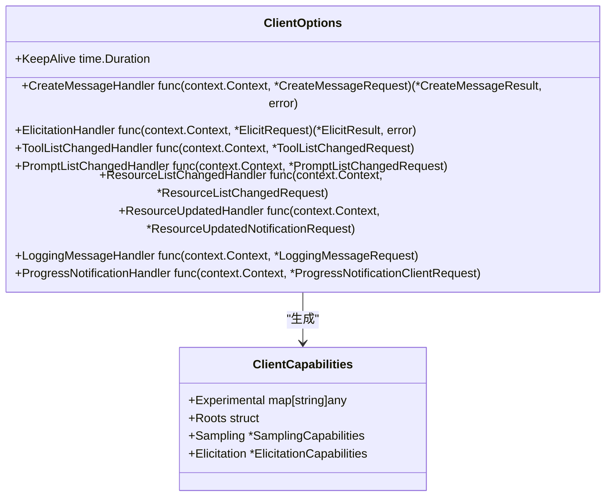
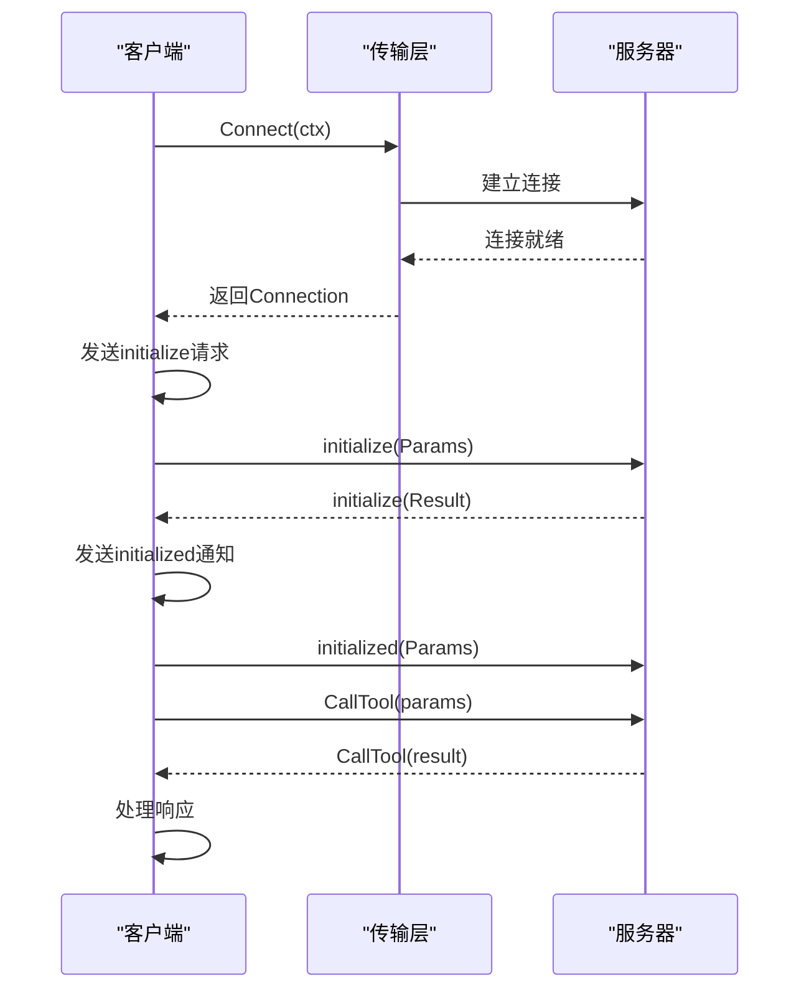

# 客户端详解

<cite>
**本文档中引用的文件**   
- [client.go](file://mcp/client.go)
- [protocol.go](file://mcp/protocol.go)
- [transport.go](file://mcp/transport.go)
- [sse.go](file://mcp/sse.go)
</cite>

## 目录
1. [客户端初始化](#客户端初始化)
2. [连接建立与会话管理](#连接建立与会话管理)
3. [客户端能力与配置](#客户端能力与配置)
4. [通信流程与中间件](#通信流程与中间件)
5. [客户端通信流程解析](#客户端通信流程解析)
6. [连接管理与超时处理](#连接管理与超时处理)

## 客户端初始化

`NewClient` 函数是创建客户端实例的入口点。该函数接收一个 `*Implementation` 类型的参数和一个可选的 `*ClientOptions` 配置对象。`Implementation` 参数不能为空，否则会触发 panic。函数内部创建一个新的 `Client` 结构体实例，并初始化其内部状态，包括用于管理根目录的 `featureSet` 和默认的发送与接收方法处理器。如果提供了 `ClientOptions`，则将其值复制到客户端实例中，以配置客户端的特定行为。

**Section sources**
- [client.go](file://mcp/client.go#L39-L53)

## 连接建立与会话管理

客户端通过 `Connect` 方法建立与服务器的连接。此方法接收一个 `Transport` 接口实例，该接口负责创建底层的双向连接。`Connect` 方法首先调用 `Transport.Connect` 来获取一个 `Connection` 实例，然后进行 MCP 协议的初始化流程。这包括发送 `initialize` 请求，其中包含客户端的实现信息和功能集，接收服务器的响应以确认协议版本兼容性，并发送 `initialized` 通知。成功完成这些步骤后，将返回一个 `ClientSession` 实例，该实例代表了与服务器的逻辑会话，可用于后续的通信。

**Section sources**
- [client.go](file://mcp/client.go#L135-L170)
- [transport.go](file://mcp/transport.go#L35-L35)

## 客户端能力与配置

`ClientOptions` 结构体定义了客户端的行为配置。通过设置 `CreateMessageHandler` 和 `ElicitationHandler` 字段，客户端可以声明其支持采样和征询功能。当这些处理器被设置时，客户端在初始化过程中会向服务器通告相应的功能。`KeepAlive` 字段用于配置心跳间隔，如果设置为非零值，客户端会定期向服务器发送 ping 请求，以检测连接的健康状况，如果服务器未能响应，会话将自动关闭。

**Diagram sources**
- [client.go](file://mcp/client.go#L56-L78)
- [protocol.go](file://mcp/protocol.go#L182-L194)

## 通信流程与中间件

客户端通过 `ClientSession` 实例与服务器进行通信。`ClientSession` 提供了多种方法来发送请求和通知，例如 `ListTools`、`CallTool` 和 `Ping`。为了扩展客户端功能，SDK 提供了中间件机制。通过 `AddSendingMiddleware` 和 `AddReceivingMiddleware` 方法，可以向客户端添加发送和接收中间件。这些中间件在请求发送前和响应接收后执行，可用于实现日志记录、指标收集、请求验证等功能。中间件按添加顺序从右到左应用，形成一个处理链。

**Section sources**
- [client.go](file://mcp/client.go#L470-L474)
- [client.go](file://mcp/client.go#L485-L489)

## 客户端通信流程解析

客户端与服务器的通信流程始于 `NewClient` 的调用，创建一个配置好的客户端实例。随后，通过选择合适的 `Transport`（如 `StdioTransport`、`IOTransport` 或 `SSEClientTransport`）并调用 `Connect` 方法来建立连接。连接建立后，`ClientSession` 实例被返回，客户端可以使用该实例的方法来调用服务器功能。例如，调用 `ListTools` 方法会发送一个 `tools/list` 请求，等待服务器响应，并返回可用工具的列表。整个流程涉及请求的序列化、通过传输层发送、等待响应、反序列化以及错误处理。

**Diagram sources**
- [client.go](file://mcp/client.go#L135-L170)
- [transport.go](file://mcp/transport.go#L91-L93)
- [sse.go](file://mcp/sse.go#L334-L397)

## 连接管理与超时处理

客户端的连接管理由 `ClientSession` 负责。`Connect` 方法成功后返回的 `ClientSession` 实例包含了管理连接状态所需的所有信息。`KeepAlive` 机制通过在后台启动一个 goroutine 来实现，该 goroutine 会按照 `ClientOptions` 中指定的间隔定期调用 `Ping` 方法。如果 `Ping` 请求失败，`keepaliveCancel` 函数将被调用，导致连接被关闭。此外，`ClientSession` 的 `Close` 方法允许客户端主动关闭连接，而 `Wait` 方法则允许客户端等待服务器关闭连接。这些机制共同确保了连接的健壮性和可控性。

**Section sources**
- [client.go](file://mcp/client.go#L135-L170)
- [client.go](file://mcp/client.go#L178-L189)