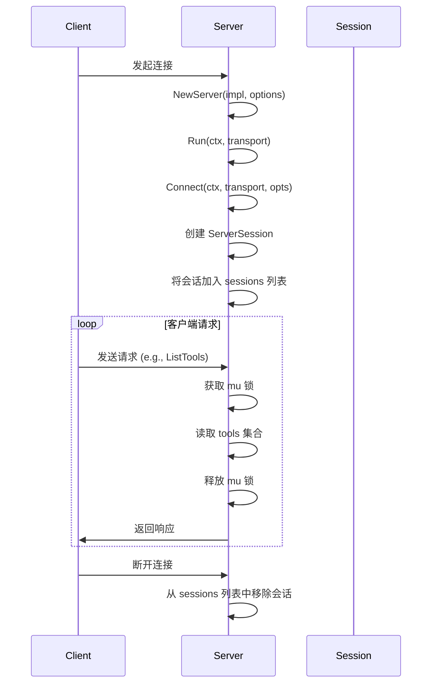
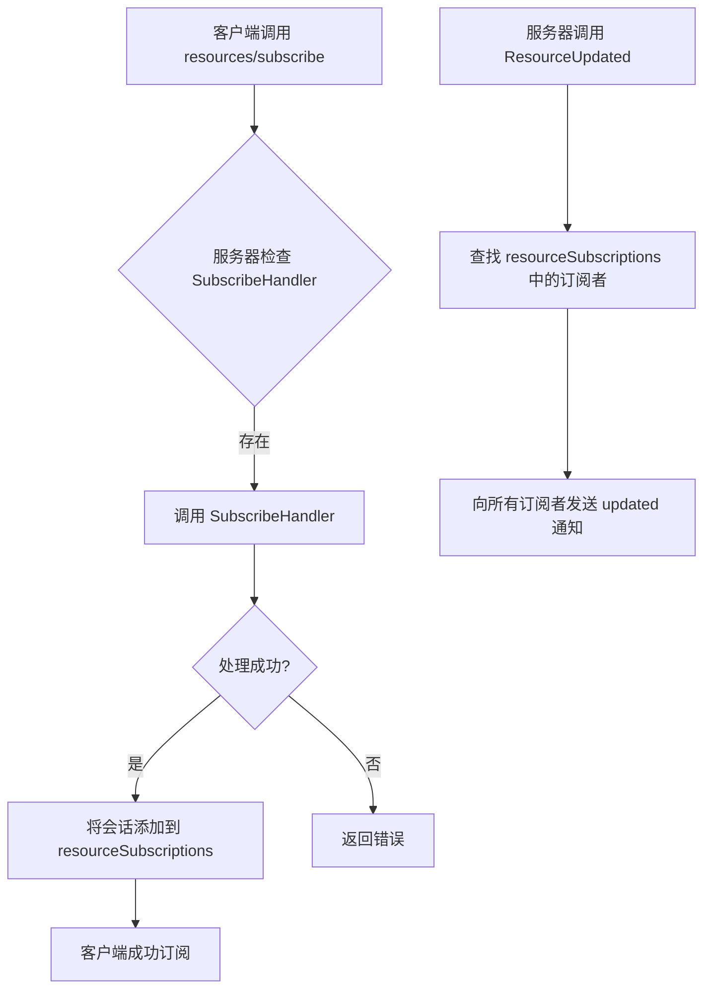

# 服务器详解

<cite>
**本文档中引用的文件**   
- [server.go](file://mcp/server.go)
- [protocol.go](file://mcp/protocol.go)
- [shared.go](file://mcp/shared.go)
- [basic/main.go](file://examples/server/basic/main.go)
</cite>

## 目录
1. [服务器创建与配置](#服务器创建与配置)
2. [功能注册机制](#功能注册机制)
3. [服务启动与会话管理](#服务启动与会话管理)
4. [能力生成与资源订阅](#能力生成与能力生成)
5. [并发模型与性能优化](#并发模型与性能优化)

## 服务器创建与配置

`NewServer` 函数是创建服务器实例的核心入口。该函数接收一个 `Implementation` 实例和一个可选的 `ServerOptions` 配置对象。`Implementation` 定义了服务器的基本信息，如名称和版本，而 `ServerOptions` 则用于精细化控制服务器的行为。

`ServerOptions` 结构体中的各项配置对服务器行为有直接影响：
- **Logger**: 如果提供了 `*slog.Logger`，服务器将记录活动日志；若未提供，则会使用一个默认的、不输出任何内容的 logger。
- **PageSize**: 控制列表方法（如 `ListTools`）单次返回的最大项目数。若设置为0，则使用默认值 `DefaultPageSize`（1000）；若为负数，则会触发 panic。
- **KeepAlive**: 定义了服务器向客户端发送“ping”请求的间隔。如果客户端未能响应，会话将被自动关闭，从而实现连接的健康检查。
- **SubscribeHandler 和 UnsubscribeHandler**: 这两个函数必须同时提供或同时不提供，用于处理客户端对资源的订阅和取消订阅请求。

服务器实例创建后，其内部状态被初始化，包括用于管理提示（prompts）、工具（tools）和资源（resources）的集合，以及一个用于管理会话的映射。

**Section sources**
- [server.go](file://mcp/server.go#L109-L150)
- [server.go](file://mcp/server.go#L54-L99)

## 功能注册机制

服务器通过 `AddTool`、`AddResource` 和 `AddPrompt` 等方法来注册其提供的功能。这些方法允许服务器动态地向客户端暴露其能力。

- **AddTool**: 用于注册一个工具。该方法会检查工具的输入和输出 schema 是否符合规范（必须是 "object" 类型），然后将其添加到内部的工具集合中。如果工具已存在，新工具将替换旧工具。注册成功后，服务器会自动通知所有已连接的客户端，告知工具列表已更改。
- **AddResource**: 用于注册一个可读取的资源。该方法会验证资源 URI 的有效性，然后将其添加到资源集合中。与工具类似，资源列表的变更也会被通知给客户端。
- **AddPrompt**: 用于注册一个提示模板。该方法同样会触发列表变更通知。

此外，SDK 还提供了一个泛型函数 `AddTool[In, Out any]`，它能自动处理参数的反序列化、验证和结果的序列化，极大地简化了工具的注册过程。

**Section sources**
- [server.go](file://mcp/server.go#L191-L234)
- [server.go](file://mcp/server.go#L422-L431)
- [server.go](file://mcp/server.go#L153-L160)
- [server.go](file://mcp/server.go#L405-L411)

## 服务启动与会话管理

服务器通过 `Run` 方法启动服务。该方法是一个便利函数，适用于处理单个会话的场景。它会调用 `Connect` 方法建立与客户端的连接，并返回一个 `ServerSession` 对象。`Run` 方法会阻塞，直到客户端终止连接或传入的上下文被取消。

`ServerSession` 代表了与单个客户端的逻辑连接。服务器通过一个互斥锁（`sync.Mutex`）来管理会话列表，确保在并发环境下对会话的增删操作是线程安全的。当一个新会话建立时，它会被添加到 `sessions` 切片中；当会话断开时，它会被从切片中移除。

服务器的并发控制主要体现在对功能集合（如 `tools`, `prompts`）的访问上。所有对这些集合的读写操作都受到 `mu` 互斥锁的保护。当客户端请求列表时，服务器会获取锁，克隆当前的集合，然后释放锁，再进行分页处理，从而将锁的持有时间最小化。

**Diagram sources **
- [server.go](file://mcp/server.go#L764-L791)
- [server.go](file://mcp/server.go#L848-L888)

**Section sources**
- [server.go](file://mcp/server.go#L764-L791)
- [server.go](file://mcp/server.go#L848-L888)

## 能力生成与资源订阅

`ServerCapabilities` 定义了服务器向客户端声明的能力。其生成逻辑在 `capabilities()` 方法中实现。该方法会检查服务器当前注册的功能以及 `ServerOptions` 中的标志位（如 `HasTools`, `HasPrompts`），来决定是否在初始化响应中包含相应的功能模块。

例如，只有当服务器注册了至少一个工具，或者 `HasTools` 标志被显式设置为 `true` 时，`ServerCapabilities.Tools` 字段才会被填充。这允许服务器即使在没有注册任何工具的情况下，也能声明其具备工具能力。

资源订阅功能通过 `SubscribeHandler` 和 `UnsubscribeHandler` 实现。当客户端调用 `resources/subscribe` 时，服务器会调用 `SubscribeHandler`，如果处理成功，则将该会话添加到 `resourceSubscriptions` 映射中，该映射以资源 URI 为键，会话为值。当资源更新时，服务器可以调用 `ResourceUpdated` 方法，该方法会查找所有订阅了该资源的会话，并向它们发送 `notifications/resources/updated` 通知。

**Diagram sources **
- [server.go](file://mcp/server.go#L77-L79)
- [server.go](file://mcp/server.go#L76-L77)

**Section sources**
- [server.go](file://mcp/server.go#L764-L791)
- [server.go](file://mcp/server.go#L77-L79)

## 并发模型与性能优化

服务器的并发模型基于 Go 的 goroutine 和 channel。`Run` 方法启动一个 goroutine 来等待会话结束，而主 goroutine 则监听上下文的取消信号，实现了优雅的关闭。

性能优化策略体现在多个方面：
1.  **锁粒度控制**：对功能集合的访问使用细粒度的互斥锁，避免长时间持有锁。
2.  **分页处理**：通过 `paginateList` 函数实现分页，避免一次性返回大量数据，减轻网络和内存压力。
3.  **连接健康检查**：`KeepAlive` 机制通过定期 ping 客户端来检测连接状态，及时清理无效会话。
4.  **中间件支持**：`AddSendingMiddleware` 和 `AddReceivingMiddleware` 允许用户在请求发送和接收的路径上插入自定义逻辑，如日志记录、指标收集和认证，而无需修改核心业务代码。

**Section sources**
- [server.go](file://mcp/server.go#L764-L791)
- [shared.go](file://mcp/shared.go#L478-L499)