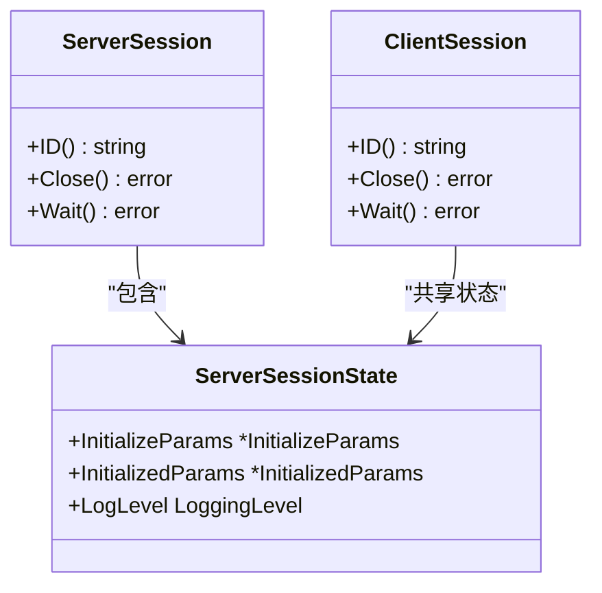
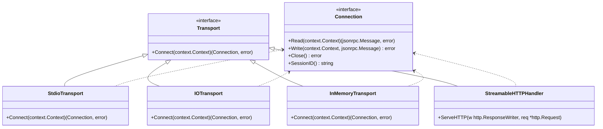
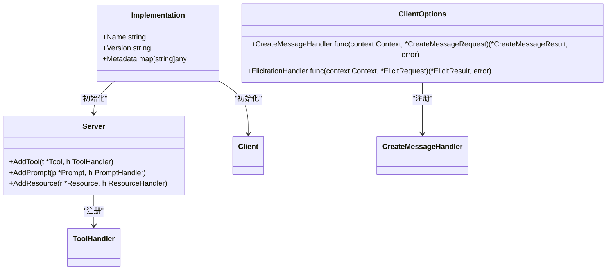
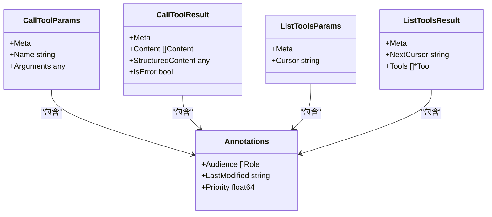
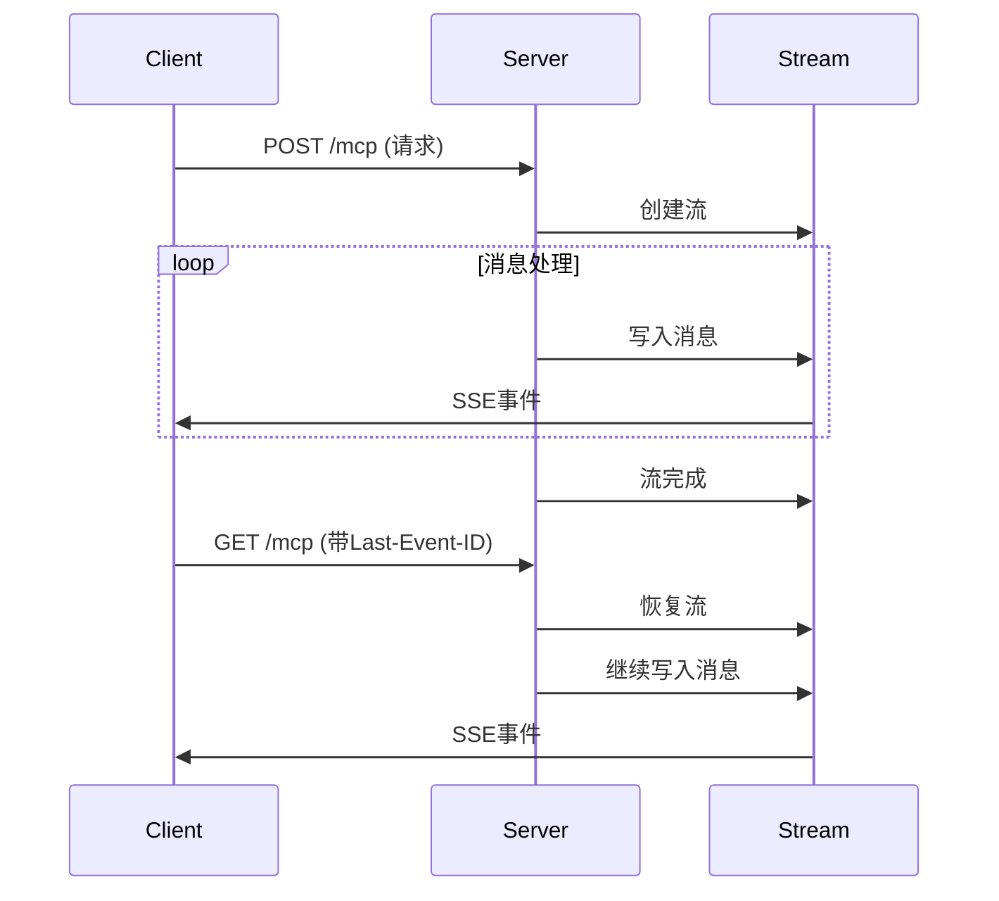

# 核心概念

<cite>
**本文档引用的文件**  
- [protocol.go](file://mcp/protocol.go)
- [server.go](file://mcp/server.go)
- [client.go](file://mcp/client.go)
- [transport.go](file://mcp/transport.go)
- [session.go](file://mcp/session.go)
- [tool.go](file://mcp/tool.go)
- [streamable.go](file://mcp/streamable.go)
</cite>

## 目录
1. [对等角色模型](#对等角色模型)
2. [会话机制](#会话机制)
3. [传输抽象](#传输抽象)
4. [JSON-RPC 2.0 通信机制](#json-rpc-20-通信机制)
5. [业务逻辑接入点](#业务逻辑接入点)
6. [配置选项](#配置选项)
7. [消息格式与方法命名](#消息格式与方法命名)
8. [异步处理与流式响应](#异步处理与流式响应)

## 对等角色模型

MCP协议采用对等（peer-to-peer）角色模型，客户端与服务器在通信中具有对等地位。这种设计打破了传统客户端-服务器的严格主从关系，允许双方在会话中主动发起请求和发送通知。在SDK实现中，`Client`和`Server`结构体分别代表通信的两端，它们通过`Transport`接口建立连接。这种对等性体现在双方都能定义处理函数：服务器通过`ServerOptions`中的`CompletionHandler`等字段定义对客户端请求的响应，而客户端通过`ClientOptions`中的`CreateMessageHandler`等字段定义对服务器请求的响应。

**Section sources**
- [server.go](file://mcp/server.go#L15-L25)
- [client.go](file://mcp/client.go#L15-L25)

## 会话机制

会话（Session）是MCP通信的核心单元，代表一次逻辑连接。`ServerSession`和`ClientSession`结构体分别封装了服务器端和客户端的会话状态。会话的生命周期由连接建立开始，通过`Server.Run`或`Client.Connect`方法初始化。`ServerSessionState`结构体记录了会话的关键状态，包括`InitializeParams`、`InitializedParams`和`LogLevel`。会话ID由`GetSessionID`函数生成，确保在分布式环境中全局唯一。会话机制支持中间件，允许在请求处理前后插入自定义逻辑，如日志记录和性能监控。

**Diagram sources**
- [session.go](file://mcp/session.go#L15-L30)
- [server.go](file://mcp/server.go#L150-L200)
- [client.go](file://mcp/client.go#L150-L200)

## 传输抽象

传输（Transport）抽象了通信的底层细节，使上层逻辑与具体通信方式解耦。`Transport`接口定义了`Connect`方法，返回一个`Connection`接口实例。SDK提供了多种传输实现：`StdioTransport`用于标准输入输出，`IOTransport`用于任意读写器，`InMemoryTransport`用于内存通信，`StreamableHTTPHandler`用于HTTP流式传输。`Connection`接口的`Read`和`Write`方法实现了消息的双向传输，支持并发调用。`LoggingTransport`作为装饰器模式的实现，可以在不修改底层传输的情况下添加日志功能。

**Diagram sources**
- [transport.go](file://mcp/transport.go#L15-L25)
- [streamable.go](file://mcp/streamable.go#L15-L25)

## JSON-RPC 2.0 通信机制

MCP协议基于JSON-RPC 2.0规范实现请求-响应和通知机制。`jsonrpc2`包提供了JSON-RPC 2.0的核心实现，包括`Request`、`Response`和`Notification`消息类型。请求和响应通过`ID`字段关联，通知则没有`ID`。`Preempter`接口用于处理优先级高的消息，如取消请求，而`Handler`接口用于处理普通请求。`call`函数封装了请求调用的逻辑，处理错误转换和上下文取消。协议支持批量请求，但在2025-06-18版本后已禁用，以简化实现。

**Section sources**
- [internal/jsonrpc2/jsonrpc2.go](file://internal/jsonrpc2/jsonrpc2.go#L15-L25)
- [transport.go](file://mcp/transport.go#L150-L200)

## 业务逻辑接入点

`Implementation`接口是业务逻辑的接入点，通过`NewServer`和`NewClient`函数的`impl`参数注入。服务器通过`AddTool`、`AddPrompt`等方法注册功能，每个功能关联一个处理函数。`ToolHandler`和`ToolHandlerFor`定义了工具调用的处理逻辑，前者是低级API，后者是泛型高级API，自动处理参数验证和结果序列化。`AddTool`函数是推荐的工具注册方式，它自动推断输入输出模式并进行验证。客户端通过`ClientOptions`中的处理函数字段注册对服务器请求的响应。

**Diagram sources**
- [server.go](file://mcp/server.go#L15-L25)
- [client.go](file://mcp/client.go#L15-L25)
- [tool.go](file://mcp/tool.go#L15-L25)

## 配置选项

`ServerOptions`和`ClientOptions`结构体提供了关键配置项。`PageSize`控制分页查询的每页大小，默认为1000。`Logger`用于日志记录，`KeepAlive`定义心跳间隔，用于检测连接存活。`GetSessionID`函数生成会话ID，支持分布式环境。服务器选项还包括各种处理函数，如`InitializedHandler`和`ProgressNotificationHandler`，用于响应客户端通知。客户端选项中的处理函数允许客户端响应服务器的采样和征询请求。这些配置项使SDK能够适应不同的部署环境和性能需求。

**Section sources**
- [server.go](file://mcp/server.go#L25-L50)
- [client.go](file://mcp/client.go#L25-L50)

## 消息格式与方法命名

`protocol.go`文件定义了MCP协议的消息格式，所有消息类型均以`Params`和`Result`后缀区分请求参数和响应结果。方法命名遵循`mcp.<category>.<action>`的规范，如`mcp.tools.list`和`mcp.resources.read`。`Meta`字段保留用于协议扩展，允许附加元数据。`Annotations`结构体提供客户端显示提示，如`Audience`和`Priority`。`CallToolParams`和`CallToolResult`定义了工具调用的输入输出，支持结构化和非结构化内容。`ListToolsParams`和`ListToolsResult`等分页查询类型包含`Cursor`和`NextCursor`字段，支持大规模数据集的分页浏览。

**Diagram sources**
- [protocol.go](file://mcp/protocol.go#L15-L25)

## 异步处理与流式响应

SDK支持异步处理和流式响应，以应对长时间运行的任务。`keepAlive`机制通过定期发送`ping`请求检测连接状态，超时则自动关闭会话。`StreamableHTTPHandler`实现HTTP流式传输，支持SSE（Server-Sent Events）和JSON响应。`EventStore`接口支持流恢复，允许客户端从断点继续接收消息。`ProgressNotificationParams`提供进度通知，用于报告长时间操作的进展。`streamableServerConn`内部使用`stream`结构体管理多个逻辑流，确保消息按正确的HTTP响应路由。这种设计使服务器能够向客户端推送实时更新，提升用户体验。

**Diagram sources**
- [streamable.go](file://mcp/streamable.go#L15-L25)