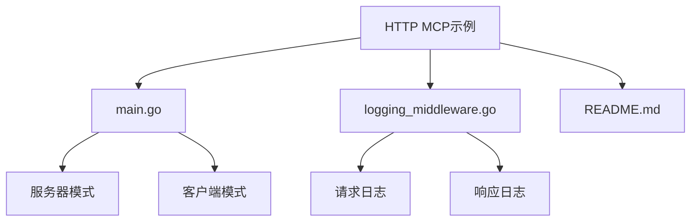
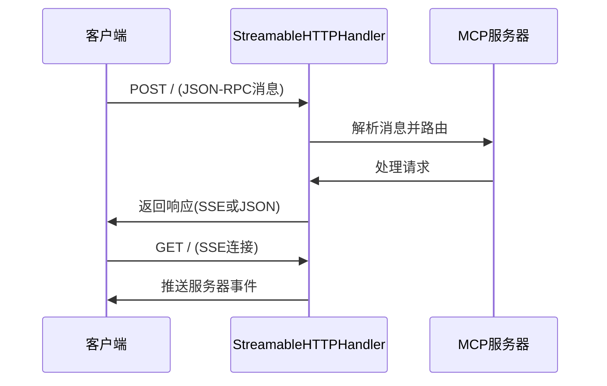
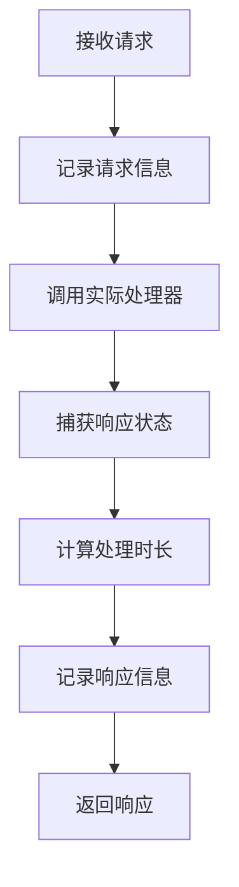

# HTTP传输示例

<cite>
**本文档中引用的文件**  
- [main.go](file://examples/http/main.go)
- [logging_middleware.go](file://examples/http/logging_middleware.go)
- [README.md](file://examples/http/README.md)
- [streamable.go](file://mcp/streamable.go)
- [server.go](file://mcp/server.go)
</cite>

## 目录
1. [简介](#简介)
2. [项目结构](#项目结构)
3. [核心组件](#核心组件)
4. [HTTP服务器实现](#http服务器实现)
5. [日志中间件分析](#日志中间件分析)
6. [HTTP与Stdio传输对比](#http与stdio传输对比)
7. [部署与测试步骤](#部署与测试步骤)
8. [结论](#结论)

## 简介
本示例演示了如何使用Model Context Protocol (MCP) 通过HTTP流式传输进行通信。该实现包含一个服务器和客户端，服务器提供`cityTime`工具以获取指定城市的当前时间，客户端则连接到服务器并调用该工具。系统通过自定义中间件增强请求处理能力，并支持通过HTTP端点暴露MCP服务。

## 项目结构
该示例位于`examples/http`目录下，包含以下核心文件：
- `main.go`：主程序入口，实现服务器和客户端逻辑
- `logging_middleware.go`：自定义日志中间件，用于记录HTTP请求和响应
- `README.md`：使用说明和测试指南



**图示来源**
- [main.go](file://examples/http/main.go#L1-L201)
- [logging_middleware.go](file://examples/http/logging_middleware.go#L1-L52)

## 核心组件
系统主要由三个核心组件构成：MCP服务器、HTTP处理器和自定义日志中间件。服务器通过`mcp.NewServer`创建，HTTP处理器通过`mcp.NewStreamableHTTPHandler`实现流式传输，日志中间件则包装HTTP处理器以增强监控能力。

**节来源**
- [main.go](file://examples/http/main.go#L25-L100)
- [logging_middleware.go](file://examples/http/logging_middleware.go#L1-L52)

## HTTP服务器实现
### 路由配置与MCP协议支持
HTTP服务器通过`mcp.NewStreamableHTTPHandler`创建，该处理器实现了MCP流式传输规范。处理器支持GET、POST和DELETE方法，分别用于事件流、消息发送和会话终止。

```go
handler := mcp.NewStreamableHTTPHandler(func(req *http.Request) *mcp.Server {
    return server
}, nil)
```

处理器根据请求方法和Accept头进行路由：
- GET请求：要求Accept头包含`text/event-stream`，用于建立SSE连接
- POST请求：要求Accept头同时包含`application/json`和`text/event-stream`，用于发送消息
- DELETE请求：用于终止会话，需要提供Mcp-Session-Id头

### HTTP端点暴露
服务器通过标准HTTP端点暴露MCP服务，支持以下端点：
- `GET /`：建立SSE连接，接收服务器推送的事件
- `POST /`：发送JSON-RPC消息到服务器
- `DELETE /`：终止指定会话



**图示来源**
- [streamable.go](file://mcp/streamable.go#L118-L332)
- [main.go](file://examples/http/main.go#L150-L180)

**节来源**
- [main.go](file://examples/http/main.go#L150-L201)
- [streamable.go](file://mcp/streamable.go#L86-L100)

## 日志中间件分析
### 中间件实现
日志中间件通过包装`http.Handler`实现，捕获请求和响应的详细信息。中间件使用`responseWriter`包装器来捕获响应状态码。

```go
func loggingHandler(handler http.Handler) http.Handler {
    return http.HandlerFunc(func(w http.ResponseWriter, r *http.Request) {
        start := time.Now()
        wrapped := &responseWriter{ResponseWriter: w, statusCode: http.StatusOK}
        
        log.Printf("[REQUEST] %s | %s | %s %s",
            start.Format(time.RFC3339),
            r.RemoteAddr,
            r.Method,
            r.URL.Path)

        handler.ServeHTTP(wrapped, r)

        duration := time.Since(start)
        log.Printf("[RESPONSE] %s | %s | %s %s | Status: %d | Duration: %v",
            time.Now().Format(time.RFC3339),
            r.RemoteAddr,
            r.Method,
            r.URL.Path,
            wrapped.statusCode,
            duration)
    })
}
```

### 请求/响应记录
中间件记录以下信息：
- 请求时间戳
- 客户端远程地址
- HTTP方法和路径
- 响应状态码
- 处理时长

这些日志信息对于监控系统性能和调试问题至关重要。



**图示来源**
- [logging_middleware.go](file://examples/http/logging_middleware.go#L1-L52)

**节来源**
- [logging_middleware.go](file://examples/http/logging_middleware.go#L1-L52)

## HTTP与Stdio传输对比
| 特性 | HTTP传输 | Stdio传输 |
|------|---------|---------|
| 通信方式 | HTTP/SSE | 标准输入/输出 |
| 连接类型 | 有状态/无状态 | 有状态 |
| 可扩展性 | 高（支持多客户端） | 低（单客户端） |
| 网络支持 | 支持远程连接 | 仅限本地进程 |
| 协议版本 | 支持版本协商 | 固定版本 |
| 错误处理 | HTTP状态码 | 退出码 |

HTTP传输更适合生产环境，支持多客户端连接、远程访问和更好的错误处理机制。Stdio传输则更适合简单的本地工具集成。

**节来源**
- [main.go](file://examples/http/main.go#L1-L201)
- [server.go](file://mcp/server.go#L764-L791)

## 部署与测试步骤
### 服务器启动
```bash
go run . server
```
此命令在`http://localhost:8000`启动MCP服务器，默认提供`cityTime`工具。

### 客户端测试
在另一个终端运行：
```bash
go run . client
```
客户端将自动连接服务器并执行以下操作：
1. 列出可用工具
2. 调用`cityTime`工具获取纽约、旧金山和波士顿的时间
3. 显示结果

### 自定义配置
可以通过命令行参数自定义主机和端口：
```bash
go run . -host 0.0.0.0 -port 9000 server
```

### 与真实MCP客户端集成
启动服务器后，可以将其添加到支持MCP的客户端中：
```bash
claude mcp add -t http timezone http://localhost:8000
```

**节来源**
- [README.md](file://examples/http/README.md#L1-L70)
- [main.go](file://examples/http/main.go#L1-L201)

## 结论
本示例展示了如何通过HTTP实现MCP服务器，利用流式传输协议提供高效的双向通信。通过自定义日志中间件，系统具备了完善的监控和调试能力。与传统的Stdio传输相比，HTTP传输提供了更好的可扩展性和网络支持，更适合现代分布式应用。部署和测试流程简单直观，便于快速集成到现有系统中。