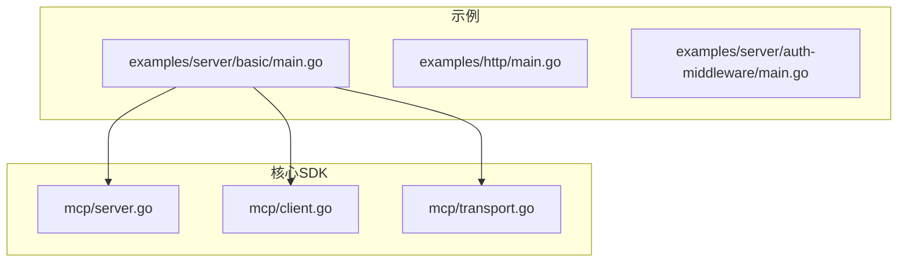
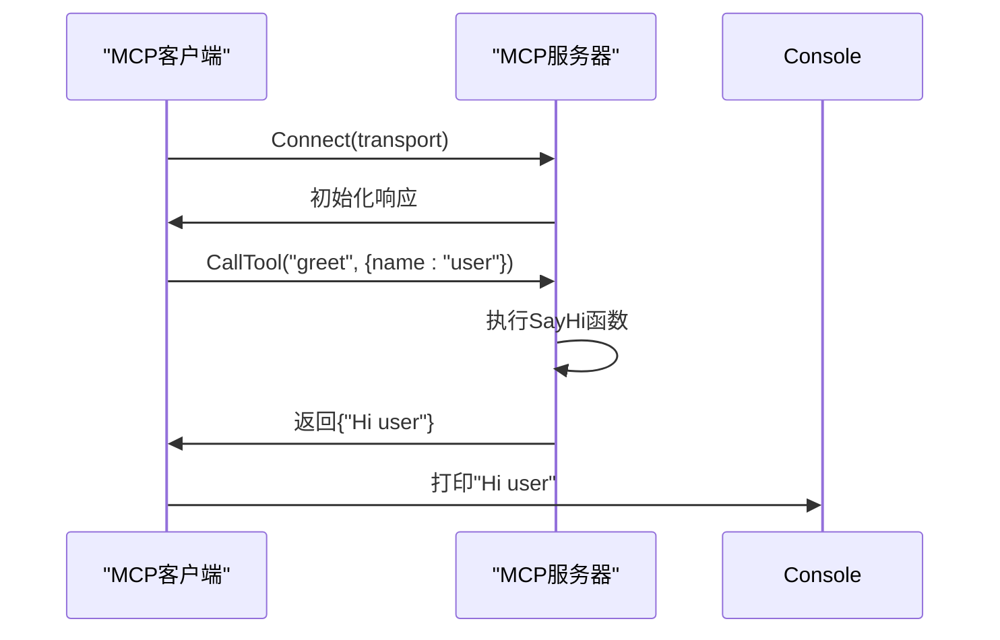
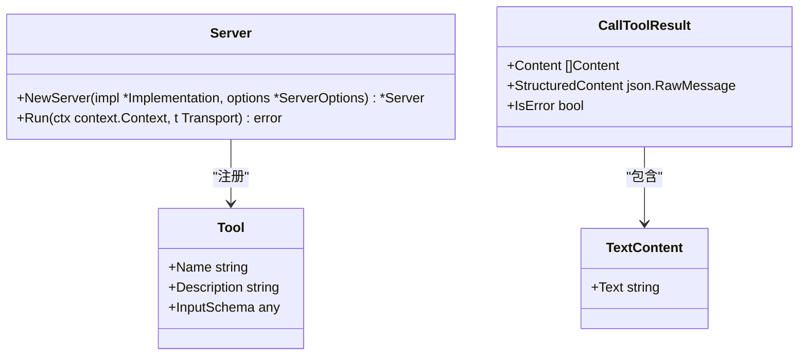
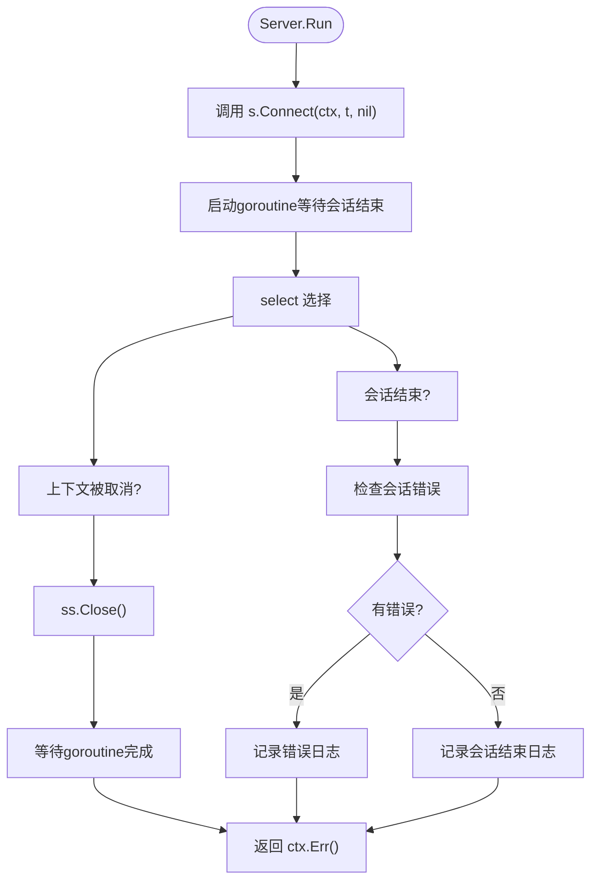
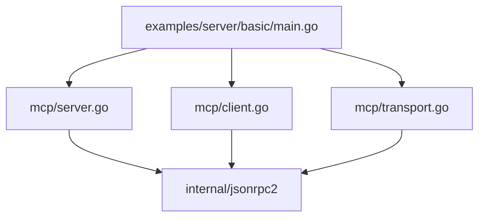

# 基础服务器示例

<cite>
**本文档中引用的文件**  
- [main.go](file://examples/server/basic/main.go)
- [server.go](file://mcp/server.go)
- [client.go](file://mcp/client.go)
- [transport.go](file://mcp/transport.go)
</cite>

## 目录
1. [简介](#简介)
2. [项目结构](#项目结构)
3. [核心组件](#核心组件)
4. [架构概述](#架构概述)
5. [详细组件分析](#详细组件分析)
6. [依赖分析](#依赖分析)
7. [性能考虑](#性能考虑)
8. [故障排除指南](#故障排除指南)
9. [结论](#结论)

## 简介
本文档详细解析了 `examples/server/basic/main.go` 中的基础MCP服务器实现。该示例展示了如何使用Go SDK创建一个简单的MCP（Model Context Protocol）服务器，通过定义工具（Tool）来响应客户端请求。文档将深入分析服务器初始化、工具注册、会话管理以及客户端-服务器通信的完整流程。通过本示例，开发者可以快速理解MCP服务器的核心概念，并以此为基础构建更复杂的应用。

## 项目结构
该项目遵循典型的Go模块结构，`examples/server/basic/main.go` 是本分析的核心文件，它提供了一个最简化的MCP服务器实现。`mcp` 目录包含了SDK的核心逻辑，包括服务器、客户端、传输层和协议定义。`examples` 目录下的其他子目录则展示了更高级的用法，如身份验证中间件、HTTP传输和分布式服务器等。

**Diagram sources**
- [main.go](file://examples/server/basic/main.go)
- [server.go](file://mcp/server.go)
- [client.go](file://mcp/client.go)
- [transport.go](file://mcp/transport.go)

**Section sources**
- [main.go](file://examples/server/basic/main.go)

## 核心组件
本示例的核心组件包括一个名为 `SayHi` 的工具函数、一个MCP服务器实例和一个MCP客户端实例。服务器通过 `mcp.NewServer` 创建，并使用 `mcp.AddTool` 注册 `SayHi` 工具。客户端通过 `mcp.NewClient` 创建，并与服务器建立连接。整个流程在 `main` 函数中通过内存传输（In-Memory Transport）进行演示，客户端调用 `greet` 工具并接收服务器的响应。

**Section sources**
- [main.go](file://examples/server/basic/main.go#L1-L58)

## 架构概述
该示例展示了一个点对点的MCP通信架构。一个MCP服务器和一个MCP客户端通过一对内存管道（由 `mcp.NewInMemoryTransports` 创建）进行连接。服务器注册了一个名为 `greet` 的工具，该工具接收一个包含 `name` 字段的参数，并返回一个包含问候语的文本内容。客户端连接到服务器后，调用该工具并打印返回结果。此架构是理解更复杂MCP应用（如通过Stdio或HTTP通信）的基础。

**Diagram sources**
- [main.go](file://examples/server/basic/main.go#L1-L58)
- [server.go](file://mcp/server.go#L109-L150)
- [client.go](file://mcp/client.go#L38-L45)

## 详细组件分析

### 服务器初始化与工具注册
`main` 函数首先创建了一个服务器实例。`mcp.NewServer` 函数接收一个 `Implementation` 结构体，该结构体包含服务器的名称和版本。服务器创建后，通过 `mcp.AddTool` 函数注册了一个工具。该函数将工具的元数据（名称、描述）和处理函数（`SayHi`）关联起来。`SayHi` 函数的参数 `SayHiParams` 定义了输入的JSON结构，其返回值是一个 `CallToolResult`，其中包含要返回给客户端的文本内容。

**Diagram sources**
- [main.go](file://examples/server/basic/main.go#L25-L45)
- [server.go](file://mcp/server.go#L109-L150)

### 客户端-服务器通信流程
通信流程始于创建一对内存传输管道。服务器和客户端分别使用其中一个管道调用 `Connect` 方法来建立会话。一旦连接成功，客户端会话就可以调用 `CallTool` 方法来请求服务器执行已注册的工具。服务器接收到请求后，会根据工具名称找到对应的处理函数（`SayHi`），执行该函数，并将结果返回给客户端。客户端收到响应后，解析并打印结果。最后，客户端会话关闭，服务器会话等待结束。

**Section sources**
- [main.go](file://examples/server/basic/main.go#L45-L58)

### Server.Run 方法分析
虽然本示例使用了内存传输进行测试，但生产环境中的MCP服务器通常会使用 `Server.Run` 方法来启动。该方法是一个便利函数，它封装了 `Connect` 和会话管理的逻辑。它接收一个 `Transport`（如 `StdioTransport`）和一个上下文。`Run` 方法会启动一个goroutine来等待会话结束，并在主goroutine中监听上下文的取消信号。如果上下文被取消，它会主动关闭会话；如果会话因错误而结束，它会返回该错误。这使得服务器可以优雅地处理启动、运行和关闭的整个生命周期。

**Diagram sources**
- [server.go](file://mcp/server.go#L764-L791)

## 依赖分析
`examples/server/basic/main.go` 的核心依赖是 `mcp` 模块。它直接依赖于 `mcp.NewServer`、`mcp.AddTool`、`mcp.NewClient` 和 `mcp.NewInMemoryTransports` 等关键函数。这些函数又依赖于 `mcp/server.go`、`mcp/client.go` 和 `mcp/transport.go` 中定义的结构体和方法。这种设计将协议实现、服务器/客户端逻辑和传输层清晰地分离，使得代码易于维护和扩展。

**Diagram sources**
- [main.go](file://examples/server/basic/main.go)
- [server.go](file://mcp/server.go)
- [client.go](file://mcp/client.go)
- [transport.go](file://mcp/transport.go)

**Section sources**
- [main.go](file://examples/server/basic/main.go)
- [server.go](file://mcp/server.go)
- [client.go](file://mcp/client.go)
- [transport.go](file://mcp/transport.go)

## 性能考虑
本示例主要用于演示目的，因此性能不是主要关注点。然而，`Server.Run` 方法的设计考虑了并发和资源管理。它使用goroutine来处理会话的异步结束，并通过 `select` 语句有效地监听多个事件源（上下文取消和会话结束）。对于生产环境，应考虑使用更高效的传输方式（如HTTP/2）和连接池来处理高并发请求。此外，`ServerOptions` 中的 `KeepAlive` 选项可用于检测和清理不活跃的连接，防止资源泄漏。

## 故障排除指南
常见的错误通常发生在服务器初始化或工具调用阶段。如果 `mcp.NewServer` 传入了 `nil` 的 `Implementation`，程序会 `panic`。如果调用了一个未注册的工具，服务器会返回一个 `unknown tool` 的错误。在调试时，应确保工具的名称完全匹配，并且其输入参数的JSON结构与定义的 `InputSchema` 兼容。使用 `LoggingTransport` 可以帮助记录详细的RPC消息，这对于诊断通信问题非常有用。

**Section sources**
- [server.go](file://mcp/server.go#L109-L150)
- [client.go](file://mcp/client.go#L100-L110)

## 结论
`examples/server/basic/main.go` 提供了一个清晰、简洁的MCP服务器入门示例。它展示了从创建服务器、注册工具到与客户端通信的完整流程。通过理解这个基础示例，开发者可以轻松地将其扩展为更复杂的应用，例如添加更多的工具、集成日志记录、使用HTTP传输，或实现资源管理功能。Go MCP SDK的设计使得构建符合规范的MCP服务器变得简单而直观。