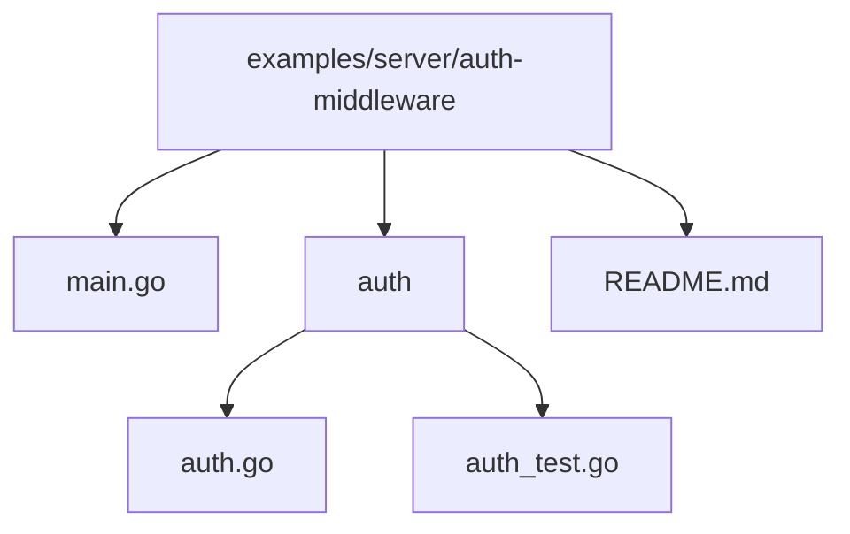
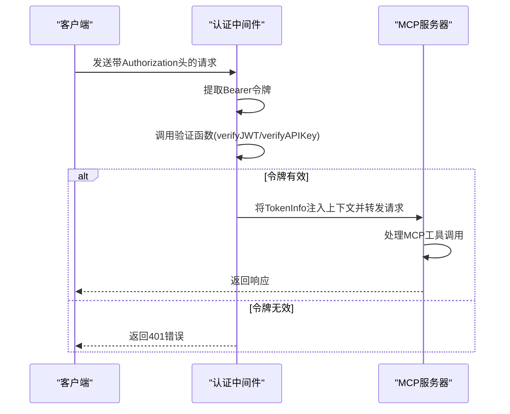
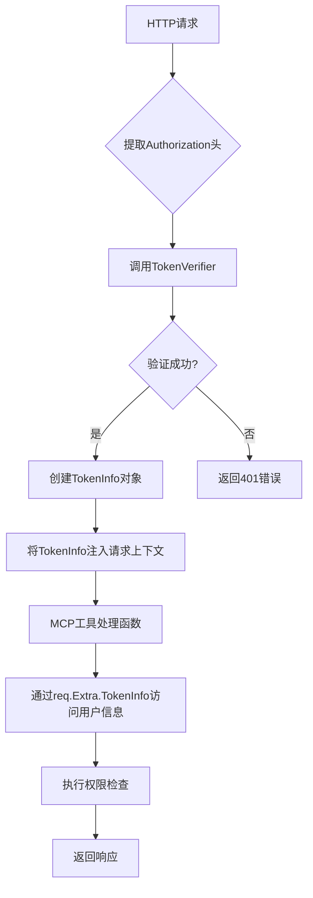
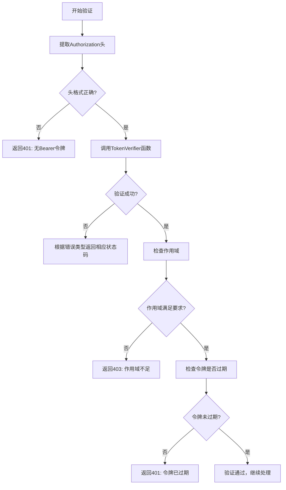

# 认证中间件示例

<cite>
**Referenced Files in This Document**   
- [main.go](file://examples/server/auth-middleware/main.go)
- [auth.go](file://auth/auth.go)
- [README.md](file://examples/server/auth-middleware/README.md)
</cite>

## 目录
1. [项目结构](#项目结构)
2. [核心组件](#核心组件)
3. [认证中间件集成](#认证中间件集成)
4. [TokenInfo上下文传递](#tokeninfo上下文传递)
5. [Bearer Token验证逻辑](#bearer-token验证逻辑)
6. [测试方法](#测试方法)
7. [常见配置错误与调试](#常见配置错误与调试)

## 项目结构

该示例位于 `examples/server/auth-middleware` 目录下，展示了如何将认证中间件集成到MCP服务器中。项目包含一个主文件 `main.go`，一个认证包 `auth`，以及一个详细的 `README.md` 文件说明使用方法。



**Diagram sources**
- [main.go](file://examples/server/auth-middleware/main.go)
- [auth.go](file://auth/auth.go)
- [README.md](file://examples/server/auth-middleware/README.md)

**Section sources**
- [main.go](file://examples/server/auth-middleware/main.go)
- [auth.go](file://auth/auth.go)

## 核心组件

本示例的核心组件包括认证中间件 `auth.RequireBearerToken`、MCP服务器处理程序以及两种认证方式：JWT令牌和API密钥。这些组件协同工作，确保只有经过身份验证的请求才能访问MCP工具。

**Section sources**
- [main.go](file://examples/server/auth-middleware/main.go#L1-L50)
- [auth.go](file://auth/auth.go#L1-L20)

## 认证中间件集成

`auth.RequireBearerToken` 函数作为中间件包装MCP服务器的HTTP处理器，实现请求级别的身份验证。在 `main.go` 中，通过将 `verifyJWT` 或 `verifyAPIKey` 验证函数传递给 `RequireBearerToken`，创建了认证中间件实例。然后将此中间件应用于MCP处理器，确保每个请求在到达MCP服务器之前都经过身份验证。



**Diagram sources**
- [main.go](file://examples/server/auth-middleware/main.go#L250-L260)
- [auth.go](file://auth/auth.go#L60-L79)

**Section sources**
- [main.go](file://examples/server/auth-middleware/main.go#L250-L265)
- [auth.go](file://auth/auth.go#L60-L79)

## TokenInfo上下文传递

`TokenInfo` 结构体通过Go的上下文(Context)机制在请求处理链中传递。当 `RequireBearerToken` 中间件成功验证令牌后，它会将 `TokenInfo` 对象存储在请求的上下文中。在MCP工具处理函数中，可以通过 `req.Extra.TokenInfo` 访问此信息，从而实现基于用户权限的访问控制。



**Diagram sources**
- [main.go](file://examples/server/auth-middleware/main.go#L85-L108)
- [auth.go](file://auth/auth.go#L16-L21)

**Section sources**
- [main.go](file://examples/server/auth-middleware/main.go#L85-L125)
- [auth.go](file://auth/auth.go#L16-L21)

## Bearer Token验证逻辑

`auth/auth.go` 文件中的 `verify` 函数负责Bearer Token的验证逻辑。它首先从Authorization头中提取令牌，然后调用用户提供的 `TokenVerifier` 函数进行实际验证。验证过程包括检查令牌格式、调用验证器、验证作用域(Scopes)和检查令牌是否过期。JWT解析过程在 `main.go` 的 `verifyJWT` 函数中实现，使用 `github.com/golang-jwt/jwt/v5` 库解析和验证JWT令牌。



**Diagram sources**
- [main.go](file://examples/server/auth-middleware/main.go#L85-L108)
- [auth.go](file://auth/auth.go#L90-L120)

**Section sources**
- [main.go](file://examples/server/auth-middleware/main.go#L85-L108)
- [auth.go](file://auth/auth.go#L90-L120)

## 测试方法

测试该示例的方法包括使用curl命令发送带Authorization头的请求。首先可以通过 `/generate-token` 或 `/generate-api-key` 端点生成测试令牌，然后使用这些令牌调用MCP工具。例如，生成JWT令牌后，可以使用curl命令调用 `say_hi` 工具，验证认证流程是否正常工作。

```bash
# 生成JWT令牌
curl 'http://localhost:8080/generate-token?user_id=alice&scopes=read,write'

# 使用JWT令牌调用MCP工具
curl -H 'Authorization: Bearer <generated_token>' \
     -H 'Content-Type: application/json' \
     -d '{"jsonrpc":"2.0","id":1,"method":"tools/call","params":{"name":"say_hi","arguments":{}}}' \
     http://localhost:8080/mcp/jwt

# 生成API密钥
curl -X POST 'http://localhost:8080/generate-api-key?user_id=bob&scopes=read'

# 使用API密钥调用MCP工具
curl -H 'Authorization: Bearer <generated_api_key>' \
     -H 'Content-Type: application/json' \
     -d '{"jsonrpc":"2.0","id":1,"method":"tools/call","params":{"name":"get_user_info","arguments":{"user_id":"test"}}}' \
     http://localhost:8080/mcp/apikey
```

**Section sources**
- [README.md](file://examples/server/auth-middleware/README.md#L140-L170)

## 常见配置错误与调试

常见的配置错误包括密钥不匹配、令牌过期和作用域不足。调试建议包括检查JWT密钥是否一致、验证令牌的过期时间以及确认请求的作用域是否满足工具要求。当出现401错误时，应检查令牌格式和有效性；当出现403错误时，应检查作用域配置。此外，确保在生产环境中使用环境变量存储密钥，而不是硬编码在代码中。

**Section sources**
- [README.md](file://examples/server/auth-middleware/README.md#L210-L230)
- [main.go](file://examples/server/auth-middleware/main.go#L330-L362)