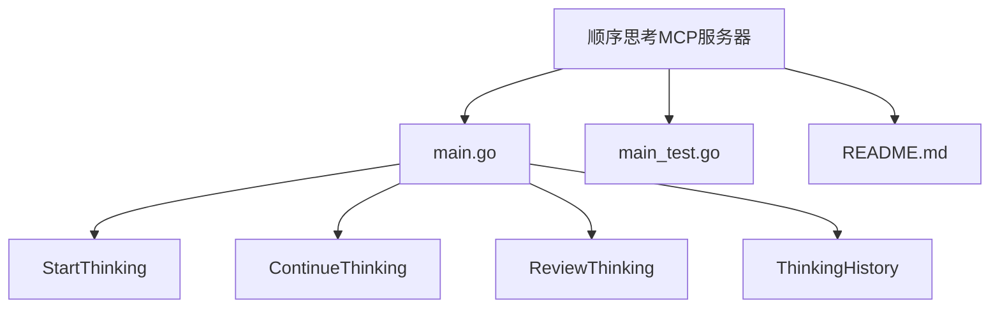
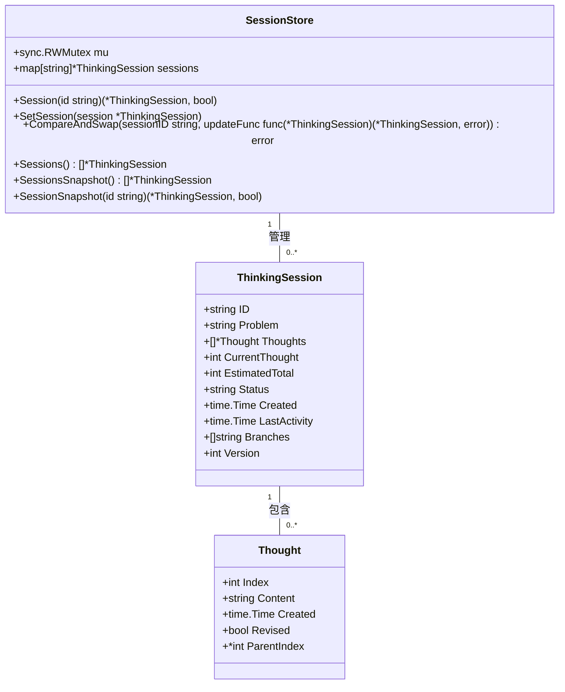
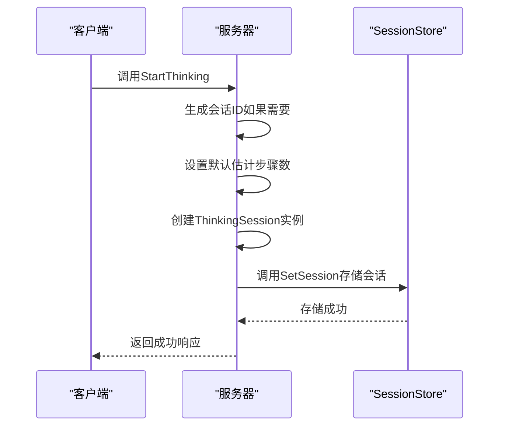
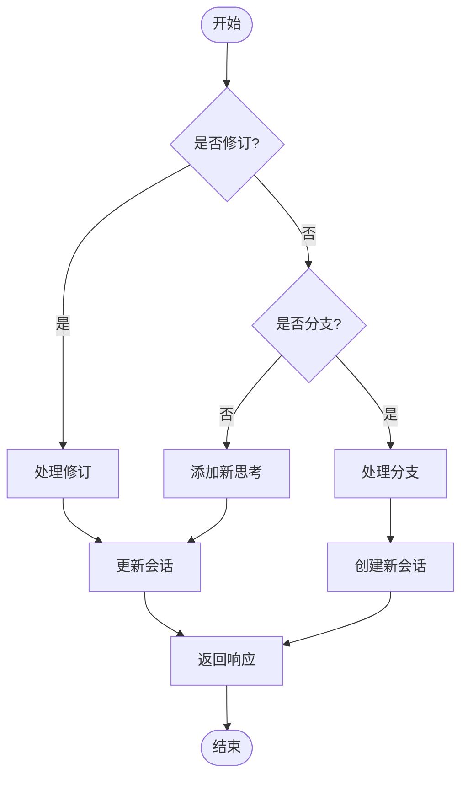
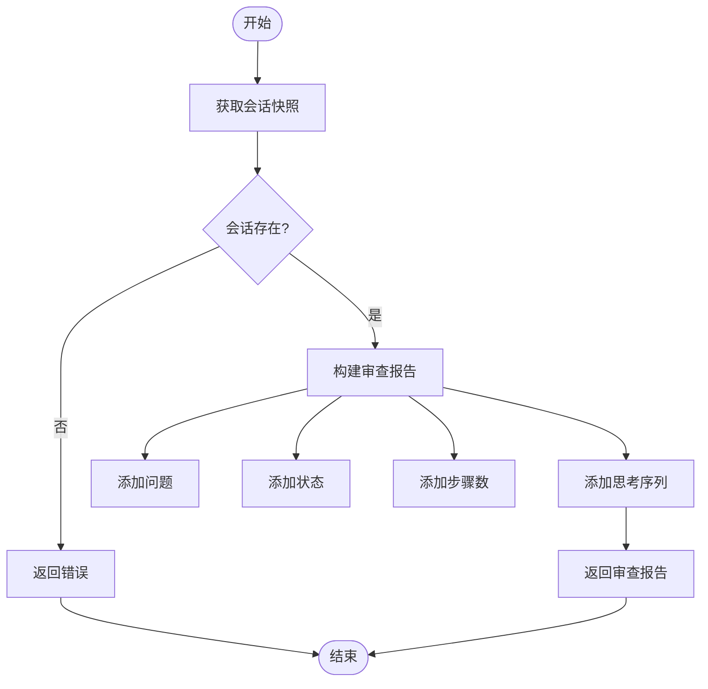
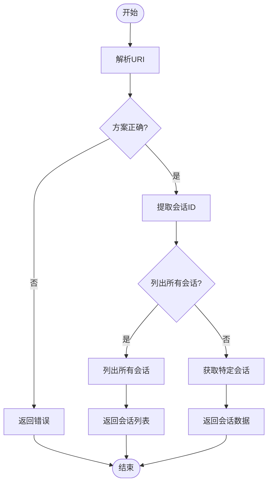
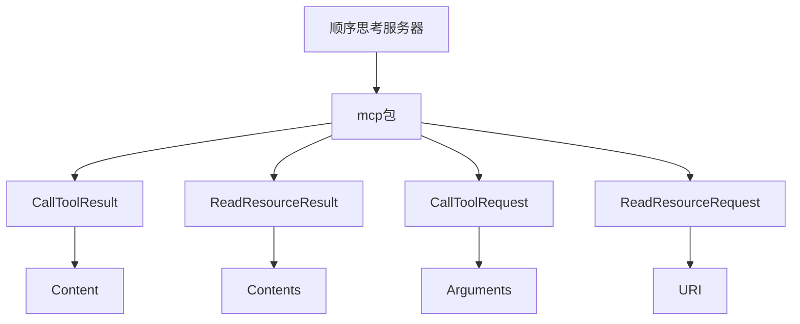

# 顺序思考示例

<cite>
**本文档引用的文件**   
- [main.go](file://examples/server/sequentialthinking/main.go)
- [main_test.go](file://examples/server/sequentialthinking/main_test.go)
- [README.md](file://examples/server/sequentialthinking/README.md)
</cite>

## 目录
1. [简介](#简介)
2. [项目结构](#项目结构)
3. [核心组件](#核心组件)
4. [架构概述](#架构概述)
5. [详细组件分析](#详细组件分析)
6. [依赖分析](#依赖分析)
7. [性能考虑](#性能考虑)
8. [故障排除指南](#故障排除指南)
9. [结论](#结论)
10. [附录](#附录)（如有必要）

## 简介
顺序思考示例展示了如何通过模型上下文协议（MCP）服务器实现动态和反思性的问题解决。该服务器通过结构化的思考过程，帮助将复杂问题分解为可管理的、顺序的思考步骤，并支持修订和分支。此文档全面解读了`examples/server/sequentialthinking/main.go`中顺序思考模式的实现，说明了该示例如何模拟多步骤推理过程，通过工具调用链实现复杂逻辑。

## 项目结构
该项目位于`examples/server/sequentialthinking`目录下，包含三个主要文件：`main.go`、`main_test.go`和`README.md`。`main.go`文件定义了服务器的主要逻辑，包括启动、继续和审查思考会话的工具。`main_test.go`文件包含了对这些工具的单元测试，确保其行为符合预期。`README.md`文件提供了详细的使用说明和功能介绍。

**图源**
- [main.go](file://examples/server/sequentialthinking/main.go#L233-L263)
- [main.go](file://examples/server/sequentialthinking/main.go#L266-L390)
- [main.go](file://examples/server/sequentialthinking/main.go#L393-L427)
- [main.go](file://examples/server/sequentialthinking/main.go#L430-L480)

**节源**
- [main.go](file://examples/server/sequentialthinking/main.go#L1-L538)
- [main_test.go](file://examples/server/sequentialthinking/main_test.go#L1-L491)
- [README.md](file://examples/server/sequentialthinking/README.md#L1-L203)

## 核心组件
顺序思考示例的核心组件包括`ThinkingSession`、`Thought`、`SessionStore`等数据结构，以及`StartThinking`、`ContinueThinking`、`ReviewThinking`和`ThinkingHistory`等工具函数。这些组件共同实现了多步骤推理过程的模拟。

**节源**
- [main.go](file://examples/server/sequentialthinking/main.go#L28-L63)
- [main.go](file://examples/server/sequentialthinking/main.go#L83-L191)

## 架构概述
该服务器的架构设计围绕着`ThinkingSession`和`Thought`两个核心数据结构展开。`ThinkingSession`表示一个活跃的思考会话，包含问题、思考步骤、当前思考索引、估计的总步数、会话状态等信息。`Thought`表示思考过程中的单个步骤，包含索引、内容、创建时间和是否修订等信息。`SessionStore`是一个全局会话存储，用于管理所有思考会话。

**图源**
- [main.go](file://examples/server/sequentialthinking/main.go#L42-L63)
- [main.go](file://examples/server/sequentialthinking/main.go#L28-L39)
- [main.go](file://examples/server/sequentialthinking/main.go#L83-L191)

## 详细组件分析
### StartThinking 分析
`StartThinking`函数用于开始一个新的顺序思考会话。它接收`StartThinkingArgs`参数，包括问题、会话ID和估计的步骤数。如果未提供会话ID，则生成一个随机ID。函数创建一个新的`ThinkingSession`实例，并将其存储在`SessionStore`中。

#### 函数调用流程

**图源**
- [main.go](file://examples/server/sequentialthinking/main.go#L233-L263)

**节源**
- [main.go](file://examples/server/sequentialthinking/main.go#L233-L263)
- [main_test.go](file://examples/server/sequentialthinking/main_test.go#L16-L67)

### ContinueThinking 分析
`ContinueThinking`函数用于添加下一个思考步骤、修订之前的步骤或创建分支。它接收`ContinueThinkingArgs`参数，包括会话ID、思考内容、是否需要下一步、修订步骤索引、是否创建分支和更新的估计总数。

#### 复杂逻辑流程

**图源**
- [main.go](file://examples/server/sequentialthinking/main.go#L266-L390)

**节源**
- [main.go](file://examples/server/sequentialthinking/main.go#L266-L390)
- [main_test.go](file://examples/server/sequentialthinking/main_test.go#L69-L128)

### ReviewThinking 分析
`ReviewThinking`函数用于提供对思考会话的完整审查。它接收`ReviewThinkingArgs`参数，包括会话ID。函数获取会话的快照，并生成一个包含问题、状态、步骤数和思考序列的审查报告。

#### 审查流程

**图源**
- [main.go](file://examples/server/sequentialthinking/main.go#L393-L427)

**节源**
- [main.go](file://examples/server/sequentialthinking/main.go#L393-L427)
- [main_test.go](file://examples/server/sequentialthinking/main_test.go#L293-L358)

### ThinkingHistory 分析
`ThinkingHistory`函数用于处理思考会话数据和历史的资源请求。它接收`ReadResourceRequest`参数，解析URI以获取会话ID，并返回相应的会话数据或会话列表。

#### 资源请求处理

**图源**
- [main.go](file://examples/server/sequentialthinking/main.go#L430-L480)

**节源**
- [main.go](file://examples/server/sequentialthinking/main.go#L430-L480)
- [main_test.go](file://examples/server/sequentialthinking/main_test.go#L360-L439)

## 依赖分析
该示例依赖于`mcp`包中的多个组件，如`CallToolResult`、`ReadResourceResult`、`CallToolRequest`和`ReadResourceRequest`。这些组件定义了MCP协议中的数据结构和接口，确保了服务器与客户端之间的通信。

**图源**
- [mcp/protocol.go](file://mcp/protocol.go#L72-L116)
- [mcp/protocol.go](file://mcp/protocol.go#L743-L748)
- [mcp/requests.go](file://mcp/requests.go#L9-L9)
- [mcp/requests.go](file://mcp/requests.go#L18-L18)

**节源**
- [main.go](file://examples/server/sequentialthinking/main.go#L72-L116)
- [main.go](file://examples/server/sequentialthinking/main.go#L743-L748)
- [main.go](file://examples/server/sequentialthinking/main.go#L9-L9)
- [main.go](file://examples/server/sequentialthinking/main.go#L18-L18)

## 性能考虑
该服务器在处理并发请求时采用了乐观并发控制机制，通过`CompareAndSwap`方法确保会话数据的一致性。此外，使用`RWMutex`保护会话映射，避免了读写冲突。这些设计选择有助于提高服务器的性能和可靠性。

## 故障排除指南
### 常见问题
1. **会话不存在**：当尝试访问不存在的会话时，服务器会返回错误。确保会话ID正确无误。
2. **无效的修订步骤**：当尝试修订不存在的步骤时，服务器会返回错误。确保步骤索引在有效范围内。
3. **并发修改冲突**：当多个客户端同时修改同一个会话时，可能会发生版本冲突。服务器会自动重试，直到成功或达到最大重试次数。

**节源**
- [main_test.go](file://examples/server/sequentialthinking/main_test.go#L441-L490)

## 结论
顺序思考示例通过模拟多步骤推理过程，展示了如何使用MCP服务器实现复杂的逻辑。通过工具调用链，服务器能够有效地管理思考会话，支持修订和分支，为用户提供了一个强大的问题解决工具。结合`main_test.go`中的测试用例，可以验证服务器的预期行为和验证方法。为了增强生产环境的适用性，建议添加超时控制、错误恢复机制或状态持久化等优化措施。