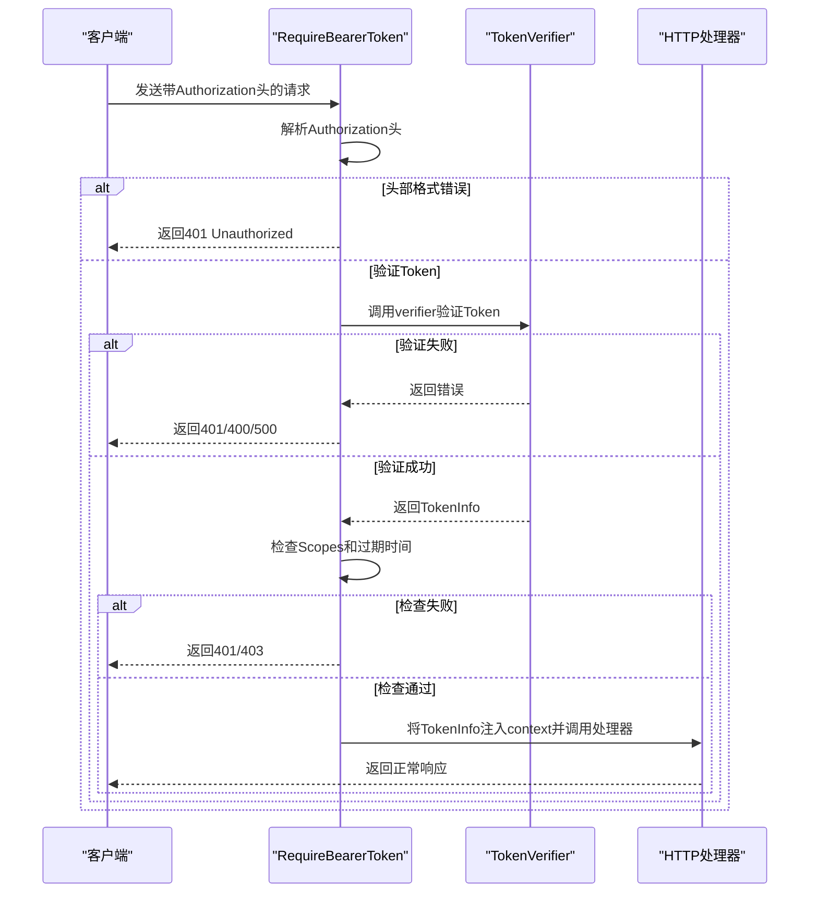
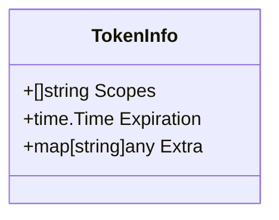
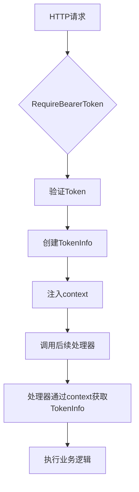
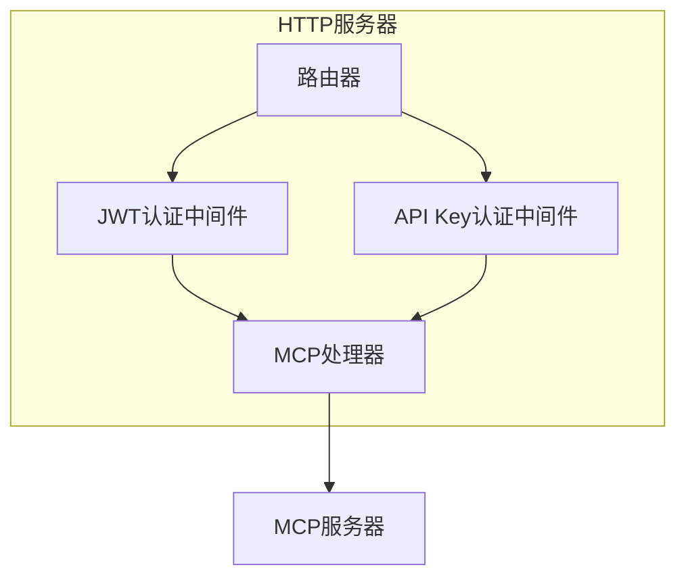

# Bearer Token 认证

<cite>
**本文档引用的文件**  
- [auth.go](file://auth/auth.go)
- [main.go](file://examples/server/auth-middleware/main.go)
- [shared.go](file://mcp/shared.go)
</cite>

## 目录
1. [简介](#简介)
2. [核心组件](#核心组件)
3. [认证机制实现原理](#认证机制实现原理)
4. [TokenInfo 结构体详解](#tokeninfo-结构体详解)
5. [上下文注入与信息传递](#上下文注入与信息传递)
6. [在 MCP 服务器中应用中间件](#在-mcp-服务器中应用中间件)
7. [自定义 TokenVerifier 实现](#自定义-tokenverifier-实现)
8. [常见问题排查](#常见问题排查)
9. [性能优化建议](#性能优化建议)
10. [总结](#总结)

## 简介
本文档全面介绍 Go MCP SDK 中基于 Bearer Token 的认证机制。深入解析 `auth.RequireBearerToken` 中间件的实现原理，详细说明 `TokenInfo` 结构体的字段含义，以及如何通过 context 将认证信息注入请求链路供后续处理器使用。结合 `auth-middleware/main.go` 示例，展示如何将中间件应用于 MCP 服务器的 HTTP 处理器以实现端点保护。提供自定义 `TokenVerifier` 的实现方法，支持 JWT、API Key 等多种验证策略，并包含常见问题排查和性能优化建议。

**Section sources**
- [main.go](file://examples/server/auth-middleware/main.go#L1-L50)

## 核心组件
本 SDK 的认证功能主要由 `auth` 包提供，核心组件包括 `RequireBearerToken` 中间件、`TokenVerifier` 接口和 `TokenInfo` 结构体。这些组件协同工作，为 MCP 服务器提供灵活且安全的认证能力。

**Section sources**
- [auth.go](file://auth/auth.go#L1-L20)

## 认证机制实现原理

`RequireBearerToken` 是一个标准的 HTTP 中间件函数，它接收一个 `TokenVerifier` 接口和选项参数，返回一个新的 HTTP 处理器。该中间件负责拦截并验证 HTTP 请求中的 Authorization 头。

**Diagram sources**
- [auth.go](file://auth/auth.go#L60-L79)
- [auth.go](file://auth/auth.go#L81-L119)

**Section sources**
- [auth.go](file://auth/auth.go#L60-L119)

## TokenInfo 结构体详解

`TokenInfo` 结构体用于存储从 Bearer Token 中提取的认证信息，包含以下字段：

**Diagram sources**
- [auth.go](file://auth/auth.go#L16-L21)

**Section sources**
- [auth.go](file://auth/auth.go#L16-L21)

### Scopes 字段
`Scopes` 字段是一个字符串切片，表示用户拥有的权限或角色。中间件会根据 `RequireBearerTokenOptions` 中指定的必需作用域来检查用户权限，确保用户具有访问特定资源所需的最小权限。

### Expiration 字段
`Expiration` 字段表示 Token 的过期时间。中间件会自动检查此时间，如果当前时间已超过过期时间，则拒绝请求并返回 "token expired" 错误。这有助于防止使用过期的 Token 进行非法访问。

### Extra 字段
`Extra` 字段是一个通用的映射，用于存储除标准字段外的其他任意信息。开发者可以利用此字段存储自定义的用户信息、组织ID等扩展数据，为业务逻辑提供支持。

## 上下文注入与信息传递

认证成功后，`RequireBearerToken` 中间件会将 `TokenInfo` 对象注入到 HTTP 请求的 context 中。后续的处理器可以通过 `TokenInfoFromContext` 函数或直接从 `RequestExtra` 中获取这些信息。

**Diagram sources**
- [auth.go](file://auth/auth.go#L46-L52)
- [shared.go](file://mcp/shared.go#L427)

**Section sources**
- [auth.go](file://auth/auth.go#L46-L52)
- [shared.go](file://mcp/shared.go#L427)

## 在 MCP 服务器中应用中间件

在 `auth-middleware/main.go` 示例中，展示了如何将 `RequireBearerToken` 中间件应用于 MCP 服务器。通过为不同的认证方式（如 JWT 和 API Key）创建独立的中间件实例，并将其应用到 MCP 的 HTTP 处理器上，实现了灵活的认证策略。

**Diagram sources**
- [main.go](file://examples/server/auth-middleware/main.go#L211-L256)

**Section sources**
- [main.go](file://examples/server/auth-middleware/main.go#L211-L256)

## 自定义 TokenVerifier 实现

开发者可以实现 `TokenVerifier` 接口来支持不同的认证策略。示例中提供了 JWT 和 API Key 两种验证器的实现。

### JWT 验证器实现
JWT 验证器使用 `github.com/golang-jwt/jwt/v5` 库解析和验证 JWT Token。它检查签名方法、验证 Token 的有效性，并从中提取用户ID和权限范围。

**Section sources**
- [main.go](file://examples/server/auth-middleware/main.go#L104-L138)

### API Key 验证器实现
API Key 验证器通过查找预定义的 API Key 映射来验证密钥的有效性。在生产环境中，这些密钥通常存储在数据库中，并可能包含额外的元数据如创建时间、使用次数等。

**Section sources**
- [main.go](file://examples/server/auth-middleware/main.go#L104-L138)

## 常见问题排查

### 令牌过期
当 Token 的 `Expiration` 时间早于当前时间时，系统会返回 "token expired" 错误。解决方案是生成新的 Token 或延长现有 Token 的有效期。

### 作用域不足
如果用户 Token 的 `Scopes` 中不包含处理器所需的权限，系统会返回 "insufficient scope" 错误。应确保在生成 Token 时分配了正确的权限范围。

### WWW-Authenticate 头设置
当 `RequireBearerTokenOptions.ResourceMetadataURL` 被设置且验证失败时，中间件会自动在响应头中添加 `WWW-Authenticate` 字段，指向资源服务器元数据的 URL，帮助客户端了解如何进行身份验证。

**Section sources**
- [auth.go](file://auth/auth.go#L70-L75)
- [main.go](file://examples/server/auth-middleware/main.go#L254-L295)

## 性能优化建议

### 缓存验证结果
对于频繁使用的 Token，可以考虑实现缓存机制，避免重复解析和验证。例如，使用内存缓存存储已验证的 TokenInfo，设置合理的过期时间。

### 避免重复解析
在同一个请求处理链中，应尽量避免多次调用 `TokenInfoFromContext` 或类似的解析函数。建议在请求开始时解析一次，并将结果存储在 context 或请求对象中供后续使用。

### 批量作用域检查
当前的作用域检查算法是 O(n*m) 的复杂度，虽然在小规模数据下表现良好，但在大规模权限系统中可能成为瓶颈。可以考虑使用集合数据结构来优化查找性能。

**Section sources**
- [auth.go](file://auth/auth.go#L99-L103)

## 总结
Go MCP SDK 提供了一套完整且灵活的 Bearer Token 认证机制。通过 `RequireBearerToken` 中间件，开发者可以轻松地为 MCP 服务器添加认证功能。结合自定义的 `TokenVerifier` 实现，可以支持多种认证策略，满足不同场景的需求。合理利用 `TokenInfo` 结构体和 context 注入机制，可以在保证安全性的同时，为业务逻辑提供丰富的用户信息。