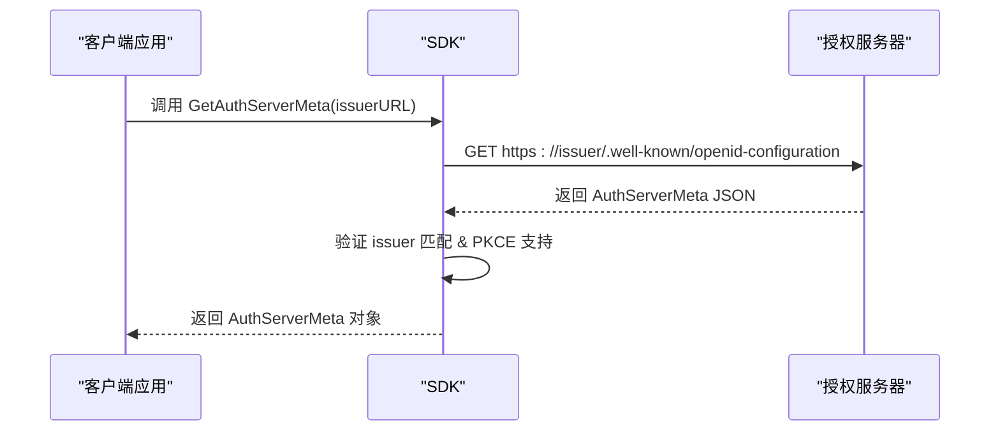
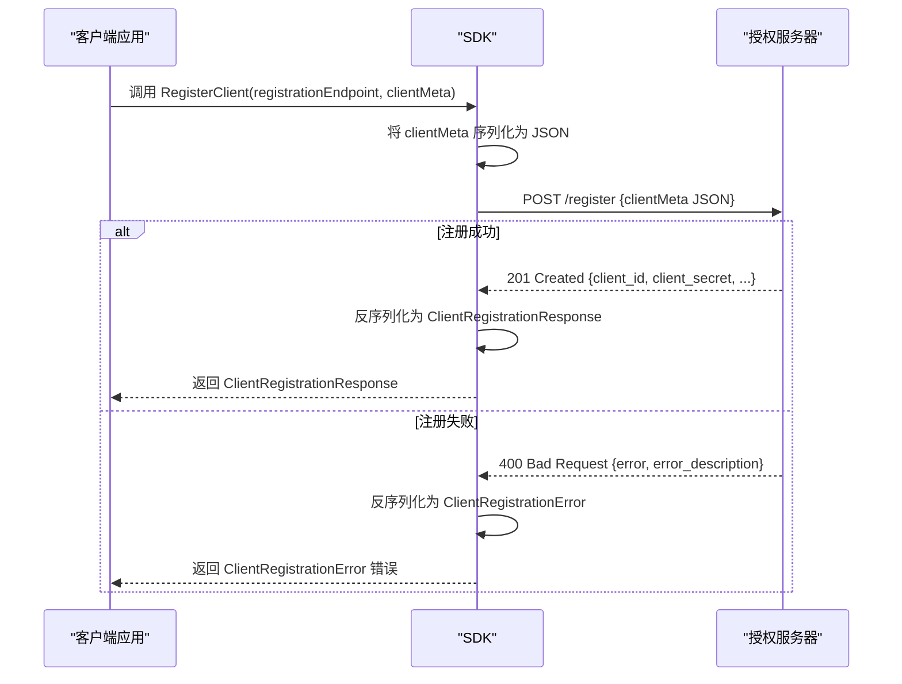

# OAuth 2.0 DCR 扩展

<cite>
**Referenced Files in This Document**   
- [oauthex.go](file://oauthex/oauthex.go)
- [resource_meta.go](file://oauthex/resource_meta.go)
- [auth_meta.go](file://oauthex/auth_meta.go)
- [dcr.go](file://oauthex/dcr.go)
- [oauth2.go](file://oauthex/oauth2.go)
- [google-auth-meta.json](file://oauthex/testdata/google-auth-meta.json)
- [client-auth-meta.json](file://oauthex/testdata/client-auth-meta.json)
</cite>

## 目录
1. [受保护资源元数据](#受保护资源元数据)
2. [授权服务器元数据发现](#授权服务器元数据发现)
3. [动态客户端注册（DCR）](#动态客户端注册dcr)
4. [与MCP服务器集成](#与mcp服务器集成)
5. [安全最佳实践](#安全最佳实践)

## 受保护资源元数据

`oauthex.ProtectedResourceMetadata` 结构体实现了 RFC 9728 标准，用于描述受保护资源的元数据。该元数据通过 HTTPS 协议从资源服务器的 well-known 端点（如 `/.well-known/oauth-protected-resource`）获取，为客户端提供与资源交互所需的关键信息。

### 核心字段语义

该结构体定义了多个关键字段，每个字段都对应特定的语义和用途：

- **`resource`**: 受保护资源的唯一标识符，通常是一个 HTTPS URL。此字段为必填项，用于验证元数据来源的真实性。
- **`authorization_servers`**: 一个可选的字符串切片，列出了可以为此资源提供授权服务的 OAuth 2.0 授权服务器的发行者标识符（Issuer）。这支持多授权服务器场景。
- **`jwks_uri`**: 一个可选的 URL，指向资源服务器的 JSON Web Key Set (JWKS) 文档。客户端可以使用此文档中的公钥来验证资源服务器签名的响应（如受保护的资源响应）。
- **`scopes_supported`**: 一个推荐的字符串切片，列出了可用于请求访问此资源的 OAuth 2.0 范围值。这为客户端提供了可用权限的清单。
- **`bearer_methods_supported`**: 一个可选的字符串切片，指定了将 OAuth 2.0 持有者令牌（Bearer Token）发送到受保护资源的受支持方法，如 `header`（在 Authorization 头中）、`body` 或 `query`。
- **`resource_signing_alg_values_supported`**: 一个可选的字符串切片，列出了资源服务器用于对其响应进行签名的 JWS 签名算法（如 `RS256`）。
- **`tls_client_certificate_bound_access_tokens`**: 一个可选的布尔值，指示资源服务器是否支持基于相互 TLS 客户端证书绑定的访问令牌（RFC 8705），这是一种增强令牌安全性的机制。
- **`dpop_signing_alg_values_supported`**: 一个可选的字符串切片，列出了资源服务器支持用于验证 DPoP（Demonstrating Proof-of-Possession）证明 JWT 的 JWS 签名算法（RFC 9449）。
- **`dpop_bound_access_tokens_required`**: 一个可选的布尔值，指定资源服务器是否始终要求使用 DPoP 绑定的访问令牌（RFC 9449）。

**Section sources**
- [oauthex.go](file://oauthex/oauthex.go#L14-L91)
- [resource_meta.go](file://oauthex/resource_meta.go#L40-L50)

## 授权服务器元数据发现

SDK 提供了 `GetAuthServerMeta` 函数来动态发现和配置 OAuth 2.0 授权服务器的元数据。此功能遵循 RFC 8414 标准，通过查询授权服务器的 well-known 配置端点（如 `/.well-known/oauth-authorization-server` 或 `/.well-known/openid-configuration`）来获取 `AuthServerMeta` 结构体。

### 动态发现流程

1.  **端点探测**: 函数会尝试将预定义的 well-known 路径（`/.well-known/oauth-authorization-server`, `/.well-known/openid-configuration`）附加到提供的授权服务器发行者 URL 上。
2.  **HTTP 请求**: SDK 会向构造出的 URL 发起一个 `GET` 请求。
3.  **响应验证**: 成功获取响应后，SDK 会进行关键的安全验证：
    *   **发行者匹配**: 验证响应中 `issuer` 字段的值是否与发起请求的原始 `issuerURL` 完全一致，防止元数据注入攻击。
    *   **PKCE 支持检查**: SDK 会检查 `code_challenge_methods_supported` 字段，确保授权服务器支持 PKCE（Proof Key for Code Exchange），这是现代 OAuth 2.0 实现中推荐的安全实践。
4.  **元数据返回**: 通过验证后，函数返回一个填充了授权服务器配置信息的 `AuthServerMeta` 对象，其中包含 `authorization_endpoint`、`token_endpoint`、`jwks_uri` 和 `registration_endpoint` 等关键信息。

此机制使得 SDK 能够与不同的 OAuth 提供者（如 Google、GitHub 等）无缝集成，而无需硬编码其端点。



**Diagram sources**
- [auth_meta.go](file://oauthex/auth_meta.go#L127-L151)
- [oauth2.go](file://oauthex/oauth2.go#L60-L88)

**Section sources**
- [auth_meta.go](file://oauthex/auth_meta.go#L127-L151)

## 动态客户端注册（DCR）

SDK 通过 `RegisterClient` 函数实现了 OAuth 2.0 动态客户端注册（RFC 7591）的核心功能。该流程允许客户端应用在运行时向授权服务器注册自身，自动获取 `client_id` 和 `client_secret`，从而实现自动化配置。

### DCR 实现流程

1.  **准备元数据**: 开发者创建一个 `ClientRegistrationMetadata` 对象，填写客户端信息，如 `redirect_uris`（重定向URI）、`client_name`（客户端名称）、`token_endpoint_auth_method`（令牌端点认证方法）等。
2.  **发送注册请求**: `RegisterClient` 函数将 `ClientRegistrationMetadata` 对象序列化为 JSON，并向授权服务器的 `registration_endpoint` 发送一个 `POST` 请求。
3.  **处理响应**:
    *   **成功 (201 Created)**: 如果注册成功，授权服务器返回一个包含 `client_id` 和 `client_secret` 的 `ClientRegistrationResponse` 对象。SDK 会解析此响应并返回给调用者。
    *   **失败 (400 Bad Request)**: 如果注册失败（例如，缺少必填字段），服务器会返回一个包含 `error` 和 `error_description` 的错误对象。SDK 会将其反序列化为 `ClientRegistrationError` 并作为错误返回。
4.  **安全存储**: 客户端应用必须安全地存储返回的 `client_id` 和 `client_secret`，这些凭据将用于后续的 OAuth 2.0 授权流程。



**Diagram sources**
- [dcr.go](file://oauthex/dcr.go#L169-L222)

**Section sources**
- [dcr.go](file://oauthex/dcr.go#L169-L222)

## 与MCP服务器集成

将 DCR 与 MCP（Model Context Protocol）服务器集成，可以实现客户端的自动化配置。例如，一个 MCP 客户端可以在启动时执行以下步骤：

1.  **发现授权服务器**: 使用 `GetAuthServerMeta` 函数，通过 MCP 服务器的发行者 URL 动态获取其授权服务器元数据。
2.  **执行 DCR**: 从元数据中提取 `registration_endpoint`，然后使用 `RegisterClient` 向该端点发起动态注册请求。
3.  **获取凭据**: 成功注册后，客户端获得 `client_id` 和 `client_secret`。
4.  **进行认证**: 使用新获取的凭据，客户端可以按照标准的 OAuth 2.0 流程（如授权码流程）与 MCP 服务器进行交互。

此集成模式消除了手动创建和分发客户端凭据的需要，极大地简化了部署和管理流程。

## 安全最佳实践

在使用 DCR 和元数据功能时，必须遵循严格的安全实践：

- **凭据保护**: `client_secret` 必须被视为最高机密。它绝不能硬编码在源代码中，而应存储在安全的环境变量或密钥管理服务中。
- **强制使用 TLS**: 所有与授权服务器、资源服务器和元数据端点的通信都必须通过 HTTPS 进行，以防止中间人攻击和凭据泄露。
- **防止令牌泄露**: 在日志记录和错误消息中，应避免记录完整的访问令牌或刷新令牌。SDK 内部已对元数据 URL 的 scheme 进行检查，以防止 `javascript:` 或 `data:` 等危险的 scheme 导致 XSS 攻击。
- **验证元数据**: 始终验证从外部来源获取的元数据（如 `issuer` 字段），确保其来源可信，防止配置被篡改。

### 主流OAuth提供者集成示例

**Google 集成配置**:
```json
{
  "issuer": "https://accounts.google.com",
  "authorization_endpoint": "https://accounts.google.com/o/oauth2/v2/auth",
  "token_endpoint": "https://oauth2.googleapis.com/token",
  "jwks_uri": "https://www.googleapis.com/oauth2/v3/certs",
  "registration_endpoint": "https://oauth2.googleapis.com/register",
  "code_challenge_methods_supported": ["S256"]
}
```

**客户端注册元数据示例**:
```json
{
  "client_name": "My Test App",
  "redirect_uris": ["https://client.example.org/callback"],
  "scope": "read write"
}
```

**Section sources**
- [google-auth-meta.json](file://oauthex/testdata/google-auth-meta.json)
- [client-auth-meta.json](file://oauthex/testdata/client-auth-meta.json)