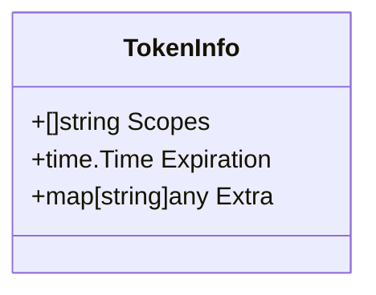
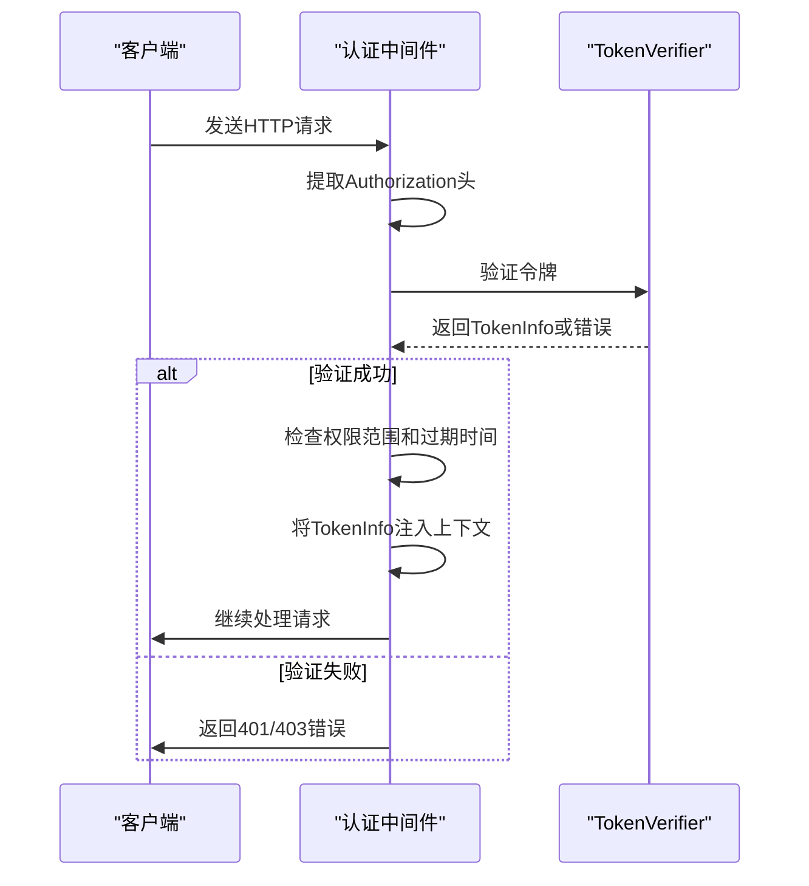
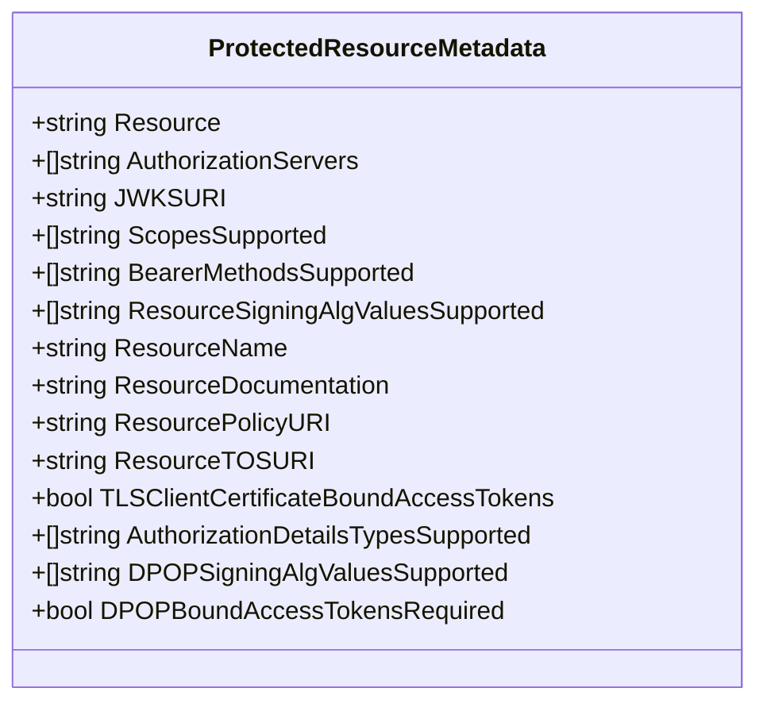
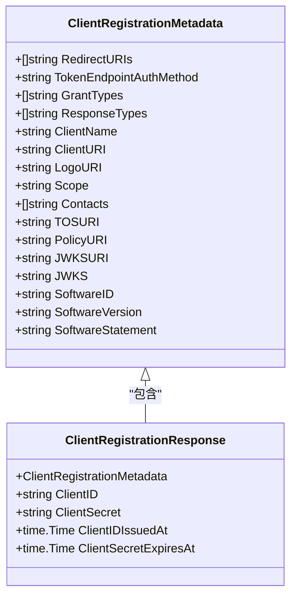
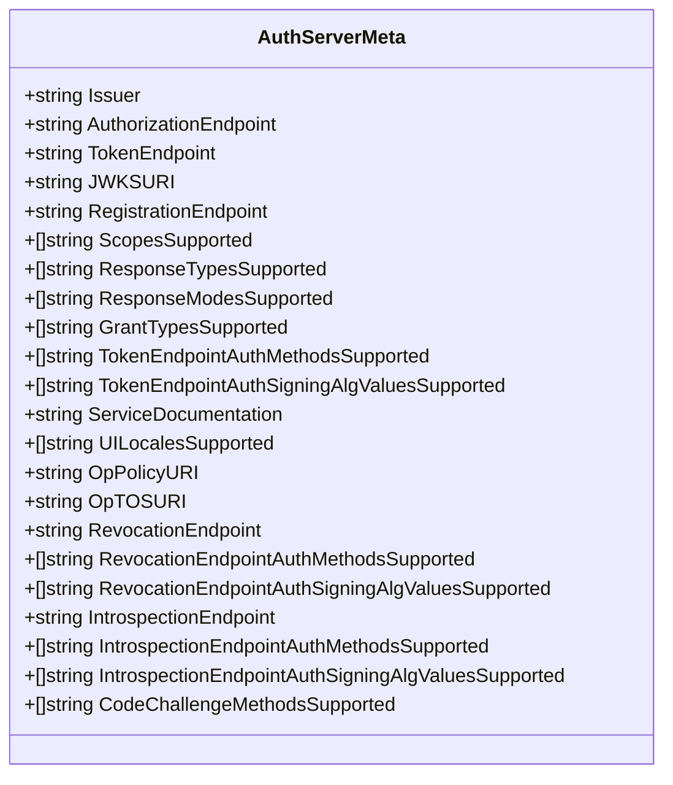
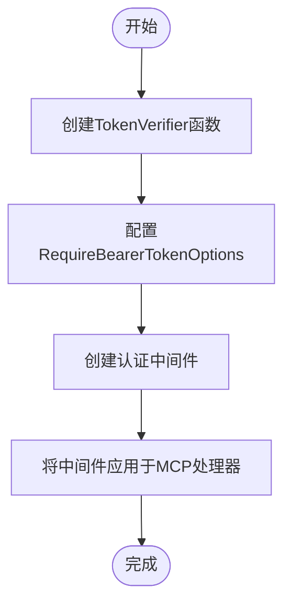
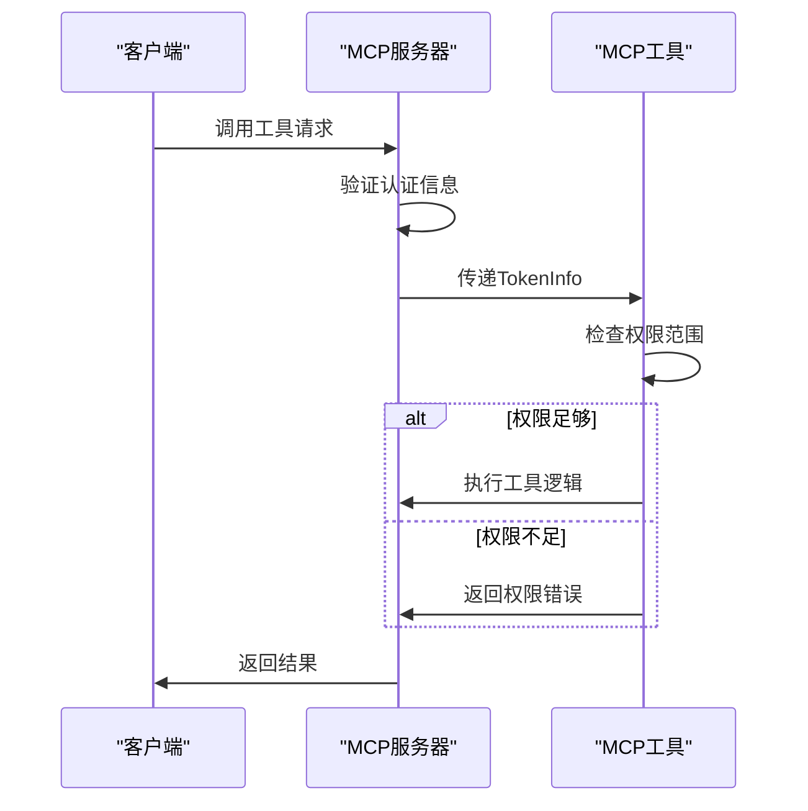

# 认证与安全

<cite>
**Referenced Files in This Document**   
- [auth.go](file://auth/auth.go)
- [auth_meta.go](file://oauthex/auth_meta.go)
- [dcr.go](file://oauthex/dcr.go)
- [oauth2.go](file://oauthex/oauth2.go)
- [resource_meta.go](file://oauthex/resource_meta.go)
- [main.go](file://examples/server/auth-middleware/main.go)
</cite>

## 目录
1. [简介](#简介)
2. [Bearer Token认证机制](#bearer-token认证机制)
3. [OAuth 2.0扩展功能](#oauth-20扩展功能)
4. [完整认证流程配置](#完整认证流程配置)
5. [安全实践建议](#安全实践建议)
6. [结论](#结论)

## 简介
本文档全面介绍SDK提供的认证机制与安全实践。首先讲解Bearer Token认证的实现，包括如何使用`auth.RequireBearerToken`中间件保护HTTP端点，以及如何在上下文中提取`TokenInfo`进行权限判断。然后深入OAuth 2.0扩展功能，通过`oauthex`包实现受保护资源元数据（Protected Resource Metadata）和动态客户端注册（DCR）。文档将解释`auth_meta.go`中元数据结构的设计，以及如何与外部OAuth提供者（如Google）集成。结合`auth-middleware/main.go`示例，展示完整的认证流程配置，并为开发者提供安全建议。

## Bearer Token认证机制

### 中间件实现
SDK通过`auth.RequireBearerToken`中间件实现Bearer Token认证。该中间件作为HTTP处理程序的包装器，验证传入请求中的Bearer令牌，并在验证成功后将`TokenInfo`注入请求上下文。

**Section sources**
- [auth.go](file://auth/auth.go#L60-L79)

### TokenInfo结构
`TokenInfo`结构体用于存储从Bearer令牌中提取的信息，包括用户权限范围（Scopes）和令牌过期时间（Expiration）。该信息在后续的权限判断中起关键作用。

**Diagram sources**
- [auth.go](file://auth/auth.go#L16-L21)

### 认证流程
认证流程包含以下步骤：
1. 从`Authorization`头中提取Bearer令牌
2. 使用`TokenVerifier`函数验证令牌有效性
3. 检查令牌是否包含必需的权限范围
4. 验证令牌是否已过期
5. 将`TokenInfo`注入请求上下文

**Diagram sources**
- [auth.go](file://auth/auth.go#L60-L79)

**Section sources**
- [auth.go](file://auth/auth.go#L0-L120)

## OAuth 2.0扩展功能

### 受保护资源元数据
`oauthex`包实现了RFC 9728规范的受保护资源元数据（Protected Resource Metadata）。`ProtectedResourceMetadata`结构体包含资源服务器的关键信息，如资源标识符、授权服务器列表、支持的权限范围等。

**Diagram sources**
- [oauthex.go](file://oauthex/oauthex.go#L14-L91)

### 动态客户端注册
SDK支持RFC 7591规范的动态客户端注册（DCR）。`ClientRegistrationMetadata`结构体定义了客户端注册所需的元数据，包括重定向URI、认证方法、授权类型等。

**Diagram sources**
- [dcr.go](file://oauthex/dcr.go#L15-L150)

### 授权服务器元数据
`AuthServerMeta`结构体实现了RFC 8414规范的授权服务器元数据，包含授权端点、令牌端点、JWKS URI等关键信息。`GetAuthServerMeta`函数用于从授权服务器获取元数据。

**Diagram sources**
- [auth_meta.go](file://oauthex/auth_meta.go#L25-L111)

**Section sources**
- [auth_meta.go](file://oauthex/auth_meta.go#L0-L152)
- [dcr.go](file://oauthex/dcr.go#L0-L223)

## 完整认证流程配置

### 示例分析
`examples/server/auth-middleware/main.go`文件展示了完整的认证流程配置。该示例实现了JWT和API密钥两种认证方式，并集成了MCP服务器。

**Section sources**
- [main.go](file://examples/server/auth-middleware/main.go#L0-L378)

### 配置步骤
1. 创建`TokenVerifier`函数实现令牌验证逻辑
2. 配置`RequireBearerTokenOptions`指定必需的权限范围
3. 使用`RequireBearerToken`创建认证中间件
4. 将中间件应用于MCP服务器处理程序

**Diagram sources**
- [main.go](file://examples/server/auth-middleware/main.go#L200-L250)

### MCP工具集成
认证信息可用于MCP工具的权限控制。通过`req.Extra.TokenInfo`可以获取用户的权限范围，并据此决定是否允许执行特定操作。

**Diagram sources**
- [main.go](file://examples/server/auth-middleware/main.go#L250-L300)

## 安全实践建议

### 令牌存储
- **生产环境**：使用环境变量存储JWT密钥
- **API密钥**：存储在数据库中，避免硬编码
- **敏感信息**：不要在日志中记录完整的令牌

### 作用域管理
- **最小权限原则**：只授予执行操作所需的最小权限
- **作用域命名**：使用清晰、一致的命名约定
- **作用域验证**：在工具执行前验证必需的作用域

### 防止重放攻击
- **设置合理过期时间**：为令牌设置适当的过期时间
- **使用HTTPS**：始终在生产环境中使用HTTPS
- **令牌绑定**：考虑使用TLS客户端证书绑定令牌

### 其他安全建议
1. **环境变量**：在生产环境中使用环境变量存储敏感信息
2. **数据库存储**：将API密钥存储在数据库中
3. **HTTPS使用**：在生产环境中始终使用HTTPS
4. **令牌过期**：设置适当的令牌过期时间
5. **最小权限原则**：只授予必要的权限范围

**Section sources**
- [README.md](file://examples/server/auth-middleware/README.md#L200-L230)

## 结论
本SDK提供了全面的认证机制和安全实践，支持Bearer Token认证和OAuth 2.0扩展功能。通过`auth`和`oauthex`包，开发者可以轻松实现安全的认证流程，保护MCP工具和资源。建议开发者遵循文档中的安全实践，确保系统的安全性。