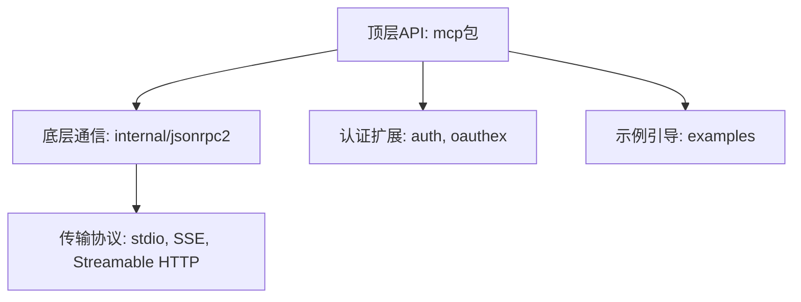
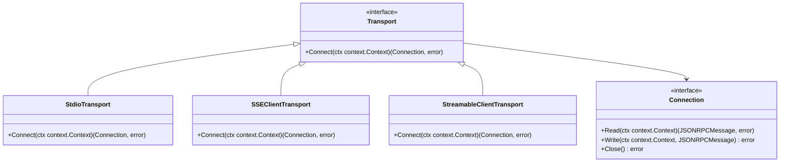
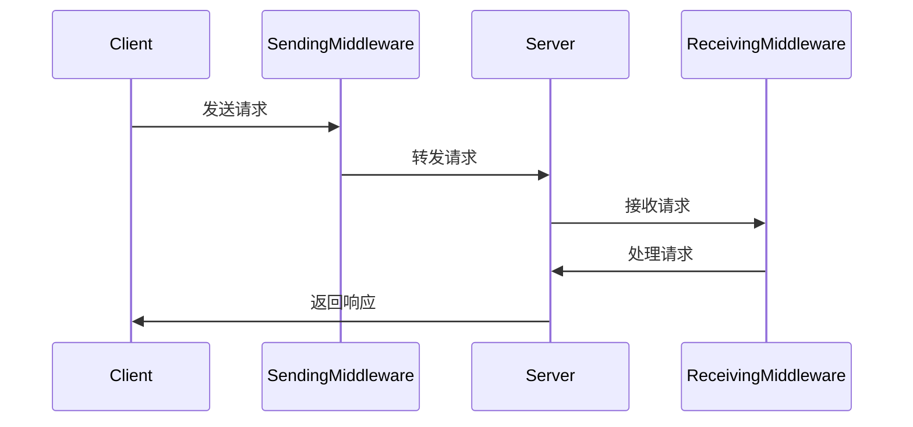

# 项目概述

<cite>
**本文档中引用的文件**
- [main.go](file://examples/server/basic/main.go)
- [README.md](file://README.md)
- [design.md](file://design/design.md)
- [mcp.go](file://mcp/mcp.go)
- [jsonrpc2.go](file://internal/jsonrpc2/jsonrpc2.go)
- [auth.go](file://auth/auth.go)
- [oauthex.go](file://oauthex/oauthex.go)
</cite>

## 目录
1. [核心目标与定位](#核心目标与定位)
2. [整体架构设计](#整体架构设计)
3. [顶层API设计](#顶层api设计)
4. [底层通信机制](#底层通信机制)
5. [认证扩展机制](#认证扩展机制)
6. [示例引导](#示例引导)
7. [关键设计决策](#关键设计决策)
8. [学习路径](#学习路径)

## 核心目标与定位

`go-sdk`项目是Model Context Protocol (MCP)的官方Go语言软件开发工具包（SDK）。该项目旨在为Go开发者提供一个完整、可靠且符合规范的工具集，用于构建智能模型上下文交互系统。其核心目标是实现MCP规范的全部功能，并以Go语言的惯用方式（idiomatic Go）提供API，确保开发者能够高效、安全地创建MCP客户端和服务器。

该项目在MCP生态系统中扮演着官方参考实现的角色。它不仅为开发者提供了构建MCP应用的基础，还通过其设计和实现为社区树立了标准。通过提供清晰的API和丰富的示例，该项目降低了开发者采用MCP的门槛，促进了智能模型与应用程序之间标准化交互的普及。

**Section sources**
- [README.md](file://README.md#L1-L145)
- [design.md](file://design/design.md#L1-L799)

## 整体架构设计

`go-sdk`项目采用分层架构设计，各层职责清晰，耦合度低。整体架构可以分为四个主要层次：顶层API、底层通信、认证扩展和示例引导。



**Diagram sources**
- [mcp.go](file://mcp/mcp.go#L1-L89)
- [jsonrpc2.go](file://internal/jsonrpc2/jsonrpc2.go#L1-L122)

**Section sources**
- [design.md](file://design/design.md#L1-L799)

## 顶层API设计

顶层API由`mcp`包提供，是开发者与SDK交互的主要入口。该包定义了构建和使用MCP客户端和服务器的核心API。其设计遵循Go语言的惯用法，将所有相关功能集中在一个包中，便于发现和使用。

`mcp`包的核心是`Client`和`Server`两个结构体。`Client`用于创建MCP客户端，`Server`用于创建MCP服务器。两者都支持通过`AddXXX`方法添加功能，如工具（Tools）、提示（Prompts）和资源（Resources）。例如，创建一个简单的服务器并添加一个工具的代码如下：

```go
server := mcp.NewServer(&mcp.Implementation{Name: "greeter", Version: "v1.0.0"}, nil)
mcp.AddTool(server, &mcp.Tool{Name: "greet", Description: "say hi"}, SayHi)
if err := server.Run(context.Background(), &mcp.StdioTransport{}); err != nil {
    log.Fatal(err)
}
```

**Section sources**
- [mcp.go](file://mcp/mcp.go#L1-L89)
- [README.md](file://README.md#L1-L145)

## 底层通信机制

底层通信由`internal/jsonrpc2`包实现，它基于Go语言服务器`gopls`的JSON-RPC库，为MCP提供了稳定、高效的通信基础。该层实现了JSON-RPC 2.0协议，处理了客户端和服务器之间的消息传递、连接管理和错误处理。

`Transport`接口是通信层的核心抽象，它定义了创建双向连接的能力。不同的传输方式（如stdio、SSE、Streamable HTTP）都实现了这个接口。这种设计使得开发者可以轻松地在不同的传输方式之间切换，而无需修改业务逻辑。



**Diagram sources**
- [jsonrpc2.go](file://internal/jsonrpc2/jsonrpc2.go#L1-L122)
- [transport.go](file://mcp/transport.go#L1-L36)

**Section sources**
- [design.md](file://design/design.md#L1-L799)

## 认证扩展机制

为了支持OAuth等认证协议，`go-sdk`提供了`auth`和`oauthex`两个扩展包。`auth`包提供了基本的认证原语，如`TokenVerifier`和`RequireBearerToken`中间件，用于验证Bearer令牌。`oauthex`包则提供了对OAuth 2.0协议的扩展支持，如`ProtectedResourceMetadata`，用于描述受保护资源的元数据。

这些扩展机制使得开发者可以轻松地为MCP服务器添加安全认证功能，确保只有经过授权的客户端才能访问敏感资源。

**Section sources**
- [auth.go](file://auth/auth.go#L1-L120)
- [oauthex.go](file://oauthex/oauthex.go#L1-L92)

## 示例引导

`examples`目录包含了丰富的示例代码，旨在为开发者提供从入门到精通的完整学习路径。这些示例覆盖了各种使用场景，包括基本的客户端/服务器通信、中间件使用、认证、速率限制、SSE和Streamable HTTP传输等。

例如，`examples/server/basic/main.go`展示了如何创建一个最简单的MCP服务器，而`examples/server/rate-limiting/main.go`则演示了如何使用中间件实现速率限制。这些示例不仅提供了代码，还通过详细的注释和README文件解释了其实现原理。

**Section sources**
- [examples/server/basic/main.go](file://examples/server/basic/main.go#L1-L58)
- [examples/server/rate-limiting/main.go](file://examples/server/rate-limiting/main.go#L1-L95)

## 关键设计决策

`go-sdk`的设计文档（`design.md`）详细阐述了其关键设计决策，这些决策确保了SDK的完整性、健壮性和可扩展性。

### 使用JSON-RPC 2.0作为传输协议
选择JSON-RPC 2.0作为传输协议是MCP规范的要求。`go-sdk`通过`internal/jsonrpc2`包实现了该协议，确保了与规范的兼容性。该实现处理了请求/响应、通知、取消和错误等所有JSON-RPC特性。

### 泛型工具注册机制
`go-sdk`引入了泛型工具注册机制`AddTool[In, Out]`，极大地简化了工具的注册过程。开发者可以使用Go结构体作为工具的输入和输出类型，SDK会自动推断其JSON Schema并进行输入验证。这不仅减少了样板代码，还提高了类型安全性。

### 中间件支持
`go-sdk`提供了强大的中间件支持，允许开发者在请求发送和接收时插入自定义逻辑。`AddSendingMiddleware`和`AddReceivingMiddleware`方法使得实现日志记录、追踪、速率限制等功能变得非常简单。



**Diagram sources**
- [design.md](file://design/design.md#L1-L799)

**Section sources**
- [design.md](file://design/design.md#L1-L799)

## 学习路径

对于初学者，建议从`examples/server/basic/main.go`开始，了解如何创建一个最简单的MCP服务器。然后阅读`README.md`中的快速入门示例，掌握客户端和服务器的基本用法。

对于高级开发者，可以深入研究`design.md`中的设计决策，理解SDK的内部工作原理。通过分析`mcp`包的源码，可以掌握模块间的依赖关系和数据流路径。最后，通过研究`examples`目录中的高级示例，如`rate-limiting`和`middleware`，可以学习如何构建复杂、健壮的MCP应用。

**Section sources**
- [README.md](file://README.md#L1-L145)
- [design.md](file://design/design.md#L1-L799)
- [examples/server/basic/main.go](file://examples/server/basic/main.go#L1-L58)