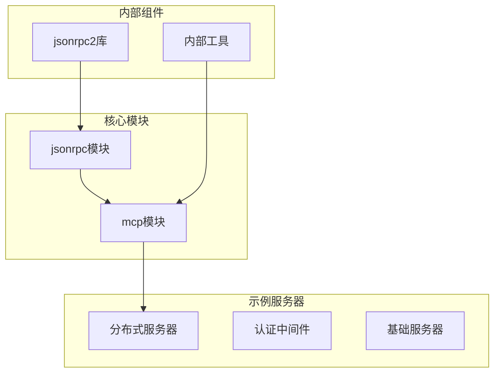
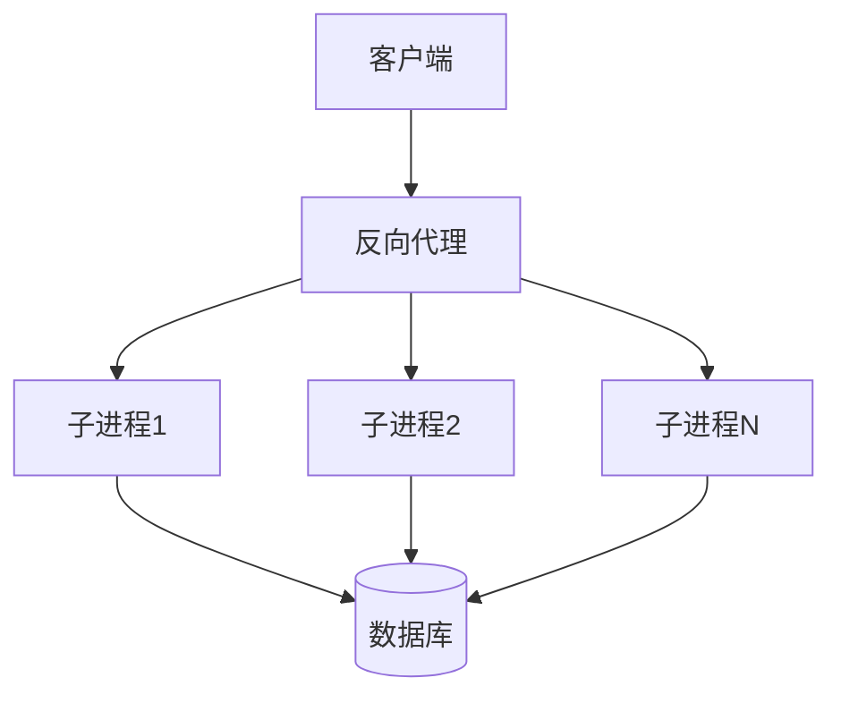
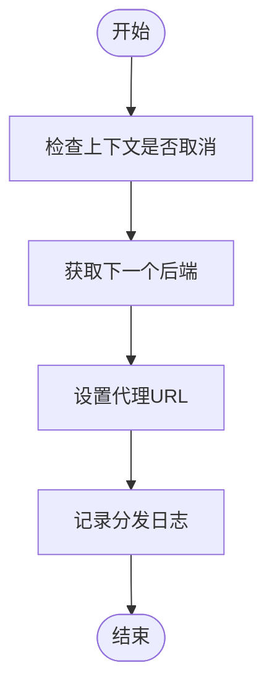
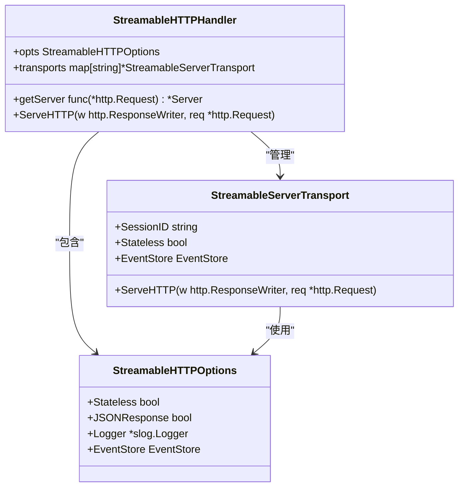
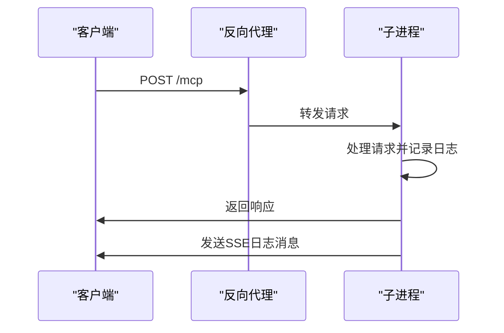
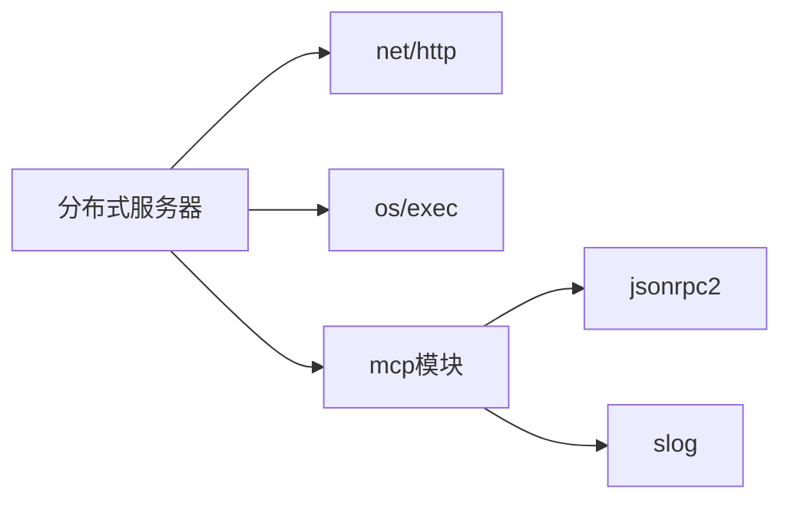

# 分布式部署

<cite>
**本文档中引用的文件**   
- [main.go](file://examples/server/distributed/main.go)
- [streamable.go](file://mcp/streamable.go)
- [streamable_test.go](file://mcp/streamable_test.go)
- [streamable_example_test.go](file://mcp/streamable_example_test.go)
- [server.go](file://mcp/server.go)
- [protocol.go](file://mcp/protocol.go)
- [transport.go](file://mcp/transport.go)
- [event.go](file://mcp/event.go)
</cite>

## 目录
1. [引言](#引言)
2. [项目结构](#项目结构)
3. [核心组件](#核心组件)
4. [架构概述](#架构概述)
5. [详细组件分析](#详细组件分析)
6. [依赖分析](#依赖分析)
7. [性能考虑](#性能考虑)
8. [故障排除指南](#故障排除指南)
9. [结论](#结论)

## 引言
本文档全面阐述了分布式MCP服务器的架构设计与实现方法。重点解析如何通过反向代理与子进程模型实现跨多个实例的功能发现与负载均衡。结合distributed示例，详细说明stateless模式在分布式环境中的关键作用，包括会话ID的逻辑处理、无状态服务的构建方式以及日志与通知的传递机制。解释NewStreamableHTTPHandler中Stateless选项的技术细节，并提供高可用部署场景下的性能调优建议和容错策略，确保服务在横向扩展时仍符合MCP协议规范。

## 项目结构
本项目采用模块化设计，主要包含认证、设计文档、示例、内部组件、JSON-RPC协议、MCP核心逻辑、OAuth扩展等模块。其中，`examples/server/distributed/main.go` 是分布式服务器的核心实现，`mcp/streamable.go` 提供了流式HTTP处理的核心逻辑。

**图示来源**
- [main.go](file://examples/server/distributed/main.go#L145-L169)
- [streamable.go](file://mcp/streamable.go#L86-L100)

**章节来源**
- [main.go](file://examples/server/distributed/main.go#L1-L170)
- [project_structure](file://workspace_path)

## 核心组件
分布式MCP服务器的核心组件包括反向代理、子进程管理、无状态会话处理和流式HTTP传输。`NewStreamableHTTPHandler` 函数是创建流式HTTP处理器的关键，它接受一个获取服务器实例的函数和配置选项，返回一个`StreamableHTTPHandler`实例。

**章节来源**
- [streamable.go](file://mcp/streamable.go#L86-L100)
- [main.go](file://examples/server/distributed/main.go#L145-L169)

## 架构概述
分布式MCP服务器采用父进程作为反向代理，子进程作为实际的MCP服务器实例。父进程通过`exec.CommandContext`启动多个子进程，每个子进程监听不同的端口。反向代理使用`httputil.ReverseProxy`将请求轮询分发到各个子进程。

**图示来源**
- [main.go](file://examples/server/distributed/main.go#L145-L169)
- [streamable.go](file://mcp/streamable.go#L86-L100)

## 详细组件分析

### 反向代理与负载均衡分析
反向代理通过`ReverseProxy`的`Rewrite`函数实现负载均衡，使用原子计数器实现简单的轮询算法。

#### 负载均衡流程图

**图示来源**
- [main.go](file://examples/server/distributed/main.go#L145-L169)

**章节来源**
- [main.go](file://examples/server/distributed/main.go#L145-L169)

### Stateless模式分析
Stateless模式在分布式环境中至关重要，因为它允许服务器在不维护会话状态的情况下处理请求，从而实现真正的无状态服务。

#### Stateless模式类图

**图示来源**
- [streamable.go](file://mcp/streamable.go#L38-L48)
- [streamable.go](file://mcp/streamable.go#L51-L79)

**章节来源**
- [streamable.go](file://mcp/streamable.go#L86-L100)
- [streamable_test.go](file://mcp/streamable_test.go#L1309-L1425)

### 日志与通知传递机制
在Stateless模式下，日志和通知的传递需要特殊处理。服务器通过`req.Session.Log`方法在请求上下文中发送日志消息。

#### 日志传递序列图

**图示来源**
- [main.go](file://examples/server/distributed/main.go#L145-L169)
- [streamable.go](file://mcp/streamable.go#L86-L100)

**章节来源**
- [main.go](file://examples/server/distributed/main.go#L145-L169)

## 依赖分析
分布式MCP服务器依赖于Go标准库的`net/http`、`os/exec`等包，以及项目内部的`mcp`、`jsonrpc2`等模块。通过`go.mod`文件管理外部依赖。

**图示来源**
- [go.mod](file://go.mod#L1-L10)
- [main.go](file://examples/server/distributed/main.go#L1-L170)

**章节来源**
- [go.mod](file://go.mod#L1-L30)
- [main.go](file://examples/server/distributed/main.go#L1-L170)

## 性能考虑
在高可用部署场景下，建议采用以下性能调优策略：
1. 使用连接池减少HTTP连接开销
2. 合理配置子进程数量，避免资源竞争
3. 启用EventStore实现事件持久化和流恢复
4. 使用JSONResponse选项减少SSE开销

## 故障排除指南
常见问题及解决方案：
1. **子进程启动失败**：检查端口是否被占用，确保环境变量正确传递
2. **会话状态丢失**：确认是否正确配置了Stateless模式
3. **负载均衡不均**：检查轮询算法实现，确保原子操作正确
4. **日志消息丢失**：验证SSE连接是否正常，检查EventStore配置

**章节来源**
- [main.go](file://examples/server/distributed/main.go#L145-L169)
- [streamable.go](file://mcp/streamable.go#L86-L100)

## 结论
分布式MCP服务器通过反向代理与子进程模型实现了高效的负载均衡和横向扩展能力。Stateless模式的引入使得服务在分布式环境中更加稳定和可靠。通过合理配置NewStreamableHTTPHandler的选项，可以在性能和功能之间取得良好平衡，确保服务符合MCP协议规范。