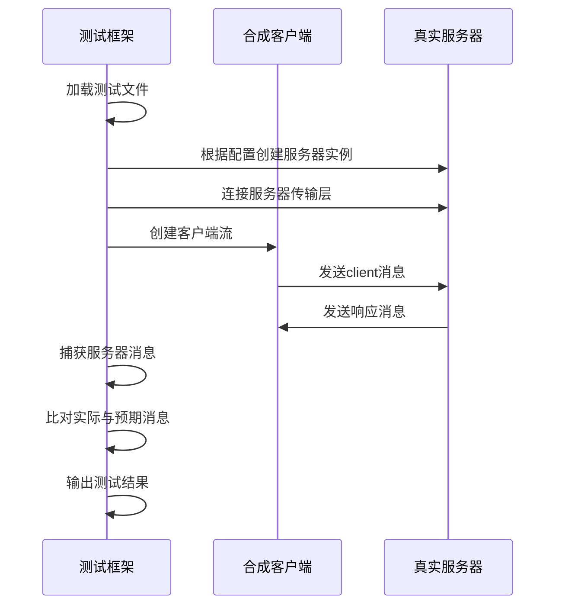
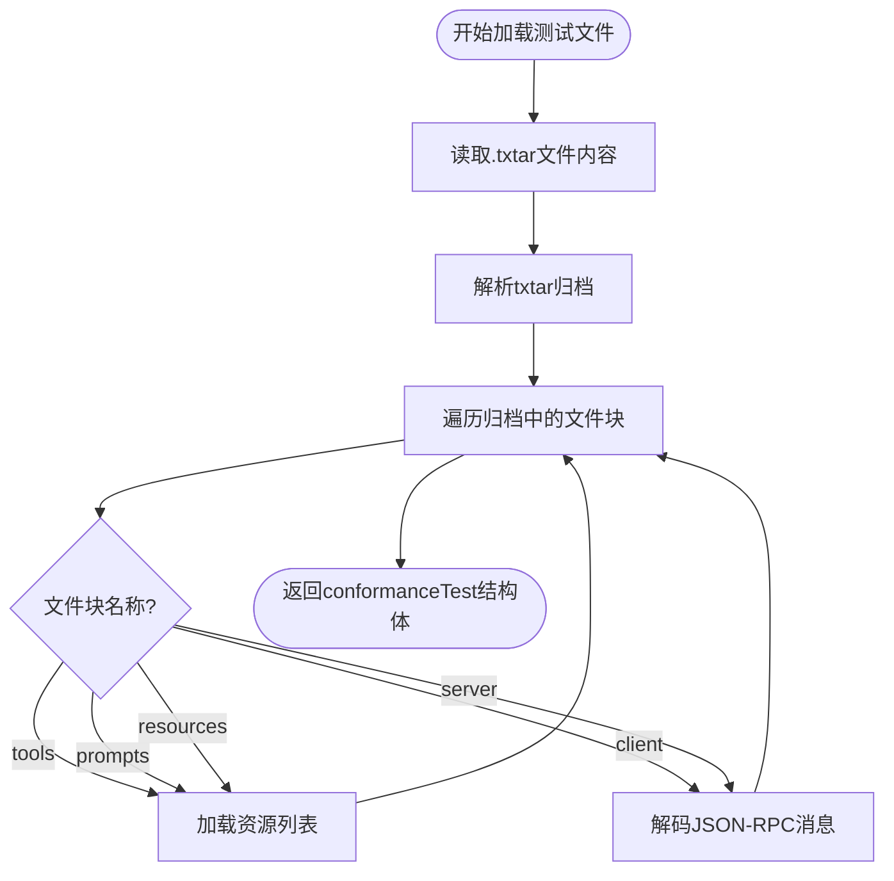
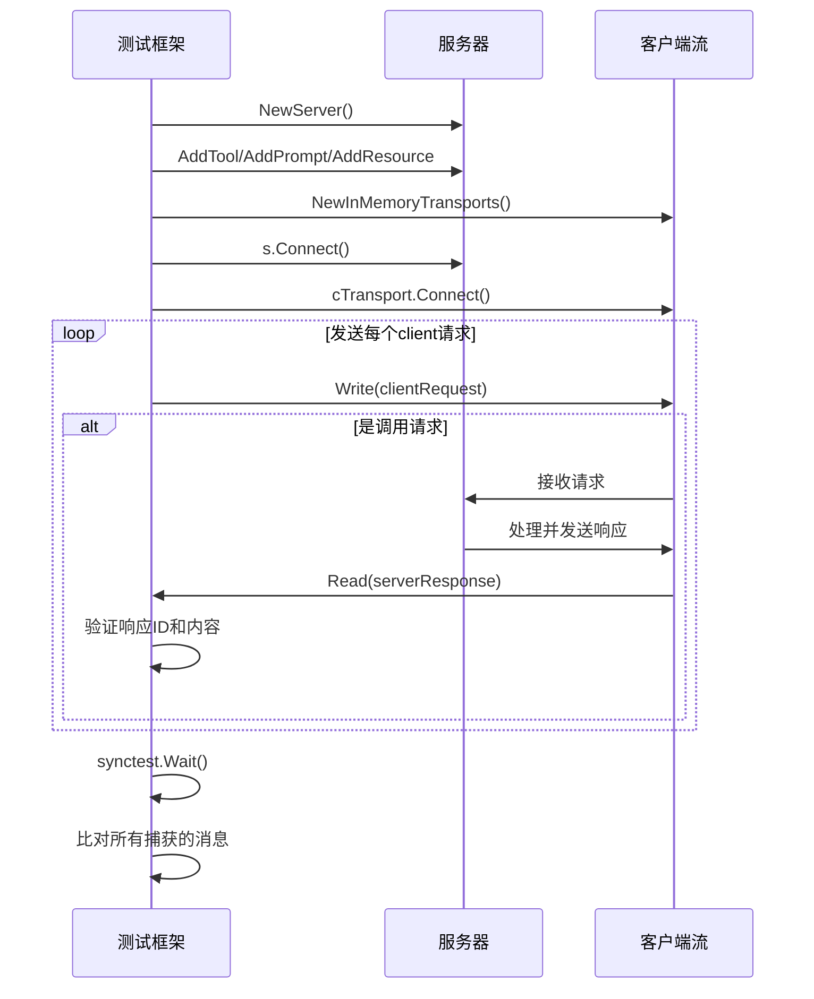
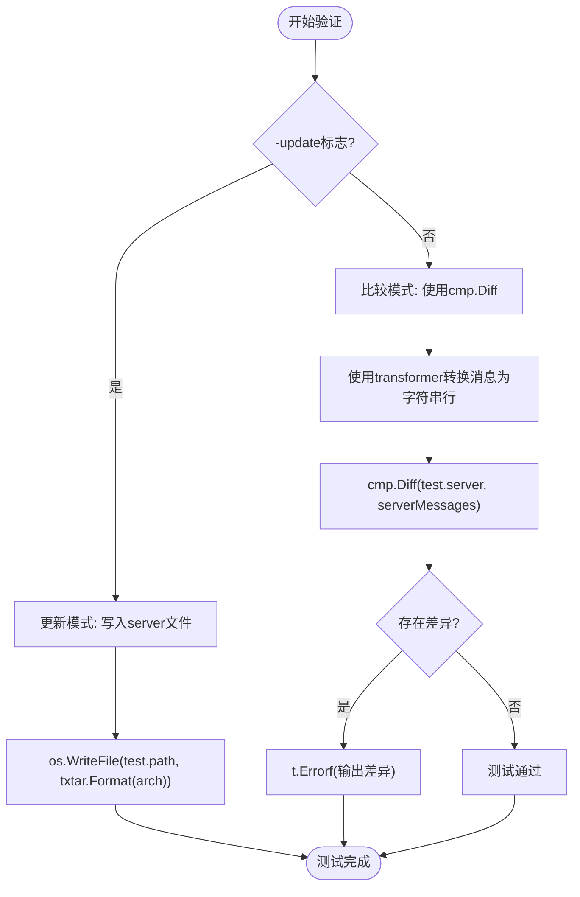

# 协议一致性测试

<cite>
**Referenced Files in This Document**   
- [conformance_test.go](file://mcp/conformance_test.go)
- [server.go](file://mcp/server.go)
- [protocol.go](file://mcp/protocol.go)
- [transport.go](file://mcp/transport.go)
</cite>

## 目录
1. [引言](#引言)
2. [测试运行机制](#测试运行机制)
3. [测试数据结构与加载](#测试数据结构与加载)
4. [核心测试流程分析](#核心测试流程分析)
5. [自定义测试扩展](#自定义测试扩展)
6. [测试执行与结果验证](#测试执行与结果验证)
7. [问题定位与调试](#问题定位与调试)
8. [最佳实践与发布前验证](#最佳实践与发布前验证)

## 引言

协议一致性测试是验证MCP（Model Context Protocol）服务器是否符合规范要求的关键环节。该测试通过检查服务器在初始化、功能发现、工具调用和资源读取等关键交互流程中的JSON级行为，确保其能够正确处理来自其他SDK的输入和输出。本测试框架基于Go语言实现，利用合成客户端与真实服务器进行交互，通过比对服务器的实际响应与预期响应来验证合规性。这种测试方法对于确保服务在不同版本间的兼容性至关重要，特别是在发布新版本或集成第三方组件时。

**Section sources**
- [conformance_test.go](file://mcp/conformance_test.go#L1-L50)

## 测试运行机制

MCP协议一致性测试的运行机制围绕`TestServerConformance`函数展开。该函数遍历`testdata/conformance/server/`目录下的所有`.txtar`测试文件，为每个文件创建一个独立的测试用例。测试的核心是`runServerTest`函数，它在一个同步测试（synctest）环境中执行，以确保能够准确检测到服务器处理完所有消息的时刻。测试流程模拟了一个合成客户端与一个真实服务器之间的交互：合成客户端根据测试文件中的`client`部分发送消息，而测试框架则捕获真实服务器的响应，并与测试文件中`server`部分的预期消息进行比对。

**Diagram sources**
- [conformance_test.go](file://mcp/conformance_test.go#L50-L138)

**Section sources**
- [conformance_test.go](file://mcp/conformance_test.go#L50-L138)

## 测试数据结构与加载

测试数据采用txtar格式进行存储，这是一种将多个文件打包在一个文本文件中的格式。每个测试文件包含多个命名的文本块，如`tools`、`prompts`、`resources`、`client`和`server`。`loadConformanceTest`函数负责解析这些文件，它首先读取文件内容并使用`txtar.Parse`进行解码。然后，该函数遍历所有文件块，根据块名分别处理：`tools`、`prompts`和`resources`块被解析为字符串切片，用于配置测试服务器的功能；`client`和`server`块则被解析为JSON-RPC消息序列，分别代表客户端的输入和服务器的预期输出。

**Diagram sources**
- [conformance_test.go](file://mcp/conformance_test.go#L335-L406)

**Section sources**
- [conformance_test.go](file://mcp/conformance_test.go#L335-L406)

## 核心测试流程分析

`runServerTest`函数是整个测试流程的核心。它首先根据测试配置创建一个`Server`实例，并通过`AddTool`、`AddPrompt`和`AddResource`等方法注册相应的功能。接着，它使用`NewInMemoryTransports`创建一对内存传输通道，将合成客户端和真实服务器连接起来。测试的交互过程是：测试框架将`client`消息写入客户端流，模拟客户端的请求；同时，它从客户端流读取服务器的响应，并与预期的`server`消息进行比对。对于请求-响应对，测试会严格检查响应的ID是否匹配。最后，通过`synctest.Wait()`等待所有异步操作完成，确保测试的完整性。

**Diagram sources**
- [conformance_test.go](file://mcp/conformance_test.go#L139-L331)
- [server.go](file://mcp/server.go#L109-L150)
- [transport.go](file://mcp/transport.go#L134-L137)

**Section sources**
- [conformance_test.go](file://mcp/conformance_test.go#L139-L331)

## 自定义测试扩展

开发者可以通过扩展测试套件来覆盖自定义的工具和资源类型。这主要通过在`runServerTest`函数中添加新的`case`分支来实现。例如，要测试一个名为`customTool`的自定义工具，可以在`switch tn`语句中添加一个新的`case "customTool"`分支，并在其中调用`AddTool`函数注册该工具及其处理函数。同样，对于自定义资源，可以在`switch rn`语句中添加相应的`case`分支，并使用`AddResource`或`AddResourceTemplate`进行注册。这种方法允许测试框架灵活地适应服务器实现的各种功能，确保所有自定义逻辑都经过充分的合规性检查。

**Section sources**
- [conformance_test.go](file://mcp/conformance_test.go#L150-L200)

## 测试执行与结果验证

测试的执行和结果验证是通过`-update`标志来控制的。当不使用`-update`标志时，测试框架会将捕获的服务器消息与`server`文件块中的预期消息进行逐行比较。比较使用`go-cmp`库的`cmp.Diff`函数，它能够清晰地展示出任何差异。如果发现不匹配，测试将失败并输出详细的差异报告。当使用`-update`标志运行测试时，如果测试通过，框架会将当前捕获的服务器消息更新回`.txtar`文件中，覆盖原有的`server`文件块。这是一种便捷的“黄金文件”测试模式，允许开发者在修改服务器实现后，快速更新预期的输出。

**Diagram sources**
- [conformance_test.go](file://mcp/conformance_test.go#L300-L331)

**Section sources**
- [conformance_test.go](file://mcp/conformance_test.go#L300-L331)

## 问题定位与调试

当测试失败时，问题定位主要依赖于详细的错误信息和日志。`cmp.Diff`函数输出的差异报告是首要的调试工具，它会以`-want +got`的格式精确指出哪些JSON-RPC消息不匹配。开发者可以据此检查服务器的实现逻辑，例如`Server`的处理方法（如`callTool`、`readResource`）是否正确。此外，通过在`ServerOptions`中设置自定义的`Logger`，可以启用详细的日志记录，追踪服务器内部的处理流程。对于复杂的异步问题，`synctest`框架提供的同步执行环境有助于简化调试，因为它能确保在所有消息处理完毕后才进行最终的验证。

**Section sources**
- [conformance_test.go](file://mcp/conformance_test.go#L320-L331)
- [server.go](file://mcp/server.go#L150-L200)

## 最佳实践与发布前验证

在发布新版本的MCP服务器之前，进行全面的协议一致性验证是至关重要的最佳实践。这不仅能确保新版本与MCP规范保持一致，还能防止引入破坏性变更。建议的流程是：首先，为所有核心功能（初始化、工具调用、资源读取等）编写或更新黄金文件测试；其次，在开发和测试环境中反复运行这些测试，确保100%通过；最后，在发布前，再次运行所有测试，并在必要时使用`-update`标志更新预期结果。此外，应将这些测试集成到CI/CD流水线中，作为发布流程的强制检查点，从而自动化地保障服务的稳定性和兼容性。

**Section sources**
- [conformance_test.go](file://mcp/conformance_test.go#L1-L50)
- [design.md](file://design/design.md#L12-L20)