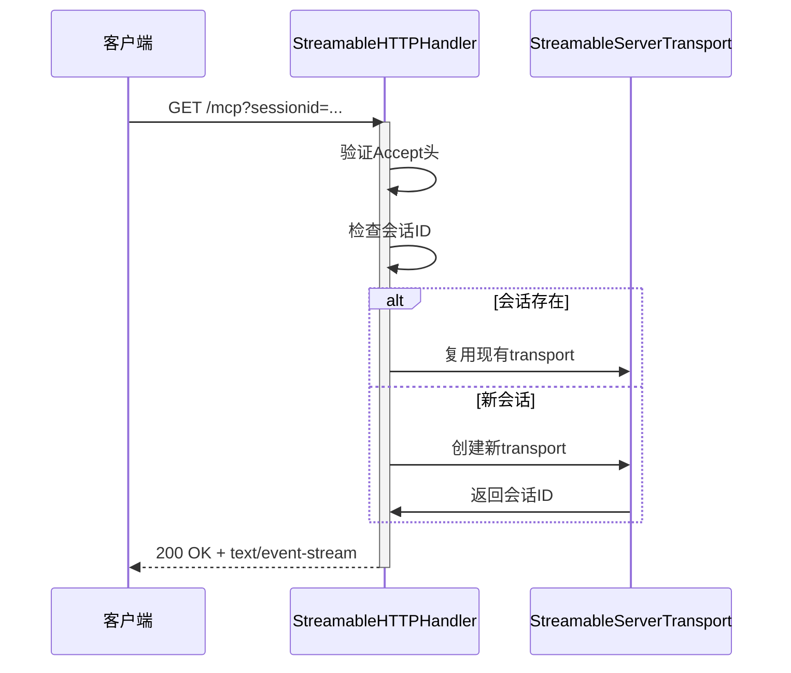
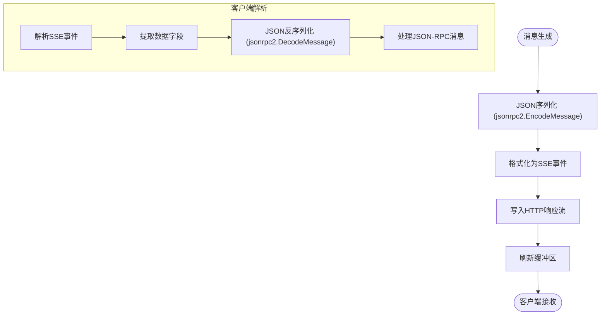
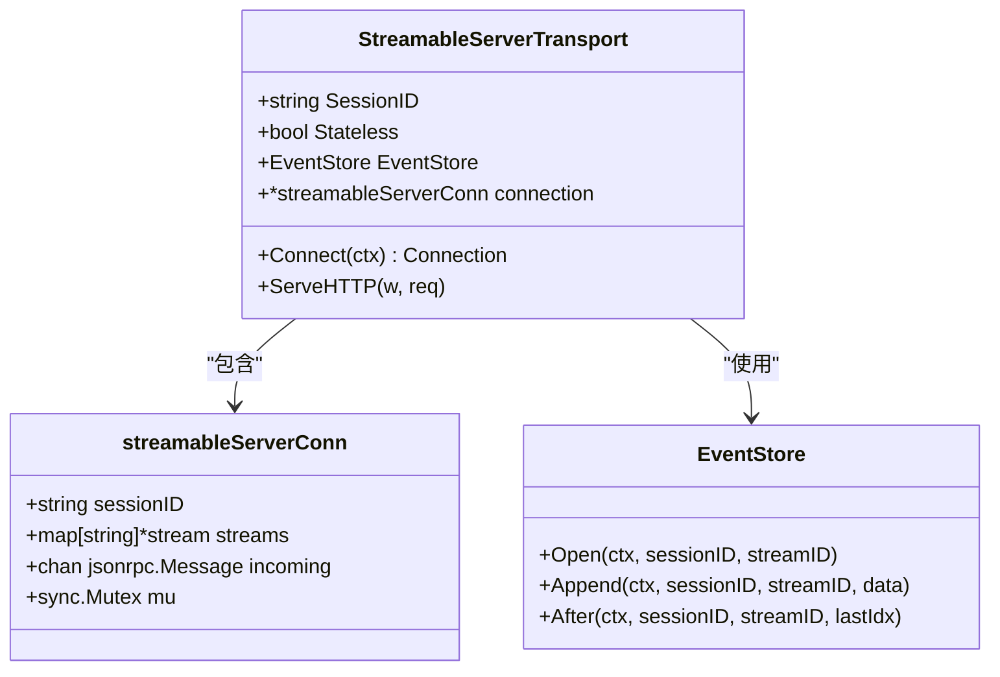
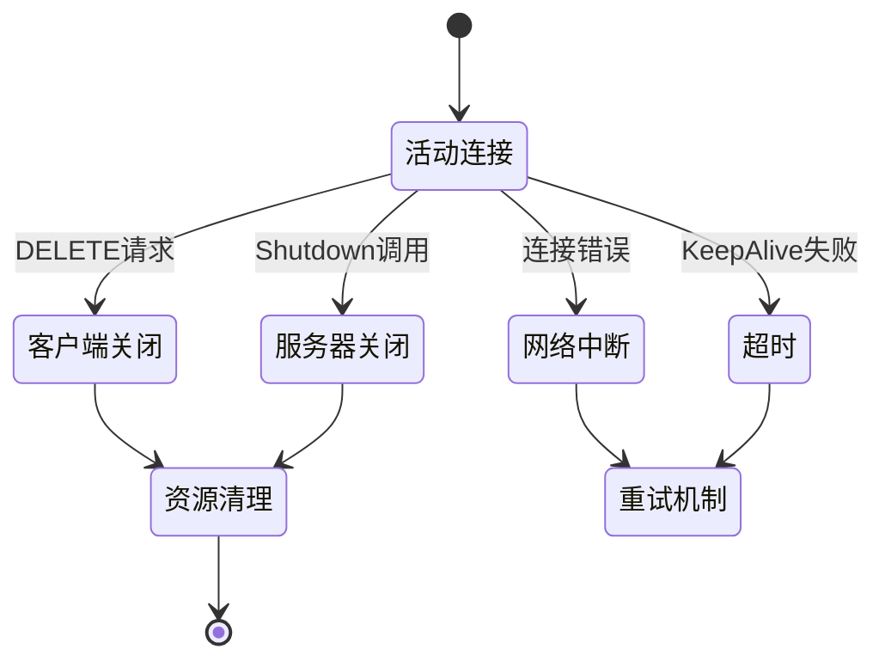
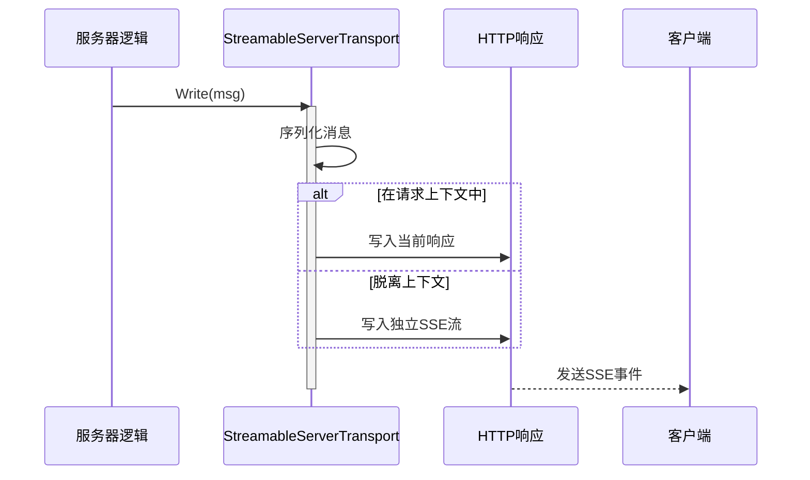
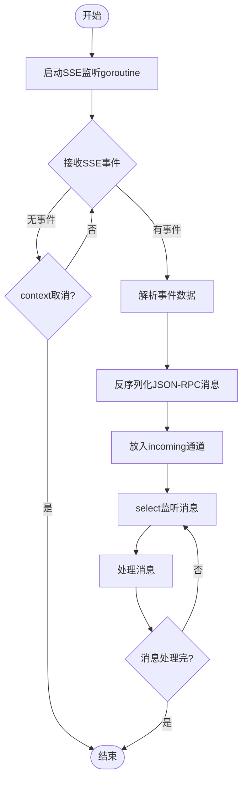
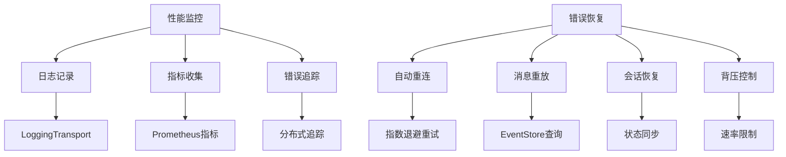

# 流式响应生命周期管理

<cite>
**本文档引用的文件**   
- [streamable.go](file://mcp/streamable.go)
- [sse.go](file://mcp/sse.go)
- [transport.go](file://mcp/transport.go)
- [protocol.go](file://mcp/protocol.go)
- [conn.go](file://internal/jsonrpc2/conn.go)
- [serve.go](file://internal/jsonrpc2/serve.go)
</cite>

## 目录
1. [引言](#引言)
2. [核心组件协作机制](#核心组件协作机制)
3. [HTTP长连接建立过程](#http长连接建立过程)
4. [数据帧编码与传输](#数据帧编码与传输)
5. [会话状态维护](#会话状态维护)
6. [连接关闭触发条件](#连接关闭触发条件)
7. [服务端数据推送机制](#服务端数据推送机制)
8. [客户端流式内容处理](#客户端流式内容处理)
9. [性能监控与错误恢复](#性能监控与错误恢复)
10. [资源释放最佳实践](#资源释放最佳实践)

## 引言
流式响应（Streamable）是一种基于HTTP长连接的实时数据传输机制，允许服务器通过channel持续向客户端推送数据片段。该机制在MCP（Model Context Protocol）协议中被广泛应用于实时通知、进度更新和服务器主动推送等场景。本文档系统性地描述了从服务器端生成到客户端消费的完整生命周期，涵盖StreamableHTTPHandler、StreamableServerTransport和StreamableClientTransport三大核心组件的协作机制。

## 核心组件协作机制

流式响应系统由三个核心组件构成：StreamableHTTPHandler负责处理HTTP请求并管理会话生命周期；StreamableServerTransport实现服务器端的传输逻辑；StreamableClientTransport则负责客户端的连接管理和消息接收。这些组件通过HTTP长连接协同工作，实现了双向通信能力。

```mermaid
graph TD
Client[客户端] --> |HTTP POST/GET| StreamableHTTPHandler[StreamableHTTPHandler]
StreamableHTTPHandler --> |管理| StreamableServerTransport[StreamableServerTransport]
StreamableServerTransport --> |连接| ServerSession[ServerSession]
StreamableClientTransport[StreamableClientTransport] --> |连接| ClientSession[ClientSession]
ServerSession < --> |JSON-RPC消息| ClientSession
```

**组件来源**
- [streamable.go](file://mcp/streamable.go#L38-L48)
- [streamable.go](file://mcp/streamable.go#L353-L397)
- [streamable.go](file://mcp/streamable.go#L1115-L1129)

## HTTP长连接建立过程

HTTP长连接的建立始于客户端发起的GET请求，该请求的Accept头必须包含"text/event-stream"以表明支持服务器发送事件（SSE）。StreamableHTTPHandler首先验证请求头中的协议版本和会话ID，然后根据配置创建或查找相应的服务器实例。

当会话ID不存在时，系统会生成一个全局唯一的会话ID，并将其作为Mcp-Session-Id响应头返回给客户端。对于无状态模式，系统使用临时会话处理请求，但限制服务器向客户端发起请求的能力。连接建立后，StreamableServerTransport会创建一个streamableServerConn实例来管理连接状态。



**流程来源**
- [streamable.go](file://mcp/streamable.go#L150-L250)
- [sse.go](file://mcp/sse.go#L100-L150)

## 数据帧编码与传输

数据帧的编码遵循JSON-RPC 2.0规范，每个消息都被封装为JSON格式并通过SSE（Server-Sent Events）协议传输。服务器端使用writeEvent函数将JSON消息编码为SSE事件，其中事件名称固定为"message"，数据部分为JSON序列化的消息内容。

StreamableServerTransport维护一个消息队列，所有待发送的消息都经过jsonrpc2.EncodeMessage函数序列化后写入HTTP响应流。客户端通过scanEvents函数解析SSE流，提取出原始数据并反序列化为JSON-RPC消息。对于批量消息，系统支持两种模式：单个JSON-RPC消息直接传输，或多个消息组成的数组批量传输。



**编码来源**
- [streamable.go](file://mcp/streamable.go#L700-L750)
- [transport.go](file://mcp/transport.go#L500-L550)
- [conn.go](file://internal/jsonrpc2/conn.go#L800-L850)

## 会话状态维护

会话状态的维护是流式响应系统的核心功能之一，主要通过EventStore接口实现。当配置了EventStore时，系统会将所有发送的事件持久化存储，以便在连接中断后能够恢复会话状态。StreamableServerTransport中的EventStore字段负责管理事件的存储和重放。

每个会话都有一个唯一的SessionID，用于标识会话实例。系统使用map结构存储活动会话，键为会话ID，值为对应的StreamableServerTransport实例。对于有状态会话，系统会在关闭连接时自动清理相关资源；而对于无状态会话，则在请求处理完成后立即释放资源。



**状态来源**
- [streamable.go](file://mcp/streamable.go#L353-L397)
- [streamable.go](file://mcp/streamable.go#L500-L550)
- [transport.go](file://mcp/transport.go#L200-L250)

## 连接关闭触发条件

连接关闭可由多种条件触发，主要包括客户端主动删除会话、服务器关闭、网络中断或超时等。当收到DELETE请求时，StreamableHTTPHandler会从会话映射中移除对应的StreamableServerTransport实例，并关闭其连接。服务器关闭时，系统会遍历所有活动会话并逐一关闭。

客户端连接的关闭通过cancel context实现，这会中断所有阻塞的读写操作。对于SSE流，系统使用done通道通知所有相关goroutine终止。在关闭过程中，系统会确保所有待处理的消息都被正确处理或丢弃，避免资源泄漏。



**关闭来源**
- [streamable.go](file://mcp/streamable.go#L100-L150)
- [serve.go](file://internal/jsonrpc2/serve.go#L200-L250)
- [transport.go](file://mcp/transport.go#L300-L350)

## 服务端数据推送机制

服务端通过channel向客户端推送连续数据片段的机制基于JSON-RPC的异步调用模型。当服务器需要发送通知或响应时，它会将消息写入streamableServerConn的incoming通道。该通道被多个goroutine共享，确保消息能够及时传递。

对于请求上下文中的消息，系统会将其路由到对应的HTTP响应；而对于脱离上下文的请求，则发送到独立的SSE流。StreamableServerTransport根据消息的来源和类型决定其传输路径，保证了消息的正确投递。系统还支持优先级控制，允许重要消息优先传输。



**推送来源**
- [streamable.go](file://mcp/streamable.go#L800-L850)
- [conn.go](file://internal/jsonrpc2/conn.go#L600-L650)

## 客户端流式内容处理

客户端通过StreamableClientTransport实现流式内容的实时接收和处理。连接建立后，客户端启动一个后台goroutine持续监听SSE流，使用scanEvents函数解析传入的事件。每个事件的数据部分被反序列化为JSON-RPC消息后放入incoming通道。

客户端采用非阻塞方式处理消息，通过select语句同时监听context取消信号和消息到达事件。当收到新消息时，系统会根据消息类型分发到相应的处理器。对于批量消息，系统会先缓存所有消息，待完整批次接收后再统一处理，确保消息顺序的一致性。



**处理来源**
- [streamable.go](file://mcp/streamable.go#L1100-L1150)
- [transport.go](file://mcp/transport.go#L400-L450)

## 性能监控与错误恢复

性能监控主要通过日志记录和指标收集实现。系统内置了LoggingTransport组件，可以包装任何Transport实例以记录所有进出的消息。错误恢复机制包括自动重连、消息重放和会话恢复等功能。当网络中断时，客户端会根据MaxRetries配置尝试重新连接。

对于消息丢失的情况，系统利用EventStore实现消息重放。客户端在重连时提供Last-Event-ID头，服务器据此从指定位置重新发送未接收的消息。系统还实现了背压控制，当客户端处理速度跟不上消息产生速度时，会暂时减缓消息发送速率。



**监控来源**
- [transport.go](file://mcp/transport.go#L250-L300)
- [streamable.go](file://mcp/streamable.go#L1200-L1250)

## 资源释放最佳实践

资源释放的最佳实践包括及时关闭连接、清理会话状态和释放内存资源。系统采用defer语句确保在函数退出时自动释放资源。对于goroutine的管理，系统使用sync.WaitGroup等待所有后台任务完成后再关闭连接。

建议在应用程序关闭时显式调用Shutdown方法，这会优雅地终止所有活动连接。避免直接终止进程，因为这可能导致资源泄漏。对于长时间运行的服务，应定期检查并清理无效会话，防止内存占用持续增长。

```mermaid
flowchart LR
A[资源释放] --> B[关闭连接]
A --> C[清理会话]
A --> D[释放内存]
B --> E[调用Close()]
B --> F[关闭done通道]
C --> G[从映射中删除]
C --> H[调用onClose回调]
D --> I[清空队列]
D --> J[释放缓冲区]
E --> K[确保所有goroutine退出]
F --> K
G --> L[通知测试钩子]
H --> L
```

**释放来源**
- [streamable.go](file://mcp/streamable.go#L90-L100)
- [serve.go](file://internal/jsonrpc2/serve.go#L150-L200)
- [transport.go](file://mcp/transport.go#L350-L400)