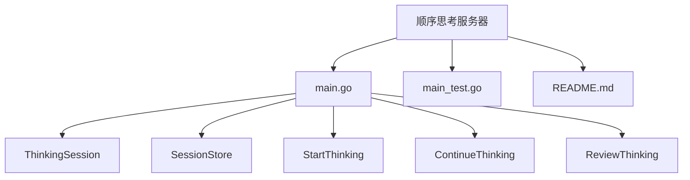
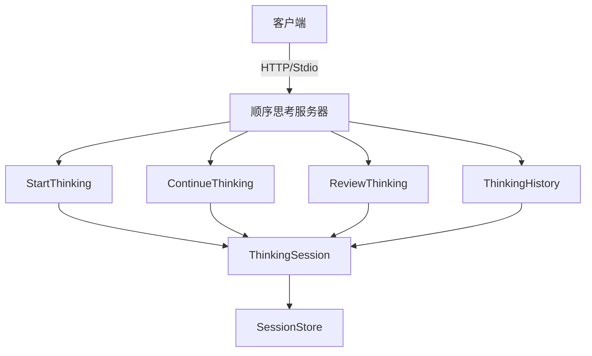
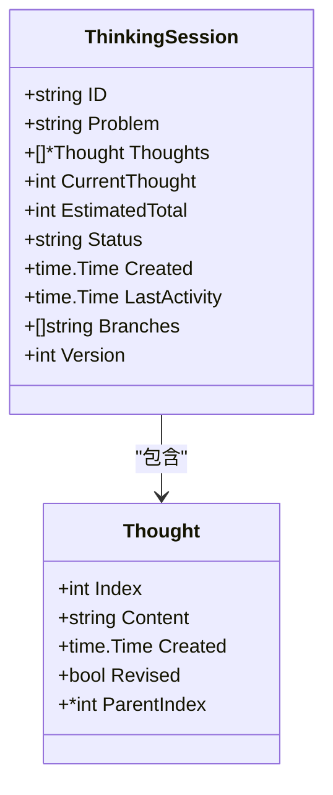
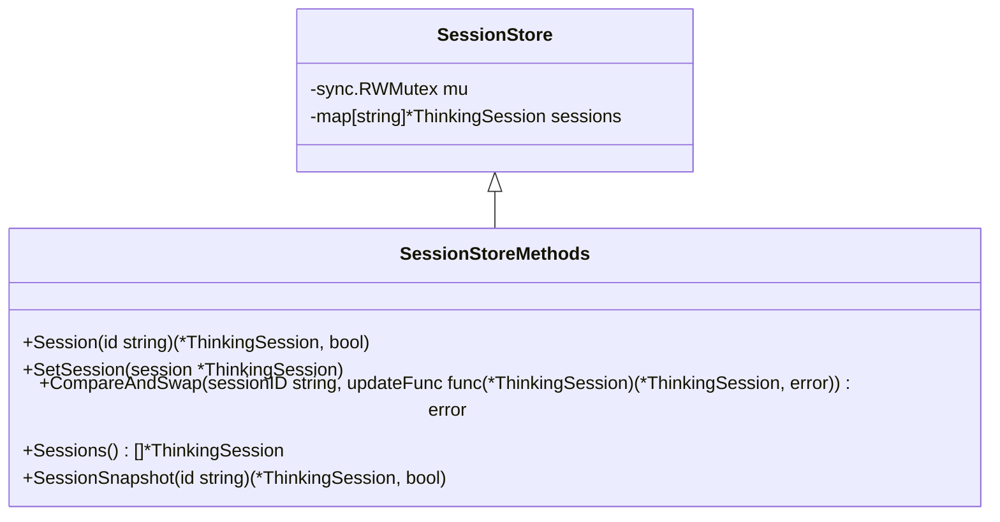
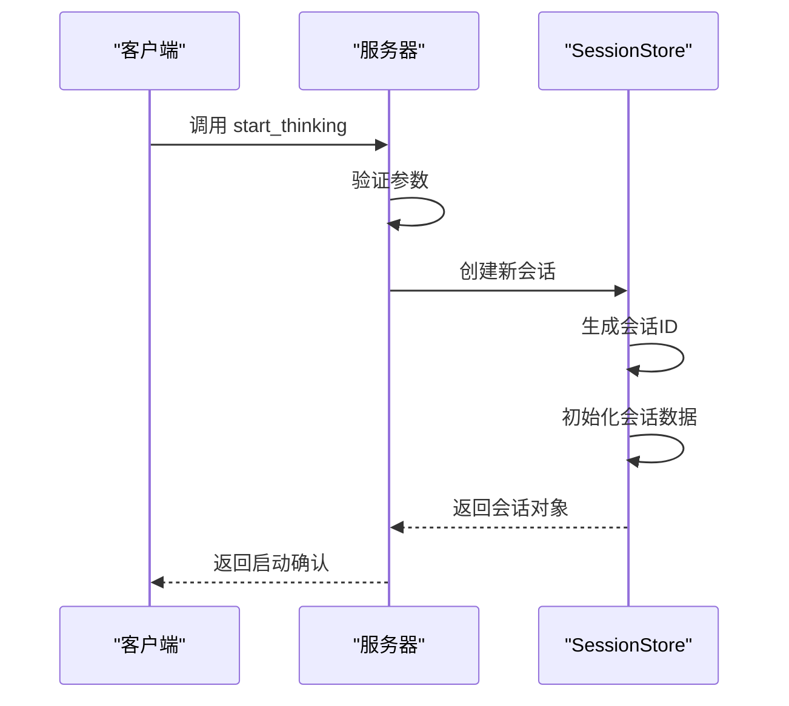
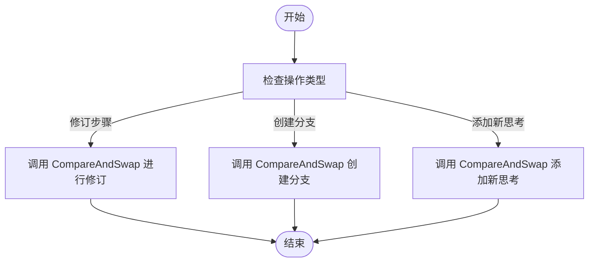
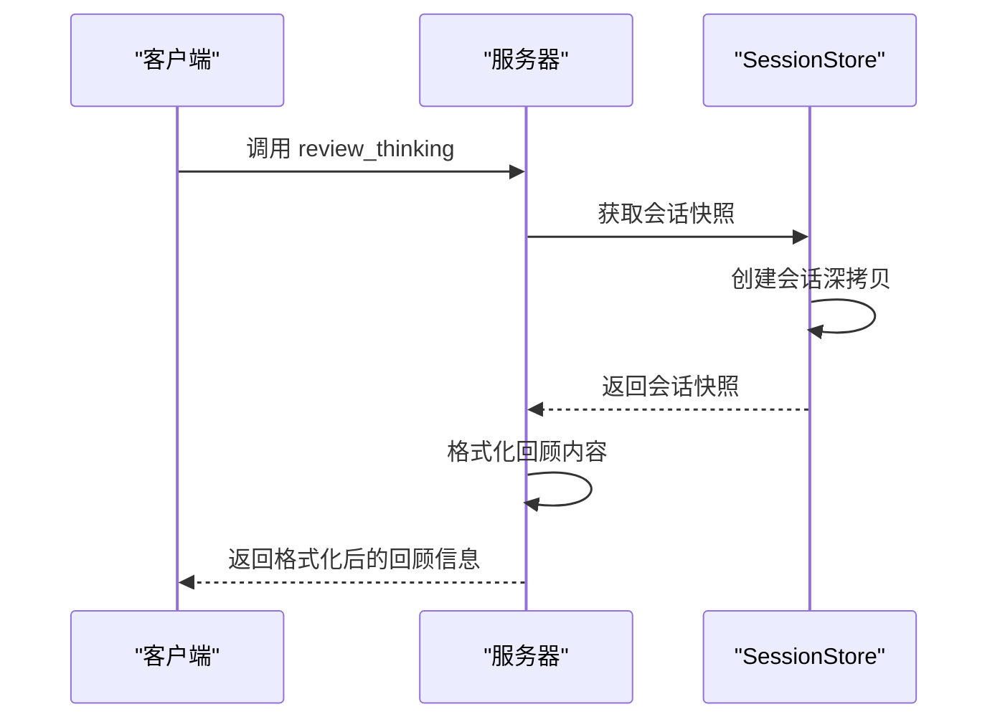
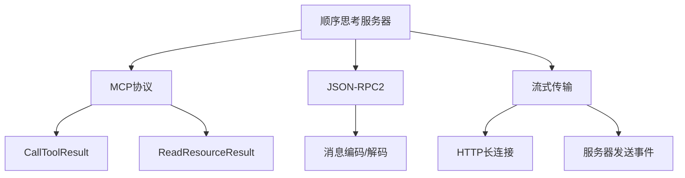

# 顺序思考

<cite>
**Referenced Files in This Document**   
- [main.go](file://examples/server/sequentialthinking/main.go)
- [main_test.go](file://examples/server/sequentialthinking/main_test.go)
- [README.md](file://examples/server/sequentialthinking/README.md)
- [streamable.go](file://mcp/streamable.go)
- [protocol.go](file://mcp/protocol.go)
</cite>

## 目录
1. [简介](#简介)
2. [项目结构](#项目结构)
3. [核心组件](#核心组件)
4. [架构概述](#架构概述)
5. [详细组件分析](#详细组件分析)
6. [依赖分析](#依赖分析)
7. [性能考虑](#性能考虑)
8. [故障排除指南](#故障排除指南)
9. [结论](#结论)

## 简介

顺序思考模式是一种结构化的复杂问题求解方法，通过将问题分解为有序的思考步骤来实现动态和反思性的分析过程。该模式支持多轮推理、步骤修订和分支创建，使用户能够系统性地探索和解决复杂问题。本文档深入讲解了顺序思考模式的实现原理与配置方法，重点介绍会话状态管理、乐观并发控制以及在流式传输环境下的上下文连贯性维护。

**Section sources**
- [README.md](file://examples/server/sequentialthinking/README.md#L1-L204)

## 项目结构

顺序思考示例位于`examples/server/sequentialthinking`目录下，包含实现该模式的核心文件。项目结构设计清晰，将业务逻辑与测试代码分离，便于维护和扩展。

**Diagram sources**
- [main.go](file://examples/server/sequentialthinking/main.go#L42-L42)
- [main.go](file://examples/server/sequentialthinking/main.go#L83-L83)
- [main.go](file://examples/server/sequentialthinking/main.go#L233-L233)
- [main.go](file://examples/server/sequentialthinking/main.go#L266-L266)
- [main.go](file://examples/server/sequentialthinking/main.go#L393-L393)

**Section sources**
- [main.go](file://examples/server/sequentialthinking/main.go#L1-L539)
- [main_test.go](file://examples/server/sequentialthinking/main_test.go#L1-L492)
- [README.md](file://examples/server/sequentialthinking/README.md#L1-L204)

## 核心组件

顺序思考模式的核心组件包括`ThinkingSession`结构体、`SessionStore`会话存储以及三个主要工具函数：`StartThinking`、`ContinueThinking`和`ReviewThinking`。这些组件共同实现了多轮推理的完整生命周期管理。

**Section sources**
- [main.go](file://examples/server/sequentialthinking/main.go#L42-L420)

## 架构概述

顺序思考服务器采用模块化架构，通过MCP协议提供工具调用和资源访问功能。服务器支持标准I/O模式和HTTP流式传输模式，能够适应不同的部署场景。

**Diagram sources**
- [main.go](file://examples/server/sequentialthinking/main.go#L233-L494)
- [main.go](file://examples/server/sequentialthinking/main.go#L83-L83)

## 详细组件分析

### ThinkingSession 结构体分析

`ThinkingSession`结构体是顺序思考模式的核心数据模型，用于表示一个活跃的思考会话。它包含了会话的元数据、思考序列和状态信息。

**Diagram sources**
- [main.go](file://examples/server/sequentialthinking/main.go#L42-L71)

**Section sources**
- [main.go](file://examples/server/sequentialthinking/main.go#L42-L71)

### SessionStore 会话存储分析

`SessionStore`实现了会话的持久化存储和乐观并发控制。它使用读写互斥锁保护会话映射，并通过版本号机制确保并发修改的安全性。

**Diagram sources**
- [main.go](file://examples/server/sequentialthinking/main.go#L83-L158)

**Section sources**
- [main.go](file://examples/server/sequentialthinking/main.go#L83-L158)

### 工具函数调用流程分析

顺序思考模式提供了三个主要工具函数，分别用于启动、继续和回顾思考过程。这些函数通过MCP协议暴露给客户端使用。

#### 启动思考流程

**Diagram sources**
- [main.go](file://examples/server/sequentialthinking/main.go#L233-L263)

#### 继续思考流程

**Diagram sources**
- [main.go](file://examples/server/sequentialthinking/main.go#L266-L390)

#### 回顾思考流程

**Diagram sources**
- [main.go](file://examples/server/sequentialthinking/main.go#L393-L427)

**Section sources**
- [main.go](file://examples/server/sequentialthinking/main.go#L233-L427)

## 依赖分析

顺序思考服务器依赖于MCP核心库提供的协议定义和传输机制。主要依赖关系如下：

**Diagram sources**
- [protocol.go](file://mcp/protocol.go#L72-L116)
- [streamable.go](file://mcp/streamable.go#L1-L799)

**Section sources**
- [main.go](file://examples/server/sequentialthinking/main.go#L1-L20)
- [protocol.go](file://mcp/protocol.go#L1-L20)
- [streamable.go](file://mcp/streamable.go#L1-L50)

## 性能考虑

顺序思考模式在设计时考虑了性能和可扩展性。会话存储使用内存映射实现快速访问，乐观并发控制减少了锁竞争。对于大规模部署，建议将会话数据持久化到外部数据库。

**Section sources**
- [main.go](file://examples/server/sequentialthinking/main.go#L78-L114)

## 故障排除指南

当遇到问题时，可以参考以下常见问题的解决方案：

1. **会话未找到错误**：确保会话ID正确，并且会话已通过`start_thinking`创建。
2. **并发修改冲突**：实现适当的重试逻辑，或增加客户端的请求间隔。
3. **流式传输中断**：检查网络连接，并确保服务器支持SSE（服务器发送事件）。

**Section sources**
- [main_test.go](file://examples/server/sequentialthinking/main_test.go#L441-L490)

## 结论

顺序思考模式提供了一种强大的结构化问题求解方法，通过会话状态管理实现了复杂的多轮推理过程。该模式支持思考步骤的添加、修订和分支创建，结合乐观并发控制确保了在并发环境下的数据一致性。通过流式传输支持，能够在保持上下文连贯性的同时提供实时反馈，是处理复杂问题的理想选择。