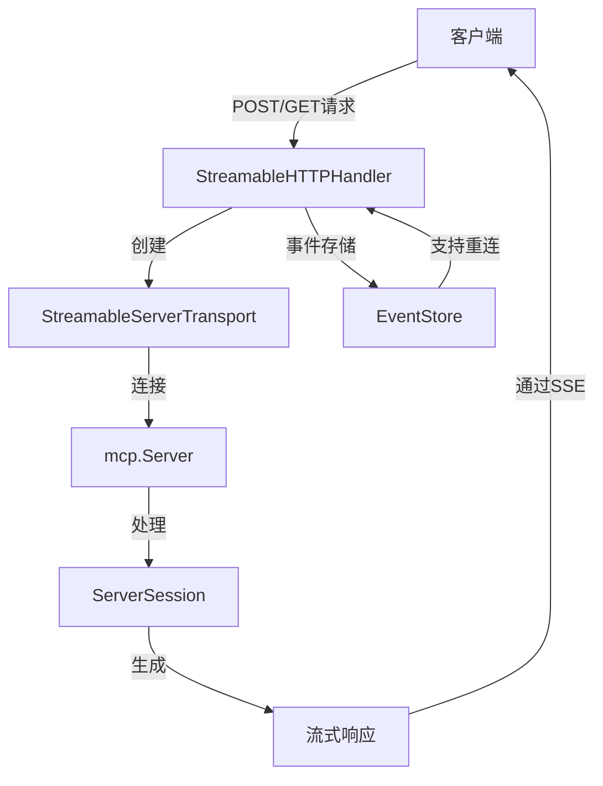
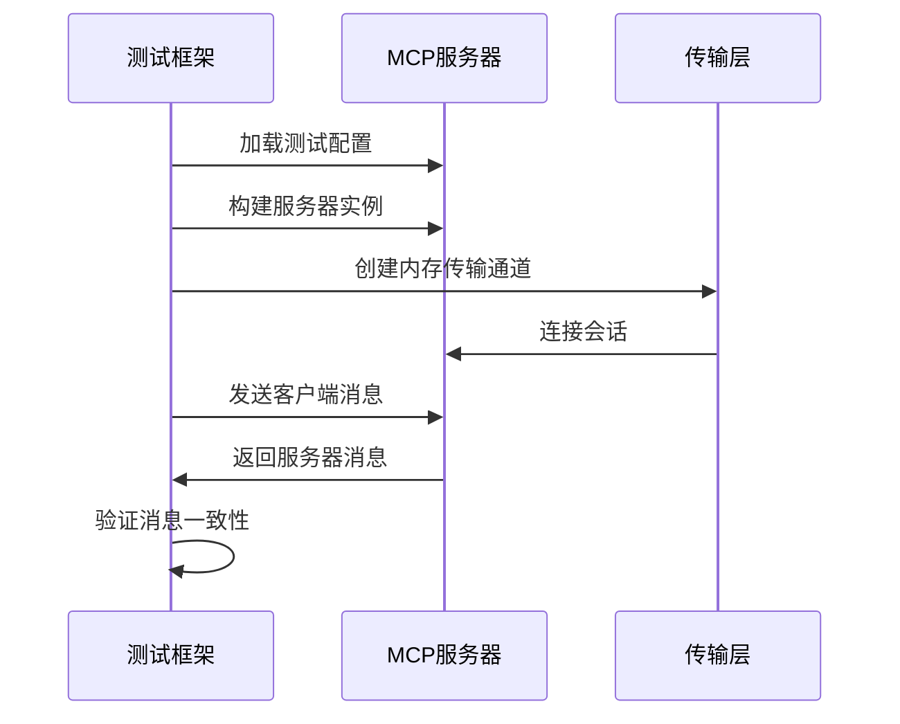

# 高级功能

<cite>
**本文档中引用的文件**  
- [streamable.go](file://mcp/streamable.go)
- [conformance_test.go](file://mcp/conformance_test.go)
- [sequentialthinking/README.md](file://examples/server/sequentialthinking/README.md)
- [sequentialthinking/main.go](file://examples/server/sequentialthinking/main.go)
- [distributed/main.go](file://examples/server/distributed/main.go)
- [protocol.src.md](file://internal/docs/protocol.src.md)
</cite>

## 目录
1. [顺序思考模式](#顺序思考模式)
2. [分布式服务器架构](#分布式服务器架构)
3. [流式响应生命周期管理](#流式响应生命周期管理)
4. [协议一致性测试](#协议一致性测试)
5. [生产级部署最佳实践](#生产级部署最佳实践)

## 顺序思考模式

顺序思考（Sequential Thinking）模式通过结构化的会话状态管理实现多轮推理，支持动态问题分解、步骤修订和分支探索。该模式基于MCP协议的会话机制，利用`ServerSession`维护上下文状态，实现复杂问题的逐步分析。

核心功能包括：
- **启动思考会话**：通过`start_thinking`工具初始化问题分析，支持自定义会话ID和步骤预估
- **延续思考过程**：通过`continue_thinking`添加新思路、修订历史步骤或创建替代推理路径
- **回顾思考历程**：通过`review_thinking`获取完整的推理过程记录

会话状态管理包含元数据、思维序列、进度跟踪、分支关系和状态管理，确保推理过程的完整性和可追溯性。

**Section sources**
- [sequentialthinking/README.md](file://examples/server/sequentialthinking/README.md#L0-L203)
- [sequentialthinking/main.go](file://examples/server/sequentialthinking/main.go)

## 分布式服务器架构

分布式服务器架构通过无状态流式传输模式实现跨多个实例的功能发现与负载均衡。关键实现基于`StreamableHTTPHandler`的无状态模式（Stateless Mode），该模式通过`StreamableHTTPOptions.Stateless`配置启用。

在无状态模式下，服务器不验证会话ID，为每个请求创建临时会话，从而支持水平扩展。此模式适用于无法建立持久会话的场景，允许服务器分布在多个进程中，通过共享配置实现功能发现和负载均衡。

架构特点：
- 无状态会话处理，支持跨实例负载均衡
- 临时会话机制，避免会话状态同步开销
- 基于HTTP的标准化通信协议

**Section sources**
- [streamable.go](file://mcp/streamable.go#L1-L1639)
- [protocol.src.md](file://internal/docs/protocol.src.md#L79-L135)
- [distributed/main.go](file://examples/server/distributed/main.go)

## 流式响应生命周期管理

流式响应（Streamable）的完整生命周期由`StreamableHTTPHandler`、`StreamableServerTransport`和`StreamableClientTransport`三个核心组件协同管理。

**Diagram sources**
- [streamable.go](file://mcp/streamable.go#L1-L1639)

**Section sources**
- [streamable.go](file://mcp/streamable.go#L1-L1639)
- [protocol.src.md](file://internal/docs/protocol.src.md#L79-L135)

## 协议一致性测试

协议一致性测试通过`conformance_test.go`文件中的`TestServerConformance`函数实现，确保服务符合MCP规范。测试框架使用txtar格式的测试数据文件，验证服务器在JSON层面与其他SDK的兼容性。

测试流程：
1. 加载包含客户端消息和预期服务器消息的txtar测试文件
2. 构建测试服务器并连接内存传输通道
3. 模拟客户端消息交互，验证服务器响应
4. 使用`-update`标志更新预期输出

测试支持工具、提示和资源的功能验证，确保服务器正确处理`initialize`、`initialized`等协议消息。

**Diagram sources**
- [conformance_test.go](file://mcp/conformance_test.go#L0-L408)

**Section sources**
- [conformance_test.go](file://mcp/conformance_test.go#L0-L408)

## 生产级部署最佳实践

结合顺序思考和分布式示例，生产级部署应遵循以下最佳实践：

### 性能调优建议
- **会话管理**：在高并发场景下使用无状态模式减少内存开销
- **流式传输**：启用`EventStore`支持连接恢复，提升用户体验
- **资源优化**：合理配置`JSONResponse`选项，平衡兼容性和性能

### 部署架构
- 采用多实例部署配合负载均衡器
- 使用共享存储实现事件持久化
- 实现健康检查和自动伸缩机制

### 可靠性保障
- 启用协议一致性测试作为CI/CD的一部分
- 监控会话生命周期和错误率
- 实施渐进式发布和回滚策略

**Section sources**
- [sequentialthinking/main.go](file://examples/server/sequentialthinking/main.go)
- [distributed/main.go](file://examples/server/distributed/main.go)
- [streamable.go](file://mcp/streamable.go#L1-L1639)
- [conformance_test.go](file://mcp/conformance_test.go#L0-L408)